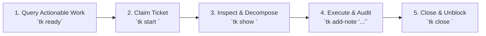

# AGENTS.md — 10,000-Foot Architecture & Workflow Guide

Operational guide for autonomous AI coding agents and engineers working in `ticket` (`tk`).

---

## 🎯 1. Project Goals & Philosophy

`tk` is a **minimal, offline task tracker with dependency intelligence**, designed for frictionless collaboration between developers and AI coding assistants.

- **Zero Database / Pure Plain Text**: State resides in `.tickets/*.md` files with YAML frontmatter, versioned by Git.
- **DAG Dependency Tracking**: Native support for parent-child hierarchies, blockers, and cycle detection. Agents compute actionable next steps deterministically.
- **Unix Speed**: Core CLI runs on portable POSIX Bash with `awk` and `sed`—zero Python/Node runtime required for base operations.
- **Decoupled Extensions**: Web UI and GitHub Sync live as modular plugins discovered via `$PATH`.

---

## 🏗️ 2. High-Level Architecture & Structure

```
ticket/
├── ticket                   # Core POSIX Bash CLI (create, show, ls, edit, query, find, dep, ready, etc.)
├── tk_webui/                # Web UI plugin (FastAPI + Tailwind Kanban & DAG Mind Map on port 8475)
│   ├── main.py              # REST API & static file server
│   ├── server.py            # Background daemon manager ('tk webui server start|status|stop')
│   ├── static/              # Single-page app (Kanban, DAG Graph, Table, Timeline, Theme engine)
│   └── WEBUI-SPEC.md        # Web UI specification
├── plugins/                 # Modular extension directory
│   ├── github/              # Bi-directional GitHub issue & PR sync ('tk github')
│   └── README.md            # Plugin catalog and integration standard
├── docs/                    # Specifications & deep guides
│   ├── SPEC.md              # Core system & data model specification
│   ├── PLUGIN_SPEC.md       # Plugin architecture standard & metadata contract
│   └── AGENTS.md            # Detailed agent integration guide
├── skills/tk/SKILL.md       # Reusable agent skill (installable to ~/.agents/skills/tk/)
├── features/                # Behave BDD acceptance test suite ('make test')
├── install.sh               # Modular installer script (--core, --full, --all, --github, --skill)
└── run.sh                   # Local zero-install runner for Web UI
```

### Component Breakdown
1. **Core CLI (`ticket` / `tk`)**:
   - Manages ticket CRUD, dependencies (`tk dep`), ready queue (`tk ready`), blockers (`tk blocked`), and listings (`tk ls`).
   - Discovers optional plugins named `tk-<cmd>` or `ticket-<cmd>` in `$PATH` and `plugins/<cmd>/`.
2. **Interactive Web UI (`tk_webui` / `tk-webui`)**:
   - Browser-based visual dashboard on default **port `8475`** (ASCII for **T** = 84, **K** = 75).
   - Features: 4-lane drag-and-drop Kanban, DAG Dependency & Mind Map canvas, multi-project switcher, theme customization (default: Indigo), and background daemon management (`tk webui server start|status|stop`).
3. **GitHub Sync Plugin (`plugins/github`)**:
   - Syncs GitHub issues and pull requests into local `.tickets/` markdown files.

---

## 🔄 3. Agent Execution Loop & Workflow

When operating inside repositories tracked by `tk`, autonomous agents follow this 5-step operational loop:



1. **Discover Actionable Tasks**:
   Run `tk ready` to list unblocked tickets whose dependencies have all been satisfied.
2. **Claim the Task**:
   Run `tk start <id>` to transition status to `in_progress`.
3. **Inspect Requirements & Subtasks**:
   Run `tk show <id>` to inspect design notes, acceptance criteria, and child tickets. Decompose complex tasks using `tk create "<title>" --parent <id>` and `tk dep <child> <dependency>`.
4. **Implement, Verify & Record Notes**:
   Execute the code changes, run tests (`make test`), and append review audit notes via `tk add-note <id> "..."`.
5. **Close the Ticket**:
   Run `tk close <id>` to mark complete and automatically unblock downstream dependent tickets.

---

## 📋 4. Agent Guidelines & Rules of Engagement

- **Preserve Zero-Dependency Core**: The root `ticket` executable must remain a pure Bash script with zero mandatory third-party dependencies.
- **Default Standards**:
  - Web UI default port: **`8475`** (ASCII `T=84`, `K=75`).
  - Web UI default theme: **Indigo** (`#6366f1`).
  - Default `tk ls`: Hides closed tickets and defaults to 10 items (unlimited with `--full` or `--all`).
- **Test-Driven Verification**: Validate changes against the BDD test suite using `make test` before finishing tasks.
- **Git Hygiene**: Do not mutate Git history or push commits without explicit confirmation.
