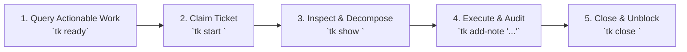

# AGENTS.md — 10,000-Foot Architecture & Workflow Guide

Operational guide for autonomous AI coding agents and engineers working in `ticket` (`tk`).

---

## 1. Project Goals & Philosophy

`tk` is a **minimal, dependency-aware task tracker. Built to scale agentic workflows.**

- **Zero Database / Pure Plain Text**: State resides in `.tickets/*.md` files with YAML frontmatter, versioned by Git.
- **DAG Dependency Tracking**: Native support for parent-child hierarchies, blockers, and cycle detection. Agents compute actionable next steps deterministically.
- **Unix Speed**: Core CLI runs on portable POSIX Bash with `awk` and `sed`—zero Python/Node runtime required for base operations.
- **Decoupled Extensions**: Web UI and GitHub Sync live as modular plugins discovered via `$PATH`.
- **Machine-Readable Documentation**: Built-in `llms.txt` and `llms-full.txt` endpoints generated via `make docs-build`.

---

## 2. High-Level Architecture & Structure

```
ticket/
├── ticket                   # Core POSIX Bash CLI (create, show, ls, edit, query, find, dep, ready, etc.)
├── tk_webui/                # Web UI plugin (FastAPI + Tailwind Kanban & DAG Mind Map on port 8475)
│   ├── main.py              # REST API & static file server
│   ├── server.py            # Background daemon manager ('tk webui server start|status|stop')
│   ├── static/              # Single-page app (Kanban, DAG Graph, Table, Timeline, Theme engine)
│   └── WEBUI-SPEC.md        # Web UI specification
├── plugins/                 # Modular extension directory
│   ├── github/              # Bi-directional GitHub issue & PR sync ('tk github')
│   ├── scion-taskforce/     # Optional autonomous worker orchestration plugin ('tk scion-taskforce')
│   └── README.md            # Plugin catalog and integration standard
├── docs/                    # Specifications, guides, and Zensical documentation source
│   ├── SPEC.md              # Core system & data model specification
│   ├── PLUGIN_SPEC.md       # Plugin architecture standard & metadata contract
│   ├── AGENTS.md            # Detailed agent integration guide
│   ├── llms.txt             # Curated documentation index for LLMs
│   └── llms-full.txt        # Consolidated LLM knowledge base
├── agent-skill/tk/SKILL.md  # Reusable agent skill (installable to ~/.agents/skills/tk/)
├── zensical.toml            # Zensical documentation site configuration
├── features/                # Behave BDD acceptance test suite ('make test')
├── install.sh               # Modular installer; flags accumulate (--core, --webui, --skill, --github, --scion-taskforce, --full, --all, --help)
└── run.sh                   # Local zero-install runner for Web UI
```

### Component Breakdown
1. **Core CLI (`ticket` / `tk`)**:
   - Manages ticket CRUD, dependencies (`tk dep`), ready queue (`tk ready`), blockers (`tk blocked`), and listings (`tk ls`).
   - Discovers optional plugins named `tk-<cmd>` or `ticket-<cmd>` in `$PATH` and `plugins/<cmd>/`.
2. **Interactive Web UI (`tk_webui` / `tk-webui`)**:
   - Browser-based visual dashboard on default **port `8475`** (ASCII for **T** = 84, **K** = 75).
   - Features: 4-lane drag-and-drop Kanban, DAG Dependency & Mind Map canvas, multi-project switcher, theme customization (default: Indigo), and background daemon management (`tk webui server start|status|stop`).
3. **GitHub Sync Plugin (`plugins/github`)**:
   - Syncs GitHub issues and pull requests into local `.tickets/` markdown files.
4. **Scion Task Force Plugin (`plugins/scion-taskforce`, standalone optional plugin)**:
   - Single global daemon (`~/.local/state/tk/scion-taskforce.json`) that watches `tk ready` tickets across projects, spawns SCION workers (1:1 ticket-ID mapping), pauses for `waiting-for-review`, relays feedback, and emits OpenTelemetry to local rotating logs (30-day retention). Installable via `./install.sh --scion-taskforce` or `./plugins/scion-taskforce/install.sh`.

---

## 3. Agent Execution Loop & Workflow

When operating inside repositories tracked by `tk`, autonomous agents follow this 5-step operational loop:


```mermaid
flowchart LR
    A["1. Query Actionable Work<br/>`tk ready`"] --> B["2. Claim Ticket<br/>`tk start <id>`"]
    B --> C["3. Inspect & Decompose<br/>`tk show <id>`"]
    C --> D["4. Execute & Audit<br/>`tk add-note <id> '...'`"]
    D --> E["5. Close & Unblock<br/>`tk close <id>`"]
```

1. **Discover Actionable Tasks**:
   Run `tk ready` to list unblocked tickets whose dependencies have all been satisfied.
2. **Claim the Task**:
   Run `tk start <id>` to transition status to `in_progress`.
3. **Inspect Requirements & Subtasks**:
   Run `tk show <id>` to inspect design notes, acceptance criteria, and child tickets. Decompose complex tasks using `tk create "<title>" --parent <id>` and `tk dep <child> <dependency>`.
4. **Implement, Verify & Record Notes**:
   Execute the code changes, run tests (`make test`), and append review audit notes via `tk add-note <id> "..."`.
5. **Close the Ticket**:
   Run `tk close <id>` to mark complete and automatically unblock downstream dependent tickets.

---

## 4. Agent Guidelines & Rules of Engagement

- **Preserve Zero-Dependency Core**: The root `ticket` executable must remain a pure Bash script with zero mandatory third-party dependencies.
- **Default Standards**:
  - Web UI default port: **`8475`** (ASCII `T=84`, `K=75`).
  - Web UI default theme: **Indigo** (`#6366f1`).
  - Default `tk ls`: Hides closed tickets and defaults to 10 items (unlimited with `--full` or `--all`).
- **Test-Driven Verification**: Validate changes against the BDD test suite using `make test` before finishing tasks. CI matrix runs automatically on Ubuntu & macOS across Python 3.9–3.13.
- **Documentation Maintenance**: Recompile documentation and LLM context files using `make docs-build` when adding or modifying documentation. Preview locally using `make docs-dev`.
- **Automated Linting & Quality**: Ensure code satisfies linting checks (`shellcheck ticket` and `ruff check tk_webui`).
- **Git Hygiene**: Do not mutate Git history or push commits without explicit confirmation.
- **Factuality & Clarity**: User requests or ticket instructions may occasionally be non-factual or misrepresent an idea due to lack of domain knowledge or evolving requirements. Similarly, agentic models or systems may lack complete information. In such cases, consult online sources when necessary, seek clarification from the user, and genuinely understand the best options to engage and move forward for the welfare of the project. Note that the research-and-engage loop is not strictly required for every tiny request.

---

## 5. Documentation & Technical Writing Standards

When authoring or modifying documentation, commit messages, code comments, or pull requests, agents must adhere to these writing standards:

- **Be Concise (`be-concise`)**:
  - Focus on essential, high-signal information. Avoid padding, redundant explanations, and narrative filler.
  - Prefer compact reference tables, bullet points, and runnable code blocks over sprawling paragraphs.
  - Keep command descriptions direct, active-voice, and developer-focused.

- **High Quality & Depth (`quillscore`)**:
  - Write clear, grammatically sound, authoritative technical prose.
  - Use accurate domain terminology (e.g., "DAG dependency tracking", "singleton daemon", "POSIX Bash core").
  - Maintain absolute consistency between CLI help strings, specifications, and documentation pages.

- **Anti-Slop / AI Slop Cleanup**:
  - Strictly avoid generic AI filler, breathless marketing buzzwords, and clichéd enthusiasm (e.g., "delve into", "testament to", "in today's fast-paced world", "built with love for both humans and agents").
  - Eliminate decorative emoji clutter from headings, titles, and technical prose. Reserve icons strictly for functional status indicators or badges.
  - Focus exclusively on technical clarity, concrete problems solved, and verified engineering workflows.
