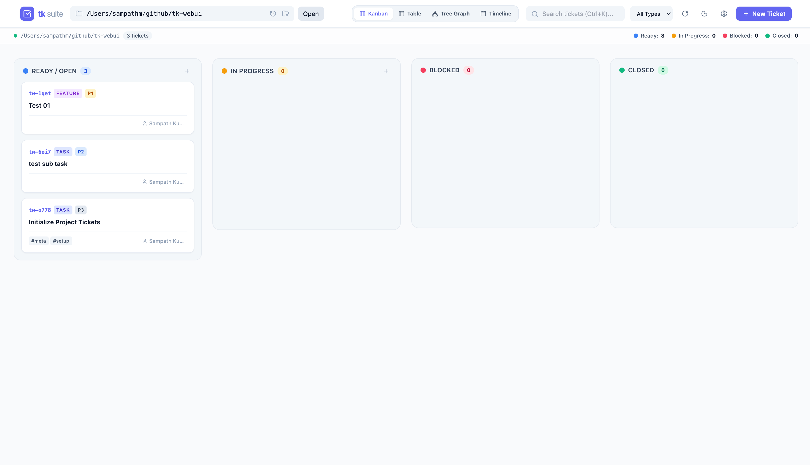
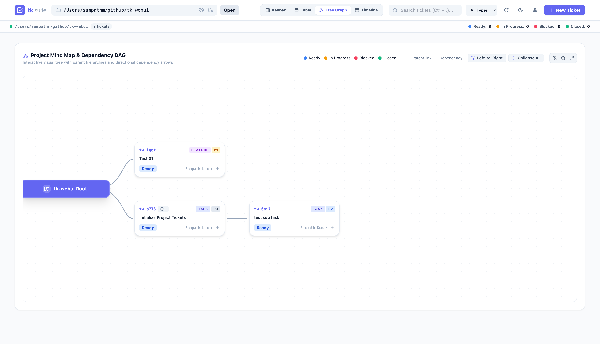
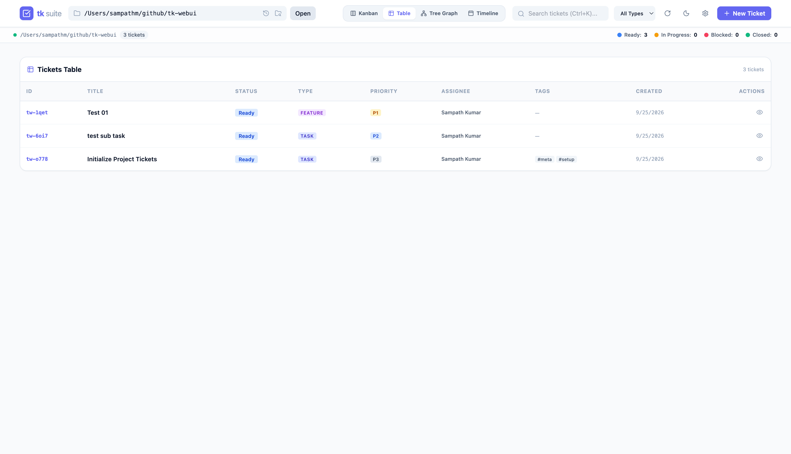
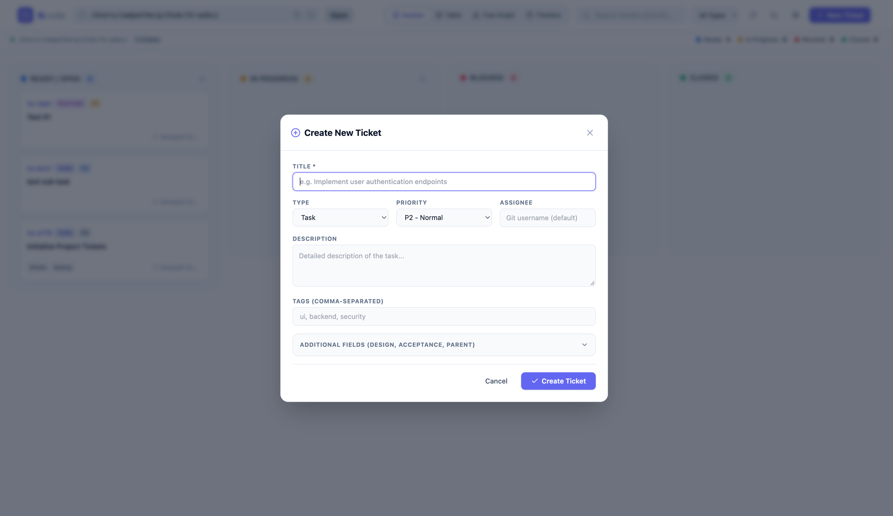
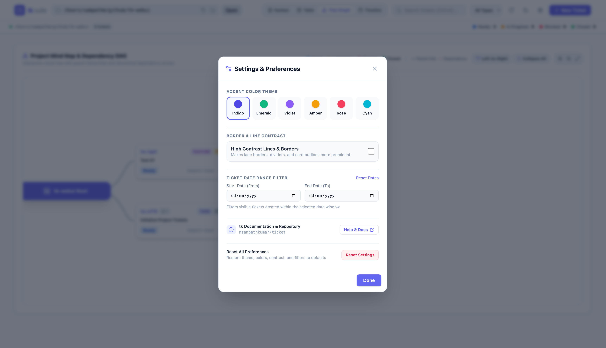

# ticket (tk)

Minimal, offline task tracker with dependency intelligence. Features an ultra-fast CLI and an optional modern Kanban & review dashboard.

Inspired by Joe Armstrong's [Minimal Viable Program](https://joearms.github.io/published/2014-06-25-minimal-viable-program.html), `tk` manages and queries task dependency graphs in plain text.

---

## ⚡ Quick Install

Install the zero-dependency Bash CLI or the full suite with the interactive Web UI:

```bash
git clone https://github.com/msampathkumar/ticket.git
cd ticket

# Full Suite (CLI + Web UI + Agent Skill)
./install.sh --full

# Core CLI Only (Pure Bash, zero Python dependencies)
./install.sh --core

# Web UI Plugin Only
./install.sh --webui
```

Binaries install to `~/.local/bin/` (`tk` and `tk-webui`). Ensure `~/.local/bin` is in `$PATH`.

### Launching Web UI & Background Server

The Web UI runs on **port `8475`** (ASCII for **T** = 84, **K** = 75):

```bash
# Foreground Server
tk webui [optional-project-path]

# Background Daemon
tk webui server start [optional-project-path]  # Starts daemon on http://127.0.0.1:8475
tk webui server status                         # Inspect PID, URL, and log path
tk webui server stop                           # Stop daemon
tk webui server restart                        # Restart daemon

# Run locally without install
./run.sh [optional-project-path]
```

---

## 🚀 Key Features

### 🖥️ Core CLI (`tk`)
- **Git-Backed**: Tickets are stored as human-readable Markdown files with YAML frontmatter inside `.tickets/`.
- **Dependency Tracking**: Track blocking relationships (`tk dep`, `tk dep tree`, `tk blocked`, `tk ready`, `tk dep cycle`).
- **Core Querying & Editing**: Built-in `tk ls`, `tk edit`, `tk query`, `tk find`, and `tk show`.
- **In-Place Ticket Updates**: Update fields, design notes, and acceptance criteria on the fly with `tk update`.
- **Extensible Plugin System**: Discovers `tk-<cmd>` or `ticket-<cmd>` executables in `$PATH` automatically.

### 🌐 Interactive Web UI (`tk webui` / `tk-webui`)
- **Background Server Management**: One-click `tk webui server start/stop/status` daemon management on default port `8475`.
- **4-Lane Kanban Board**: Fluid drag-and-drop between Ready, In Progress, Blocked, and Closed lanes.
- **Multi-View Switcher**: Toggle instantly between **Kanban**, **Table View**, **Interactive Dependency Tree Graph**, and **Timeline/Gantt View**.
- **In-Place Task Editing**: Edit title, description, tags, priority, assignee, design notes, and acceptance criteria directly in the browser.
- **PR-Style Review Feedback**: Chronological audit trail for review notes and comments (`Cmd+Enter` to submit).
- **Collapsible Completed Tasks**: Automatically cleans up closed tasks with a 1-click toggle to view older tasks.
- **Multi-Project Switcher**: Switch between any repositories containing `.tickets/` on your system.

### 🖼️ Web UI Showcase

| 4-Lane Kanban Board | Interactive Dependency Graph |
| :---: | :---: |
|  |  |

| Table & Filter View | Create & Edit Ticket |
| :---: | :---: |
|  |  |

| Settings & Themes |
| :---: |
|  |

---

## 📖 CLI Usage

```bash
tk (v0.2.0) — Minimal, offline task tracker with dependency intelligence.
Created by Sampath Kumar & wedow contributors
GitHub: https://github.com/msampathkumar/ticket
License: MIT

Usage: tk <command> [args]

Commands:
  create [title] [options] Create ticket, prints ID
    -d, --description      Description text
    --design               Design notes
    --acceptance           Acceptance criteria
    -t, --type             Type (bug|feature|task|epic|chore) [default: task]
    -p, --priority         Priority 0-4, 0=highest [default: 2]
    -a, --assignee         Assignee
    --external-ref         External reference (e.g., gh-123, JIRA-456)
    --parent               Parent ticket ID
    --tags                 Comma-separated tags (e.g., --tags ui,backend,urgent)
  start <id>               Set status to in_progress
  close <id>               Set status to closed
  reopen <id>              Set status to open
  status <id> <status>     Update status (open|in_progress|closed)
  update <id> [options]    Update title, description, priority, tags, etc.
  dep <id> <dep-id>        Add dependency (id depends on dep-id)
  dep tree [--full] <id>   Show dependency tree (--full disables dedup)
  dep cycle                Find dependency cycles in open tickets
  undep <id> <dep-id>      Remove dependency
  link <id> <id> [id...]   Link tickets together (symmetric)
  unlink <id> <target-id>  Remove link between tickets
  ready [-a X] [-T X]      List open/in-progress tickets with deps resolved
  blocked [-a X] [-T X]    List open/in-progress tickets with unresolved deps
  closed [--limit=N] [-a X] [-T X] List recently closed tickets (default 20, by mtime)
  ls, list [options]       List tickets (default: hides closed, limit 10)
    -s, --status           Filter status (open|in_progress|closed|all)
    -a, --assignee         Filter assignee
    -t, --type             Filter type
    -p, --priority         Filter priority (0-4)
    -T, --tag              Filter tag
    -n, --limit            Limit results (default: 10)
    --full                 Show all results (no limit)
    --all                  Show all statuses without limit
  edit <id>                Open ticket in $EDITOR
  query [jq-filter]        Output tickets as JSON, optionally filtered with jq
  find <search-term>       Search text across tickets
  show <id>                Display ticket
  update <id> [options]    Update title, description, priority, tags, etc.
  add-note <id> [text]     Append timestamped note (or pipe via stdin)
  agent-skill [options]    Display or install agent skill (--install, --path)
  version, --version, -v   Display version, description, and license information
  super <cmd> [args]       Bypass plugins, run built-in command directly

Plugins (tk-<cmd> or ticket-<cmd> in PATH or plugins/<cmd>/):
  webui                  Interactive Kanban Web UI & PR review dashboard
  github                 Sync GitHub issues and pull requests into local tickets
```

---

## 🔌 Plugins System

Plugins are organized into self-contained directories under `plugins/<plugin-name>/`, each containing their executable, symlinks, and a dedicated specification (`<PLUGIN-NAME>-SPEC.md`). Except for the Web UI (`tk-webui`), all plugins are strictly **optional** to install.

| Plugin | Directory | Specification | Description |
| :--- | :--- | :--- | :--- |
| **`webui`** | [`tk_webui/`](tk_webui/) / [`plugins/webui/`](plugins/webui/) | [`WEBUI-SPEC.md`](tk_webui/WEBUI-SPEC.md) | Interactive Kanban & Review Dashboard |
| **`github`** | [`plugins/github/`](plugins/github/) | [`GITHUB-SPEC.md`](plugins/github/GITHUB-SPEC.md) | Sync GitHub issues and pull requests |

### Modular Installation Options

```bash
# Core CLI Only (Includes create, show, ls, edit, query, find, etc.)
./install.sh --core

# Core + Web UI (Full default suite)
./install.sh --full

# Install Everything (Core + Web UI + GitHub Plugin + Agent Skill)
./install.sh --all

# Selectively install plugins
./install.sh --github --skill
```

---

## 📚 Documentation & Specifications

- **[AI Agent Guide & Workflow (AGENTS.md)](AGENTS.md)**: 10,000-foot overview of architecture, goals, and autonomous agent operating workflows.
- **[System & Data Specification (SPEC.md)](docs/SPEC.md)**: Complete schema, DAG semantics, error codes, and lifecycle specification (spec-driven architecture).
- **[Plugin Standard Specification (PLUGIN_SPEC.md)](docs/PLUGIN_SPEC.md)**: Official plugin development standard, directory convention, execution lifecycle, and metadata contracts.
- **[Plugin Architecture & Catalog (plugins/README.md)](plugins/README.md)**: Catalog of built-in plugins with links to individual plugin specs.
- **[Plugin Authoring Guide (PLUGINS.md)](docs/PLUGINS.md)**: Guide on writing and distributing custom plugins.
- **[Agent Skill (SKILL.md)](skills/tk/SKILL.md)**: Agent skill definition installable to `~/.agents/skills/tk/SKILL.md`.

---

## 🧪 Testing

The test suite is written using [Behave](https://behave.readthedocs.io/en/latest/).

```bash
make test
```

---

## 🙏 Credits & Acknowledgments

This project is built upon the foundational architecture and minimal design created by [**wedow**](https://github.com/wedow) in the original [`wedow/ticket`](https://github.com/wedow/ticket) project. We extend deep gratitude to the original author and contributors for creating such an elegant, git-backed ticket tracking foundation for developers and AI agents.

---

## 📝 License

[MIT License](LICENSE)
