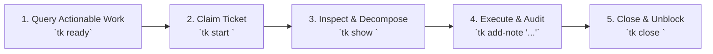

# tk - Developer & Agent Operational Guide

`tk` (`ticket`) is a **minimal, dependency-aware task tracker. Built to scale agentic workflows.**

- **Repository**: [https://github.com/msampathkumar/ticket](https://github.com/msampathkumar/ticket)
- **Documentation**: [https://msampathkumar.github.io/ticket/](https://msampathkumar.github.io/ticket/)
- **LLM Context Endpoints**: [`llms.txt`](https://msampathkumar.github.io/ticket/llms.txt) | [`llms-full.txt`](https://msampathkumar.github.io/ticket/llms-full.txt)

---

## 1. Installation & Setup

Any coding agent or developer can install `tk` directly:

### Option A: Install from GitHub (Zero Clone via NPX or Curl)
```bash
# Direct agent skill installation
npx github:msampathkumar/ticket agent-skill --install
```

### Option B: Clone & Install Full Suite
```bash
git clone https://github.com/msampathkumar/ticket.git
cd ticket

# Full Suite: Core CLI + Web UI + Agent Skill (Default)
./install.sh --full

# Or install everything including optional plugins (GitHub & SCION Task Force):
./install.sh --all

# Or core POSIX Bash CLI only (pure Bash, zero Python/Node runtime required):
./install.sh --core
```
Binaries are placed in `~/.local/bin/` (`tk`, `tk-webui`, `tk-github`, `tk-scion-taskforce`). Ensure `~/.local/bin` is in `$PATH`.

---

## 2. Core Concepts & Storage

- **Pure Plain Text & Git-Backed**: State is stored in `.tickets/*.md` files with YAML frontmatter. Zero external databases.
- **DAG Dependency Graph**: Native support for parent-child hierarchies (`--parent`), blocking dependencies (`tk dep`), cycle detection (`tk dep cycle`), and automated downstream unblocking upon ticket completion.
- **Discovered Discovery**: Running `tk help` automatically lists all built-in commands and dynamically discovers installed plugins (`tk-<cmd>` or `ticket-<cmd>`).

---

## 3. The 5-Step Autonomous Agent Workflow Loop

When operating in repositories tracked by `tk`, autonomous coding agents follow this deterministic operational loop:



1. **Discover Actionable Tasks**:
   Run `tk ready` to list unblocked tickets whose dependencies have all been satisfied. Never pick blocked tasks out of order.
2. **Claim the Task**:
   Run `tk start <id>` to transition status to `in_progress`, signaling to humans and other agents that the ticket is claimed.
3. **Inspect Requirements & Subtasks**:
   Run `tk show <id>` to inspect design notes, acceptance criteria checklists, and parent/child hierarchies.
   Decompose complex tasks into subtasks:
   ```bash
   tk create "Implement backend endpoint" --parent <epic-id> -t task
   tk create "Build frontend UI modal" --parent <epic-id> -t task
   tk dep <frontend-id> <backend-id>
   ```
4. **Implement, Verify & Record Notes**:
   Execute the code changes, run automated tests, and append timestamped review audit notes:
   ```bash
   tk add-note <id> "Implemented changes and passed test suite."
   ```
5. **Close the Ticket**:
   Run `tk close <id>`. This resolves the ticket and automatically unblocks all downstream dependent tickets.

---

## 4. Complete CLI Reference

### Repository & Ticket Management
```bash
# Initialize tracking in current repository
tk init [directory]

# Create a ticket
tk create "Title" -t feature -p 1 -d "Description" --tags "backend,auth"
# Options:
#   -t, --type: bug | feature | task | epic | chore (default: task)
#   -p, --priority: 0 (critical) to 4 (trivial) (default: 2)
#   -a, --assignee: Name or username
#   -d, --description: Description text
#   --design: Architecture / design notes
#   --acceptance: Acceptance criteria checklist
#   --parent: Parent ticket ID (or 'none' to unlink)
#   --external-ref: External reference (e.g. gh-42, JIRA-101)
#   --tags: Comma-separated tags

# Inspect ticket
tk show <ticket-id>

# Update ticket fields
tk update <ticket-id> -p 1 -a "Developer" --tags "urgent"

# Status changes
tk start <ticket-id>                       # Mark in_progress
tk close <ticket-id>                       # Mark closed
tk reopen <ticket-id>                      # Reopen ticket
tk status <ticket-id> <open|in_progress|closed>

# Append audit notes
tk add-note <ticket-id> "Progress update or review feedback"

# Listings & Search
tk ls                                      # List tickets (hides closed, limit 10)
tk ls --full                               # List all open tickets without limit
tk ls --status=closed                      # List closed tickets
tk ls -a "Developer" --type bug            # Filter by assignee and type
tk find "search query"                     # Search across titles, body, and notes
tk query                                   # Stream tickets as JSON lines
tk query '.priority == "0"'                # Query via jq filter
tk edit <ticket-id>                        # Open ticket in $EDITOR
```

### Dependency Management & DAG Queries
```bash
tk dep <child-id> <blocker-id>             # <child-id> now depends on <blocker-id>
tk undep <child-id> <blocker-id>           # Remove dependency
tk link <ticket-a> <ticket-b>              # Symmetrical link without blocking semantics
tk unlink <ticket-a> <ticket-b>            # Remove symmetrical link
tk dep tree <ticket-id>                    # Show dependency tree
tk dep cycle                               # Detect dependency cycles in open tickets
tk ready                                   # Query actionable tickets (all deps closed)
tk blocked                                 # Query blocked tickets (waiting on deps)
tk closed                                  # List recently closed tickets
```

---

## 5. Official Plugins Reference

Plugins are discovered automatically from `$PATH` matching `tk-<name>` or `ticket-<name>`. Use `tk super <command>` to bypass plugins and run built-in commands directly.

### 5.1 Interactive Web UI (`tk webui`)
Interactive 4-lane drag-and-drop Kanban board, live DAG Mind Map graph, table view, and project switcher on default **port `8475`** (ASCII `T=84`, `K=75`):
```bash
# Foreground launch
tk webui [dir]

# Background singleton daemon management
tk webui server start [dir]                # Start daemon in background
tk webui server status                     # Check URL, PID, and active project
tk webui server stop                       # Stop background daemon
tk webui server restart [dir]              # Restart background daemon
```

### 5.2 GitHub Issue & PR Sync (`tk github`)
Bi-directional sync between local `.tickets/` markdown files and GitHub issues/pull requests:
```bash
tk github sync                             # Sync issues and PRs
tk github sync --issues                    # Sync only issues
tk github sync --prs                       # Sync only pull requests
tk github list                             # List synced GitHub tickets
tk github unsync -y                        # Remove synced tickets
```

### 5.3 SCION Task Force (`tk scion-taskforce`)
Event-driven multi-agent worker orchestration on the SCION agent runtime, with human review checkpoints. `init` installs a `tk` save hook; no daemon runs:
```bash
# Interactive project setup wizard & template seeder
tk scion-taskforce init                    # Interactive setup (wizard)
tk scion-taskforce init --defaults         # Non-interactive with sensible defaults

# Verification test run
tk scion-taskforce test                    # Verifies provider, model garden, and agent container

# Workers
tk scion-taskforce status                  # Save hook, provider health, workers for this project
tk scion-taskforce sync                    # Catch up after hand edits or git pull
tk scion-taskforce attach <id>             # Attach to an active worker session
```

> **Rules for Task Force**:
> - Only tickets tagged `taskforce` by human operators are claimed; saving such a ticket starts its worker.
> - Workers keep the ticket `in_progress` with the label `waiting-for-review`, record progress via `tk add-note`, and pause.
> - When feedback is added via `tk add-note`, the save hook forwards it and wakes the worker. `tk close` stops the worker.
