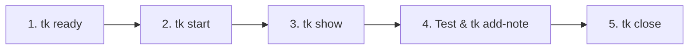

# Why AI Coding Agents Need DAG-Based Task Tracking

*Published: September 2026*

As LLM coding tools evolve from simple tab-autocompletes into multi-step autonomous agents, task coordination becomes the primary bottleneck.

When you dispatch an autonomous coding agent into a repository, how does it know what to do next?

---

## The Flaws of Traditional Issue Trackers for Agents

Most teams rely on centralized trackers (Jira, Linear, GitHub Issues) or simple flat TODO checklists:

1. **Network Latency & Auth Friction**: Every API call introduces auth tokens, rate limits, and latency that slow down local agent execution.
2. **Lack of Dependency Logic**: Flat lists don't convey execution order. Agents often pick up tasks that depend on unmerged schema migrations or missing helper modules.
3. **Context Drift**: External databases disconnect task history from Git commits and branches.

---

## The 5-Step Agent Loop with `tk`

`tk` introduces an agent-friendly loop:



### 1. Zero Hallucination Task Discovery
Instead of parsing unstructured markdown or asking the user, the agent runs:
```bash
tk ready
```
This returns only actionable tasks whose prerequisite dependencies are closed.

### 2. Traceable Notes & Audit Trails
As the agent runs test suites, it leaves audit traces directly in frontmatter-backed markdown:
```bash
tk add-note tk-8f2a "All 125 BDD acceptance tests passed under Python 3.12."
```

### 3. Automatic Cascade Unblocking
Closing a task automatically satisfies dependency constraints for dependent downstream features:
```bash
tk close tk-8f2a
```

---

## Bringing Determinism to Autonomous Work

By grounding agent tasks in Git-versioned plain text and DAG dependency graphs, teams achieve repeatable, deterministic software delivery without cloud lock-in.
