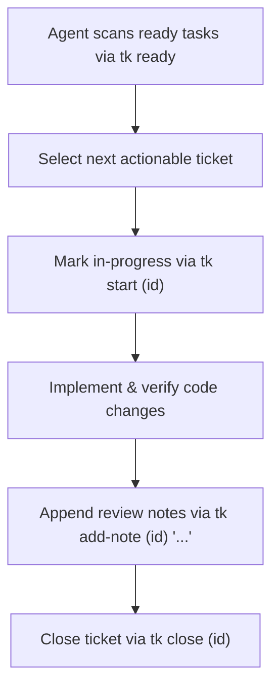

# tk - AI Agent Guidelines & Integration Guide

`tk` is a **minimal, dependency-aware task tracker. Built to scale agentic workflows.** This document outlines operational standards for AI coding assistants and autonomous agents (e.g., Antigravity, Claude, Cursor, Copilot, Gemini CLI) operating within repositories tracked by `tk`.

---

## 1. Agent Architecture & Core Capabilities

- **File-Centric State**: Agents read and write tickets using standard file and CLI tools without database drivers.
- **Topological Dependency Order**: `tk ready` prevents agents from claiming blocked tasks out of order.
- **Audit Trails in Markdown**: Agents record reasoning, test results, and review comments directly in ticket files.
- **LLM Context Endpoints**: Native `llms.txt` and `llms-full.txt` files provide direct context window loading.

---

## 2. Standard Workflow for AI Agents



### Step 1: Discover Actionable Work
Run `tk ready` to list open tickets whose dependencies are already resolved:
```bash
tk ready
```

### Step 2: Mark Task in Progress
Inform human developers and other agents that the ticket is being worked on:
```bash
tk start <ticket-id>
```

### Step 3: Check Subtasks and Design Requirements
View ticket specifications, design notes, and acceptance checklist:
```bash
tk show <ticket-id>
```

### Step 4: Record Progress & Notes
Append timestamped notes detailing the verification results or implementation choices:
```bash
tk add-note <ticket-id> "Implemented feature and verified against test suite."
```

### Step 5: Mark Complete
Close the ticket after test execution:
```bash
tk close <ticket-id>
```

---

## 3. Subtask Decomposition Pattern

When an agent encounters a large epic or complex feature:
1. Create subtasks with `--parent <epic-id>`:
   ```bash
   tk create "Implement backend API endpoint" --parent <epic-id> -t task
   tk create "Build frontend UI modal" --parent <epic-id> -t task
   ```
2. Wire dependencies between subtasks:
   ```bash
   tk dep <frontend-id> <backend-id>
   ```

---

## 4. Agent Skill Installation

Agents supporting custom skills can inspect or install the `tk` skill definition:
```bash
# Inspect the skill definition
tk agent-skill

# Install via tk CLI
tk agent-skill --install

# Or directly via npx without cloning
npx github:msampathkumar/ticket agent-skill --install
```

---

## 5. Documentation & Technical Writing Standards

When authoring or modifying documentation, commit messages, code comments, or pull requests, agents must adhere to these writing standards:

- **Be Concise (`be-concise`)**:
  - Focus on essential, high-signal information. Avoid padding, redundant explanations, and narrative filler.
  - Prefer compact reference tables, bullet points, and runnable code blocks over sprawling paragraphs.
  - Keep command descriptions direct, active-voice, and developer-focused.

- **High Quality & Depth (`quillscore`)**:
  - Write clear, grammatically sound, authoritative technical prose.
  - Use accurate domain terminology (e.g., "DAG dependency tracking", "singleton daemon", "POSIX Bash core").
  - Maintain absolute consistency between CLI help strings, specifications, and documentation pages.

- **Anti-Slop / AI Slop Cleanup**:
  - Strictly avoid generic AI filler, breathless marketing buzzwords, and clichéd enthusiasm (e.g., "delve into", "testament to", "in today's fast-paced world", "built with love for both humans and agents").
  - Eliminate decorative emoji clutter from headings, titles, and technical prose. Reserve icons strictly for functional status indicators or badges.
  - Focus exclusively on technical clarity, concrete problems solved, and verified engineering workflows.
