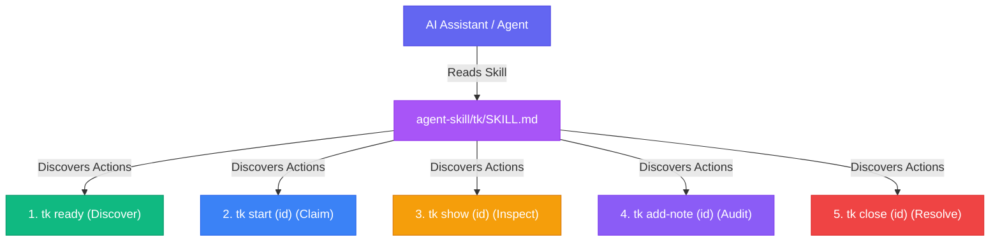

`ticket` provides an **Agent Skill** (`agent-skill/tk/SKILL.md`) that equips AI coding assistants with `tk` task management and DAG dependency intelligence.

---

## Overview

The agent skill instructs AI agents on:
- **Autonomous Execution**: Following the 5-step lifecycle (`tk ready` -> `tk start` -> `tk show` -> `tk add-note` -> `tk close`).
- **Dependency Awareness**: Managing parent-child tasks and blockers.
- **Review Audits**: Logging clear timestamped notes.

---

## Installation

Inspect the skill definition or install it locally, or install directly via `npx`:

```bash
# Inspect the skill definition
tk agent-skill

# Install to ~/.agents/skills/tk/SKILL.md using tk CLI
tk agent-skill --install

# Or install directly via npx without cloning
npx github:msampathkumar/ticket agent-skill --install
```

This installs the skill definition to `~/.agents/skills/tk/SKILL.md` where agents can discover and use it.

---

## Architecture Flow


