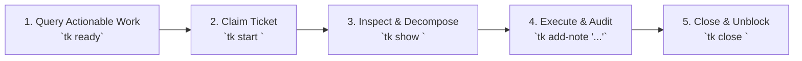

When operating inside repositories tracked by `ticket`, autonomous AI coding agents follow a deterministic 5-step execution loop:

---

### The 5-Step Loop

1. **Discover Actionable Tasks**:
   Run `tk ready` to list unblocked tickets whose dependencies have all been satisfied.
2. **Claim the Task**:
   Run `tk start <id>` to transition status to `in_progress`.
3. **Inspect Requirements & Subtasks**:
   Run `tk show <id>` to inspect design notes, acceptance criteria, and child tickets. Decompose complex tasks using `tk create "<title>" --parent <id>` and `tk dep <child> <dependency>`.
4. **Implement, Verify & Record Notes**:
   Execute code changes, run tests (`make test`), and append review audit notes via `tk add-note <id> "..."`.
5. **Close the Ticket**:
   Run `tk close <id>` to mark complete and automatically unblock downstream dependent tickets.
