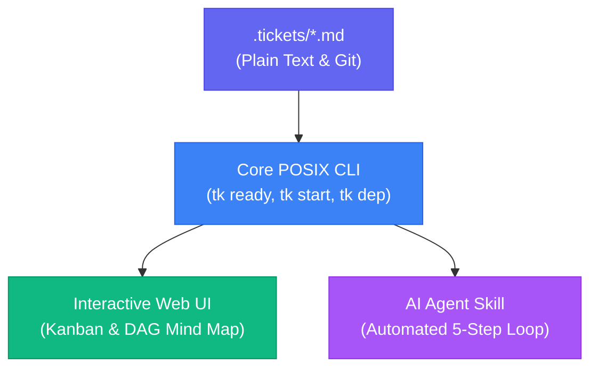

#  ticket (tk)

> Minimal, dependency-aware task tracker. Built to scale agentic workflows.

---

## Terminal Demo


---

## Architecture & Workflow



---

## Key Features

- **Plain Text Storage**: Tasks reside in `.tickets/*.md` files with YAML frontmatter, versioned directly in Git alongside codebase.
- **DAG Dependency Tracking**: Native support for parent-child hierarchies, blockers, cycle detection, and automated downstream unblocking.
- **Fast POSIX Core**: Core CLI runs on portable POSIX Bash with zero mandatory runtime dependencies (no Python or Node required for base operations).
- **AI Agent Integration**: Deterministic 5-step operational loop, reusable agent skill (`agent-skill/tk/SKILL.md`), and machine-readable context endpoints.

---

## Official Plugins

Extend `ticket` with modular plugins discovered automatically via `$PATH`:

- **[Web UI (`tk webui`)](plugins/webui.md)**: Interactive 4-lane Kanban board, DAG Mind Map graph, table view, and background daemon manager.
- **[GitHub Sync (`tk github`)](plugins/github.md)**: Bi-directional synchronization between local markdown tickets and GitHub issues/pull requests.
- **[SCION Task Force (`tk scion-taskforce`)](plugins/scion-taskforce.md)**: Autonomous multi-agent worker orchestration daemon with human review checkpoints.

Learn how to write custom plugins in pure Bash or Python in the [Plugin Architecture Guide](plugins/architecture.md).

---

## Quick Installation

Install the zero-dependency Bash CLI or the full suite with the interactive Web UI:

```bash
git clone https://github.com/msampathkumar/ticket.git
cd ticket

# Full Suite (CLI + Web UI + Agent Skill) — default
./install.sh --full

# Core CLI Only (Pure Bash, zero Python dependencies)
./install.sh --core
```

---

## Install Agent Skill via NPX

Install the agent skill for your AI coding assistant without cloning the repo:

```bash
npx github:msampathkumar/ticket agent-skill --install
```

---

## Machine-Readable Agent Documentation (llms.txt)

- [`/llms.txt`](llms.txt): Structured table of contents linking directly to all Markdown documentation files.
- [`/llms-full.txt`](llms-full.txt): Consolidated single-file documentation reference combining all specifications into one payload.
