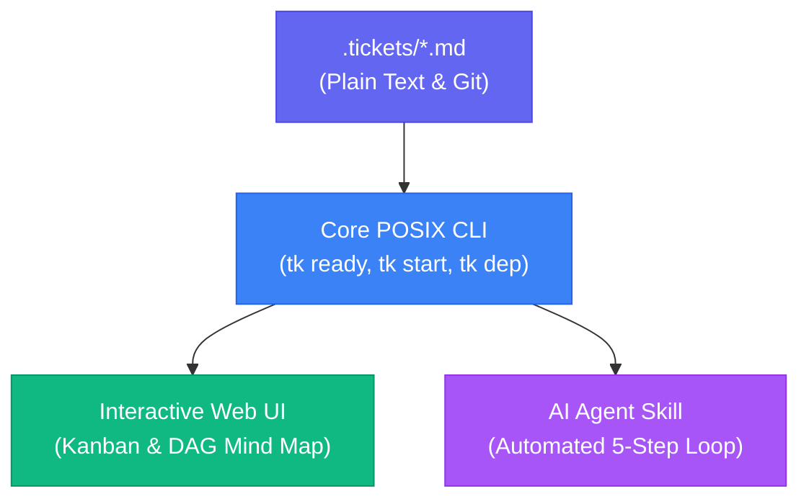

#  ticket (tk)

> **Minimal, offline task tracker with DAG dependency intelligence.**  
> Built with :heart: for both **human developers** and **autonomous AI coding agents**.

---

## 🎯 Architecture & Visual Workflow



---

## 💡 Key Highlights

- **Zero Database / Pure Plain Text**: State resides in `.tickets/*.md` files with YAML frontmatter, versioned by Git.
- **DAG Dependency Tracking**: Native support for parent-child hierarchies, blockers, cycle detection, and automated downstream unblocking.
- **Unix Speed**: Core CLI runs on portable POSIX Bash with zero mandatory runtime dependencies (no Python or Node required for base CLI).
- **Built for AI Agents First**: Deterministic 5-step agent execution loop, built-in agent skill (`agent-skill/tk/SKILL.md`), and machine-readable `llms.txt` endpoints.

---

## ⚡ Quick Installation

Install the zero-dependency Bash CLI or the full suite with the interactive Web UI:

```bash
git clone https://github.com/msampathkumar/ticket.git
cd ticket

# Full Suite (CLI + Web UI + Agent Skill) — default
./install.sh --full

# Core CLI Only (Pure Bash, zero Python dependencies)
./install.sh --core
```

---

## 🤖 Install Agent Skill via NPX

Equip your AI coding assistant with the `tk` skill in a single command without cloning:

```bash
npx github:msampathkumar/ticket agent-skill --install
```

---

## 🧭 Machine-Readable Agent Docs (`llms.txt`)

As part of our commitment to being super agent-friendly:
- [`/llms.txt`](llms.txt): Structured table of contents linking directly to all markdown documentation files.
- [`/llms-full.txt`](llms-full.txt): Consolidated single-file documentation reference combining all specifications into one payload.
