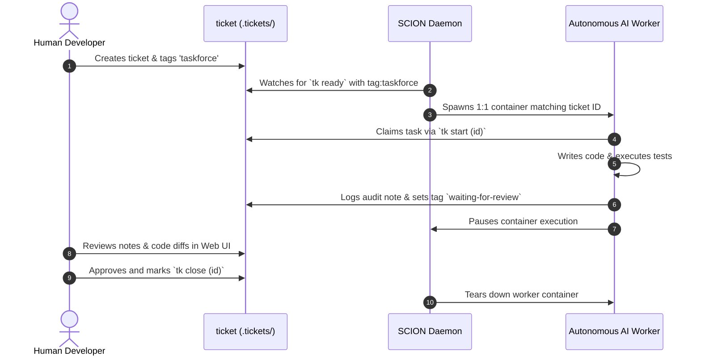

The **SCION Task Force** (`tk-scion-taskforce`) is an optional standalone orchestrator plugin that manages autonomous coding workers mapped 1:1 to tickets.

---

## Prerequisites

Before running the SCION Task Force daemon, ensure your system meets the following requirements:

### 1. Python 3.9+
Required for the daemon runtime and OpenTelemetry logging.

### 2. SCION CLI (`scion`)
Must be installed and available in your `$PATH` ([GoogleCloudPlatform/scion](https://github.com/GoogleCloudPlatform/scion)):

```bash
scion --version
```

### 3. Container Runtime
A running container daemon: **Docker** or **Podman**. SCION uses containers to isolate each autonomous coding agent.

### 4. Project Initialization
Each repository monitored by the task force must be initialized with SCION:

```bash
cd /path/to/project
scion init
```

### 5. Opt-in Tag
The daemon only claims tickets explicitly tagged with `taskforce`. Human engineers maintain full control over which tasks are delegated.

---

## Installation

Install the plugin via the modular installer:

```bash
./install.sh --scion-taskforce
```

This installs `tk-scion-taskforce` to `~/.local/bin/` and sets up the isolated Python virtual environment.

---

## How It Works



1. **Singleton Daemon**: A single background daemon (`~/.local/state/tk/scion-taskforce.json`) watches `.tickets/` directories across all registered projects.
2. **1:1 Worker Mapping**: When a ticket becomes `ready` with the `taskforce` tag, a dedicated worker container is spawned named after the ticket ID.
3. **Review Pause**: The worker executes the task, passes local tests, logs findings with `tk add-note`, and automatically pauses on `waiting-for-review`.
4. **Human Verification**: Human engineers review the output in the Web UI and close the ticket, which automatically cleans up the worker.

---

## Daemon Commands

```bash
# Start background daemon for current project
tk scion-taskforce start

# Inspect running daemon, registered projects, and active worker pool
tk scion-taskforce status

# Stop background daemon
tk scion-taskforce stop

# Attach to an active worker session for interactive debugging
tk scion-taskforce attach <ticket-id>
```

Local rotating logs and OpenTelemetry traces are stored at `~/.local/state/tk/scion-taskforce/logs/` and `.tickets/.scion-taskforce-logs/`.

---

## Configuration & State

- **Singleton Registry**: Host-wide daemon state is tracked at `~/.local/state/tk/scion-taskforce.json` (registers active projects, workers, and PID).
- **Dynamic Registration**: Running `tk scion-taskforce start [path]` registers any target directory into the running singleton watchlist without spawning duplicate daemons.
- **Tag Policies**:
  - `taskforce`: Opt-in tag required for worker execution.
  - `no-taskforce`: Explicit override tag to ignore a task.
  - `waiting-for-review`: Automated checkpoint tag applied upon test pass.
- **Telemetry & Logs**: Global daemon logs and OTel traces are stored at `~/.local/state/tk/scion-taskforce/logs/` (30-day retention with local rotation), with per-project symlinks at `.tickets/.scion-taskforce-logs/`.
- **Worker Retention**: Completed worker containers are automatically cleaned up after 5 days.
