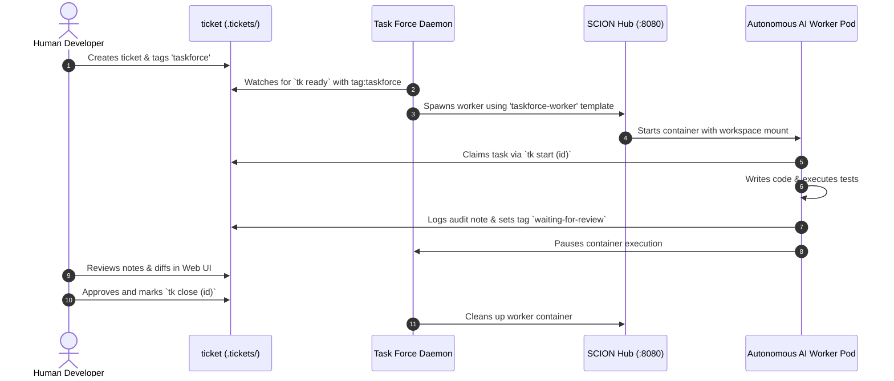

The **SCION Task Force** (`tk-scion-taskforce`) is an optional standalone orchestrator plugin that manages autonomous coding workers mapped 1:1 to tickets.

It wraps directly on top of the native **SCION Hub** (`http://127.0.0.1:8080`) rather than running a parallel conflicting daemon, bridging `tk` dependency DAGs with isolated containerized agent execution.

---

## Prerequisites

Before running the SCION Task Force daemon, ensure your system meets the following requirements:

1. **Python 3.9+**: Required for the task force CLI and OpenTelemetry logging.
2. **SCION CLI (`scion`)**: Must be installed and available in your `$PATH` ([GoogleCloudPlatform/scion](https://github.com/GoogleCloudPlatform/scion)):
    ```bash
    scion --version
    ```
3. **Container Runtime**: A running container daemon (**Podman** or **Docker**). SCION uses containers to isolate each autonomous coding agent.
4. **Google Cloud ADC (Optional for Vertex AI models)**: If using Claude or Gemini models via Google Cloud Vertex AI Model Garden:
    ```bash
    gcloud auth application-default login
    ```
5. **Project Initialization**: Initialize taskforce configuration and worker templates in each monitored repository:
    ```bash
    tk scion-taskforce init
    ```
6. **Opt-in Tag**: The taskforce only claims tickets explicitly tagged with `taskforce`. Human engineers maintain full control over which tasks are delegated.

---

## Installation

Install the plugin via the modular installer:

```bash
./install.sh --scion-taskforce
```

This installs `tk-scion-taskforce` to `~/.local/bin/`. Ensure `~/.local/bin` is in your `$PATH`.

---

## Setup & Verification

### 1. Interactive Setup Wizard (`tk scion-taskforce init`)

Run the setup wizard in your repository to configure the project orchestrator and seed the worker template:

```bash
# Interactive setup with guided prompts and defaults
tk scion-taskforce init

# Or non-interactive setup with production defaults
tk scion-taskforce init --defaults

# Force overwrite existing templates
tk scion-taskforce init --force
```

The setup wizard configures:
- **SCION Harness Engine**: Defaults to `claude` (Claude Code) or `opencode`.
- **Model**: Default model ID or alias (blank for Model Garden Claude Sonnet via Vertex AI).
- **Google Cloud Settings**: Automatically detects active `gcloud` project ID and sets default region (`us-east5` for Vertex AI Anthropic models).
- **Project Template**: Seeds `.scion/templates/taskforce-worker/` with `scion-agent.yaml`, `agents.md`, and `system-prompt.md`.
- **Project Configuration**: Generates `.scion-taskforce/scion-taskforce.yaml` and `.scion-taskforce/prompt.md`.

### 2. End-to-End Test Worker (`tk scion-taskforce test`)

Verify your SCION Hub connection, container permissions, and model authentication with a real test run:

```bash
# Run standard test worker
tk scion-taskforce test

# Or run with a custom test prompt
tk scion-taskforce test --prompt "Create a hello.txt file and exit"
```

The test runner:
1. Provisions an isolated test worker through the SCION Hub (`http://127.0.0.1:8080`).
2. Automatically accepts container workspace trust prompts.
3. Watches the agent write `poem.md` (default: 4-line poem about the latest Google Gemini model).
4. Verifies the generated file in the local workspace.
5. Cleans up the test worker container and temporary test artifacts.

---

## How It Works



1. **SCION Hub Wrapper**: The task force bridges `tk` tickets to the SCION daemon/Hub running on `http://127.0.0.1:8080`.
2. **1:1 Worker Mapping**: When a ticket becomes `ready` with the `taskforce` tag, a dedicated worker container is spawned named after the ticket ID.
3. **Workspace Isolation**: Workers execute inside containers mounting the repository checkout, with branch isolation per ticket.
4. **Review Pause**: The worker passes tests, logs findings with `tk add-note`, and pauses on `waiting-for-review`.
5. **Feedback Loop**: Engineers can send review feedback using `tk scion-taskforce feedback <id> "..."` which wakes the paused worker with your comments.
6. **Human Verification**: Human engineers review output in the Web UI and close the ticket, triggering pod garbage collection.

---

## Command Reference

| Command | Description |
| :--- | :--- |
| `tk scion-taskforce init [--defaults] [--force]` | Initialize project configuration and worker templates |
| `tk scion-taskforce test [--prompt "<text>"]` | Run end-to-end test worker to verify SCION Hub & LLM credentials |
| `tk scion-taskforce start [dir]` | Start task force for project (boots global daemon if not running) |
| `tk scion-taskforce status` | Inspect daemon status, watched projects, and active workers |
| `tk scion-taskforce stop [dir] \| --all` | Stop task force for one project or terminate global daemon (`--all`) |
| `tk scion-taskforce dispatch [<id>]` | Claim and spawn worker for `<id>` or all ready tickets |
| `tk scion-taskforce feedback <id> "<msg>"` | Add review feedback, remove `waiting-for-review`, and wake worker |
| `tk scion-taskforce attach <id>` | Attach interactively to worker terminal session |
| `tk scion-taskforce pause <id>` | Manually pause worker container |
| `tk scion-taskforce logs [<id>]` | View OpenTelemetry daemon or worker logs (including rotated `.gz`) |
| `tk scion-taskforce brief <id>` | Inspect generated worker brief for a ticket |
| `tk scion-taskforce trace [<id>]` | Inspect OpenTelemetry trace spans |
| `tk scion-taskforce gc [--force]` | Run 5-day closed pod garbage collection and 30-day log cleanup |
| `tk scion-taskforce project list` | List all registered project directories |

---

## Configuration (`scion-taskforce.yaml`)

Configuration resides in `.scion-taskforce/scion-taskforce.yaml` (project overrides) or `~/.config/tk/scion-taskforce.yaml` (global defaults):

```yaml
version: 1

tags:
  claim: taskforce                # Opt-in tag required to trigger task force
  ignore: no-taskforce            # Safety override to skip tickets
  review: waiting-for-review      # Tag added by worker when pausing for review

watcher:
  poll_interval_seconds: 15       # Reconcile interval across projects
  max_concurrent: 10              # Maximum workers across all projects
  max_concurrent_per_project: 1   # Max concurrent workers per repository
  gc_retention_days: 5            # Days to retain paused pods after ticket closed
  auto_pause_on_review: true      # Pause pod when waiting-for-review tag is added
  auto_wake_on_feedback: true     # Resume pod when review note is added

provider:
  driver: scion                   # Backend driver
  binary: scion                   # Provider CLI command
  template: taskforce-worker      # SCION template in .scion/templates/
  harness_config: claude          # Harness engine (claude or opencode)
  model: ""                       # Model ID (blank for Vertex AI default)
  extra_start_args: ["--harness-auth", "vertex-ai"]
  auto_accept_prompts: true       # Auto-confirm workspace trust prompts

telemetry:
  enabled: true
  log_dir: ~/.local/state/tk/scion-taskforce/logs
  retention_days: 30              # Retain rotated logs for 30 days
```
