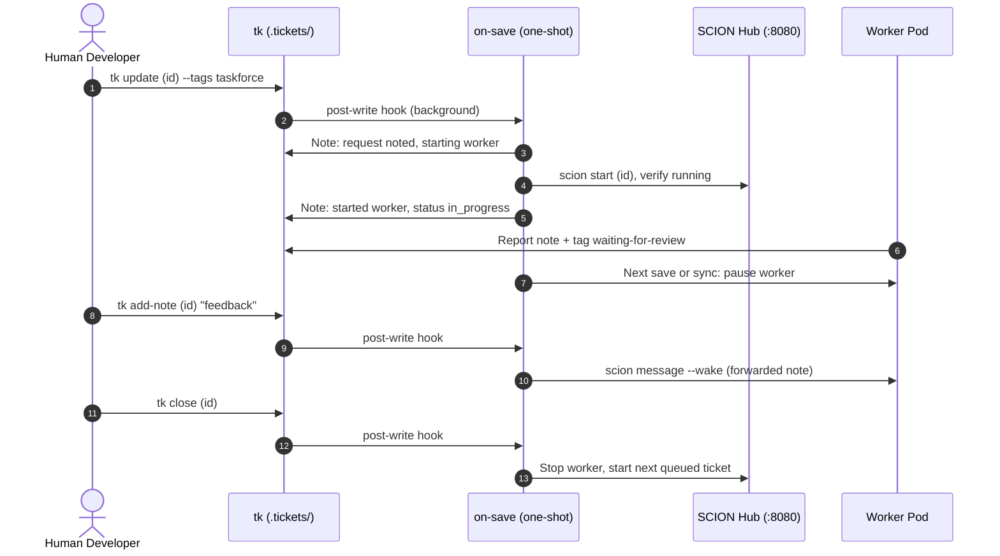

The **SCION Task Force** (`tk-scion-taskforce`) is an optional standalone orchestrator plugin that manages autonomous coding workers mapped 1:1 to tickets.

It is a simple, straightforward integration tool for SCION: it bridges `tk` dependency DAGs with the native `scion` CLI, delegating container provisioning, workspace mounting, and agent lifecycles directly to SCION.

---

## Prerequisites

Before using the SCION Task Force, ensure your system meets the following requirements:

1. **Python 3.9+**: Required for the task force CLI and OpenTelemetry logging.
2. **SCION CLI (`scion`)**: Must be installed and available in your `$PATH` ([GoogleCloudPlatform/scion](https://github.com/GoogleCloudPlatform/scion)):
    ```bash
    scion --version
    ```
3. **Container Runtime**: A running container daemon (**Podman** or **Docker**). SCION uses containers to isolate each autonomous coding agent.
4. **Google Cloud ADC (Optional for Vertex AI models)**: If using Claude or Gemini models via Google Cloud Vertex AI Model Garden:
    ```bash
    gcloud auth application-default login
    ```
5. **Project Initialization**: Initialize taskforce configuration and worker templates in each monitored repository:
    ```bash
    tk scion-taskforce init
    ```
6. **Opt-in Tag**: The taskforce only claims tickets explicitly tagged with `taskforce`. Human engineers maintain full control over which tasks are delegated.

---

## Installation

Install the plugin via the modular installer:

```bash
./install.sh --scion-taskforce
```

This installs `tk-scion-taskforce` to `~/.local/bin/`. Ensure `~/.local/bin` is in your `$PATH`.

---

## Setup & Verification

### 1. Interactive Setup Wizard (`tk scion-taskforce init`)

Run the setup wizard in your repository to configure the project orchestrator and seed the worker template:

```bash
tk scion-taskforce init                 # wizard when run in a terminal
tk scion-taskforce init --defaults      # no questions; detected harness, blank model, shell's GCP env
tk scion-taskforce init --interactive   # force the wizard (e.g. piped input)
tk scion-taskforce init --force         # overwrite instead of archiving old config as *.old
```

**Pre-flight.** `init` runs `tk init` when `.tickets/` is missing and `scion init` when `.scion/` is missing, so one command sets up a fresh repository.

**Wizard.** Each question is a numbered menu. Press Enter for the default (`*`), pick a number, or choose `Other` to type a value. Invalid input is re-asked; `q` quits without changing anything. A summary is confirmed before anything is written.

| # | Question | Options | Validation |
|---|----------|---------|------------|
| 1 | Harness | From `scion harness-config list`; default `gemini-cli` (the worker template's pairing), else Scion's `default_harness_config` | Must be installed |
| 2 | Model | Harness aliases (`small`, `medium`, `large`, …) with resolved IDs, or the harness default. `opencode` also lists `google-vertex/` Gemini IDs and defaults to one: its own default picks a non-Vertex model | No quotes or backslashes |
| 3 | Google Cloud project | Detected from `GOOGLE_CLOUD_PROJECT` or `gcloud`. Skipped for `gemini-cli` | Project ID format |
| 4 | Vertex AI location | `europe-west3` (Frankfurt, default), `global`, `eu`, `europe-west4`, `us-central1`, `us-east5`. Skipped for `gemini-cli` | Google Cloud location; AWS-style names like `eu-central1` are rejected with a hint |
| 5 | Opt-in tag | `taskforce` | Letters, digits, `-_.` |
| 6 | Max concurrent workers | 1 (recommended), 2, 3 | 1–10 |

**Auth follows the harness.** `gemini-cli` gets `--harness-auth api-key` and reads `GEMINI_API_KEY` from Scion secrets (`scion hub secret list --scope=hub`). Other harnesses get `--harness-auth vertex-ai`; the project and location are saved as `provider.gcp_project` / `provider.gcp_region` and passed to every `scion start` as `GOOGLE_CLOUD_PROJECT` / `GOOGLE_CLOUD_REGION` (they override the shell).

**Standard worker template.** `init` seeds `.scion/templates/tk-worker-gemini-cli-with-api-key-auth/`, modelled on a hand-made Scion agent that ran successfully with `gemini-cli`, API-key auth and `gemini-3.5-flash` (the `medium` alias):

| File | Content |
|------|---------|
| `scion-agent.yaml` | `schema_version`, `description`, `agent_instructions`, `system_prompt`. No `harness`/`harness_config`: Scion's template rules reserve those for the launch config |
| `agents.md` | Own one ticket; smallest verified change; report via a ticket note plus the review tag; commit on the ticket branch only |
| `system-prompt.md` | Careful senior engineer persona |

`init` also writes `.scion-taskforce/scion-taskforce.yaml` and `prompt.md`. Projects set up earlier keep `taskforce-worker` until you re-run `init`; `uninit` removes both template folders.

### 2. End-to-End Check (`tk scion-taskforce test`)

`init` offers to run this when it finishes. It verifies the whole pipeline with a real ticket instead of a side channel:

```bash
tk scion-taskforce test                  # ticket-based check (default timeout 600 s)
tk scion-taskforce test --keep           # leave the check ticket open afterwards
tk scion-taskforce test --raw            # old check: launch a worker directly, no ticket or hook
```

1. Creates a ticket tagged `init` and `taskforce` that asks the worker to report its harness, model, branch and `ls`, change nothing, and add the review tag.
2. The save hook dispatches it: status notes, a Scion worker with the project template.
3. Prints each new ticket note while it waits, merging the worker's report back every 10 s.
4. Succeeds when the review tag arrives, then closes the ticket, which stops the worker. The ticket keeps the report.

It fails fast if dispatch fails, and stops at the timeout with `attach`/`logs` hints. In both cases the ticket stays open for inspection. If another worker holds the project's only slot, the check waits in the queue.

---

## How It Works

The task force is event-driven. `tk scion-taskforce init` installs a `tk` post-write hook at `.tickets/.hooks/post-write.d/scion-taskforce`. Every successful ticket write (`create`, `update`, `add-note`, `start`, `close`, …, from the CLI or the Web UI) runs `tk scion-taskforce on-save <id>` in the background.



| On save of a ticket… | `on-save` does |
| :--- | :--- |
| tagged `taskforce`, `open`, deps closed, no worker | Note "request noted", start a verified Scion worker, set `in_progress` |
| tagged, but all worker slots busy | Note "queued (N of N workers busy)"; starts when a slot frees |
| tagged, deps still open | Note "waiting on dependencies: …"; starts when the blocker closes |
| with an active worker, after `tk add-note` by a human | Forward the note to the worker (`scion message --wake`) |
| whose worker added `waiting-for-review` | Pause the worker, free its slot, start the next queued ticket |
| closed | Stop its worker (`scion stop`), then start the next queued ticket |
| with a worker, after `taskforce` is removed or `no-taskforce` added | Stop and delete the worker (branch kept); note it on the ticket |
| deleted (file removed; seen on the next save or `sync`) | Stop and delete its worker (branch kept), free its slot |
| not tagged | Nothing |

Notes are written straight to the ticket file with a `**Task Force:**` prefix, so they never re-trigger the hook and are never forwarded to workers. A per-project lock prevents two quick saves from starting two workers.

**Catching up.** Saves that bypass `tk` (hand edits, `git pull`, a worker editing the file or its isolated worktree) fire no hook. Run `tk scion-taskforce sync` to merge worker reports, pause reviewed workers, flag workers whose pods died, and start queued tickets.

1. **One Hub Project per Folder**: `init` links the project folder to the Hub once (`scion hub link`). Dispatch never creates Hub projects; an unlinked folder fails preflight with a hint.
2. **1:1 Worker Mapping**: Each ticket gets its own worker in that folder's Hub project, named after the ticket ID, on a branch named after the ticket ID.
3. **Human Verification**: Workers never close tickets. Humans review in the Web UI and run `tk close`, which stops the worker.

---

## Command Reference

| Command | Description |
| :--- | :--- |
| `tk scion-taskforce init [--defaults\|--interactive] [--force]` | Run `tk init`/`scion init` if needed, then the setup wizard: config, worker template, Hub link, save hook |
| `tk scion-taskforce hook install\|uninstall\|status` | Manage the `tk` post-write hook for this project |
| `tk scion-taskforce on-save <id> [--event <e>]` | Handle one ticket save (called by the hook) |
| `tk scion-taskforce sync [dir]` | Catch up on saves the hook missed; flag dead workers; start queued tickets |
| `tk scion-taskforce test [--timeout <s>] [--keep] [--raw]` | End-to-end check: ticket tagged `init`+`taskforce`, wait for its worker to report back, then close it |
| `tk scion-taskforce dispatch <id>` | Start a verified worker for one opted-in ticket now |
| `tk scion-taskforce status` | Save hook, provider health and workers for this project |
| `tk scion-taskforce list` | All tracked workers across projects |
| `tk scion-taskforce feedback <id> "<msg>"` | Wake the ticket's active worker with a review note, then remove `waiting-for-review` |
| `tk scion-taskforce attach <id>` | Attach interactively to worker terminal session |
| `tk scion-taskforce pause <id>` | Manually pause worker container |
| `tk scion-taskforce logs [<id>]` | View OpenTelemetry logs (including rotated `.gz`) |
| `tk scion-taskforce brief <id>` | Inspect generated worker brief for a ticket |
| `tk scion-taskforce trace [<id>]` | Inspect OpenTelemetry trace spans |
| `tk scion-taskforce gc [--force]` | Run 5-day closed pod garbage collection and 30-day log cleanup |

The old daemon commands (`start`, `stop`, `server`, `watch`, `project`) were removed; running one prints what to use instead. `sync` warns when the save hook is missing.

The hook's output is appended to `.tickets/.hooks/hooks.log` (git-ignored). Set `TK_NO_HOOKS=1` to skip hooks for one `tk` call.

---

## Configuration (`scion-taskforce.yaml`)

Configuration resides in `.scion-taskforce/scion-taskforce.yaml` (project overrides) or `~/.config/tk/scion-taskforce.yaml` (global defaults):

```yaml
version: 1

tags:
  claim: taskforce                # Opt-in tag required to trigger task force
  ignore: no-taskforce            # Safety override to skip tickets
  review: waiting-for-review      # Tag added by worker when pausing for review

watcher:
  max_concurrent: 10              # Maximum workers across all projects
  max_concurrent_per_project: 1   # Max concurrent workers per repository
  gc_retention_days: 5            # Days to retain paused pods after ticket closed

provider:
  driver: scion                   # Backend driver
  binary: scion                   # Provider CLI command
  template: tk-worker-gemini-cli-with-api-key-auth      # SCION template in .scion/templates/
  harness_config: gemini-cli      # Scion harness-config (`scion harness-config list`)
  model: medium                   # Model ID or Scion alias; blank = harness default
  gcp_project: my-project         # Vertex AI project; blank = inherit GOOGLE_CLOUD_PROJECT
  gcp_region: europe-west3        # Vertex AI location; blank = shell env or harness fallback
  extra_start_args: ["--harness-auth", "api-key"]  # init: api-key for gemini-cli, vertex-ai otherwise
  auto_accept_prompts: true       # Auto-confirm workspace trust prompts

telemetry:
  enabled: true
  log_dir: ~/.local/state/tk/scion-taskforce/logs
  retention_days: 30              # Retain rotated logs for 30 days
```
