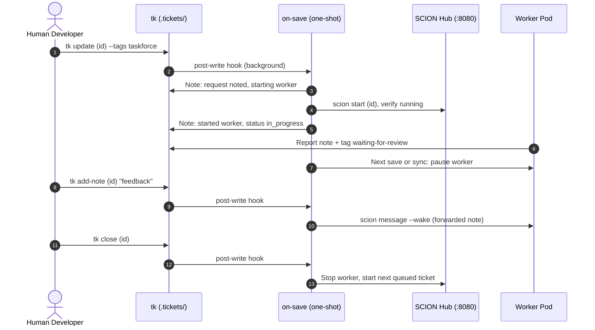

The **SCION Task Force** (`tk-scion-taskforce`) is an optional standalone orchestrator plugin that manages autonomous coding workers mapped 1:1 to tickets.

It is a simple, straightforward integration tool for SCION: it bridges `tk` dependency DAGs with the native `scion` CLI, delegating container provisioning, workspace mounting, and agent lifecycles directly to SCION.

---

## Prerequisites

Before using the SCION Task Force, ensure your system meets the following requirements:

1. **Python 3.9+**: Required for the task force CLI and OpenTelemetry logging.
2. **SCION CLI (`scion`)**: Must be installed and available in your `$PATH` ([GoogleCloudPlatform/scion](https://github.com/GoogleCloudPlatform/scion)):
    ```bash
    scion --version
    ```
3. **Container Runtime**: A running container daemon (**Podman** or **Docker**). SCION uses containers to isolate each autonomous coding agent.
4. **Google Cloud ADC (Optional for Vertex AI models)**: If using Claude or Gemini models via Google Cloud Vertex AI Model Garden:
    ```bash
    gcloud auth application-default login
    ```
5. **Project Initialization**: Initialize taskforce configuration and worker templates in each monitored repository:
    ```bash
    tk scion-taskforce init
    ```
6. **Opt-in Tag**: The taskforce only claims tickets explicitly tagged with `taskforce`. Human engineers maintain full control over which tasks are delegated.

---

## Installation

Install the plugin via the modular installer:

```bash
./install.sh --scion-taskforce
```

This installs `tk-scion-taskforce` to `~/.local/bin/`. Ensure `~/.local/bin` is in your `$PATH`.

---

## Setup & Verification

### 1. Interactive Setup Wizard (`tk scion-taskforce init`)

Run the setup wizard in your repository to configure the project orchestrator and seed the worker template:

```bash
# Interactive setup with guided prompts and defaults
tk scion-taskforce init

# Or non-interactive setup with production defaults
tk scion-taskforce init --defaults

# Force overwrite existing templates
tk scion-taskforce init --force
```

The setup wizard configures:
- **SCION Harness Engine**: Defaults to `claude` (Claude Code) or `opencode`.
- **Model**: Default model ID or alias (blank for Model Garden Claude Sonnet via Vertex AI).
- **Google Cloud Settings**: Automatically detects active `gcloud` project ID and sets default region (`us-east5` for Vertex AI Anthropic models).
- **Project Template**: Seeds `.scion/templates/taskforce-worker/` with `scion-agent.yaml`, `agents.md`, and `system-prompt.md`.
- **Project Configuration**: Generates `.scion-taskforce/scion-taskforce.yaml` and `.scion-taskforce/prompt.md`.

### 2. End-to-End Test Worker (`tk scion-taskforce test`)

Verify your SCION Hub connection, container permissions, and model authentication with a real test run:

```bash
# Run standard test worker
tk scion-taskforce test

# Or run with a custom test prompt
tk scion-taskforce test --prompt "Create a hello.txt file and exit"
```

The test runner:
1. Provisions an isolated test worker through the SCION Hub (`http://127.0.0.1:8080`).
2. Automatically accepts container workspace trust prompts.
3. Watches the agent write `poem.md` (default: 4-line poem about the latest Google Gemini model).
4. Verifies the generated file in the local workspace.
5. Cleans up the test worker container and temporary test artifacts.

---

## How It Works

The task force is event-driven. `tk scion-taskforce init` installs a `tk` post-write hook at `.tickets/.hooks/post-write.d/scion-taskforce`. Every successful ticket write (`create`, `update`, `add-note`, `start`, `close`, …, from the CLI or the Web UI) runs `tk scion-taskforce on-save <id>` in the background.



| On save of a ticket… | `on-save` does |
| :--- | :--- |
| tagged `taskforce`, `open`, deps closed, no worker | Note "request noted", start a verified Scion worker, set `in_progress` |
| tagged, but all worker slots busy | Note "queued (N of N workers busy)"; starts when a slot frees |
| tagged, deps still open | Note "waiting on dependencies: …"; starts when the blocker closes |
| with an active worker, after `tk add-note` by a human | Forward the note to the worker (`scion message --wake`) |
| whose worker added `waiting-for-review` | Pause the worker, free its slot, start the next queued ticket |
| closed | Stop its worker, then start the next queued ticket |
| not tagged | Nothing |

Notes are written straight to the ticket file with a `**Task Force:**` prefix, so they never re-trigger the hook and are never forwarded to workers. A per-project lock prevents two quick saves from starting two workers.

**Catching up.** Saves that bypass `tk` (hand edits, `git pull`, a worker editing the file or its isolated worktree) fire no hook. Run `tk scion-taskforce sync` to merge worker reports, pause reviewed workers, flag workers whose pods died, and start queued tickets.

1. **One Hub Project per Folder**: `init` links the project folder to the Hub once (`scion hub link`). Dispatch never creates Hub projects; an unlinked folder fails preflight with a hint.
2. **1:1 Worker Mapping**: Each ticket gets its own worker in that folder's Hub project, named after the ticket ID, on a branch named after the ticket ID.
3. **Human Verification**: Workers never close tickets. Humans review in the Web UI and run `tk close`, which stops the worker.

---

## Command Reference

| Command | Description |
| :--- | :--- |
| `tk scion-taskforce init [--defaults] [--force]` | Initialize config and worker template, link the folder to the SCION Hub, install the save hook |
| `tk scion-taskforce hook install\|uninstall\|status` | Manage the `tk` post-write hook for this project |
| `tk scion-taskforce on-save <id> [--event <e>]` | Handle one ticket save (called by the hook) |
| `tk scion-taskforce sync [dir]` | Catch up on saves the hook missed; flag dead workers; start queued tickets |
| `tk scion-taskforce test [--prompt "<text>"]` | Run end-to-end test worker to verify SCION Hub & LLM credentials |
| `tk scion-taskforce dispatch <id>` | Start a verified worker for one opted-in ticket now |
| `tk scion-taskforce status` | Save hook, provider health and workers for this project |
| `tk scion-taskforce list` | All tracked workers across projects |
| `tk scion-taskforce feedback <id> "<msg>"` | Add review feedback, remove `waiting-for-review`, and wake worker |
| `tk scion-taskforce attach <id>` | Attach interactively to worker terminal session |
| `tk scion-taskforce pause <id>` | Manually pause worker container |
| `tk scion-taskforce logs [<id>]` | View OpenTelemetry logs (including rotated `.gz`) |
| `tk scion-taskforce brief <id>` | Inspect generated worker brief for a ticket |
| `tk scion-taskforce trace [<id>]` | Inspect OpenTelemetry trace spans |
| `tk scion-taskforce gc [--force]` | Run 5-day closed pod garbage collection and 30-day log cleanup |

The old daemon commands (`start`, `stop`, `server`, `watch`, `project`) were removed; running one prints what to use instead. `sync` warns when the save hook is missing.

The hook's output is appended to `.tickets/.hooks/hooks.log` (git-ignored). Set `TK_NO_HOOKS=1` to skip hooks for one `tk` call.

---

## Configuration (`scion-taskforce.yaml`)

Configuration resides in `.scion-taskforce/scion-taskforce.yaml` (project overrides) or `~/.config/tk/scion-taskforce.yaml` (global defaults):

```yaml
version: 1

tags:
  claim: taskforce                # Opt-in tag required to trigger task force
  ignore: no-taskforce            # Safety override to skip tickets
  review: waiting-for-review      # Tag added by worker when pausing for review

watcher:
  max_concurrent: 10              # Maximum workers across all projects
  max_concurrent_per_project: 1   # Max concurrent workers per repository
  gc_retention_days: 5            # Days to retain paused pods after ticket closed

provider:
  driver: scion                   # Backend driver
  binary: scion                   # Provider CLI command
  template: taskforce-worker      # SCION template in .scion/templates/
  harness_config: claude          # Harness engine (claude or opencode)
  model: ""                       # Model ID (blank for Vertex AI default)
  extra_start_args: ["--harness-auth", "vertex-ai"]
  auto_accept_prompts: true       # Auto-confirm workspace trust prompts

telemetry:
  enabled: true
  log_dir: ~/.local/state/tk/scion-taskforce/logs
  retention_days: 30              # Retain rotated logs for 30 days
```
