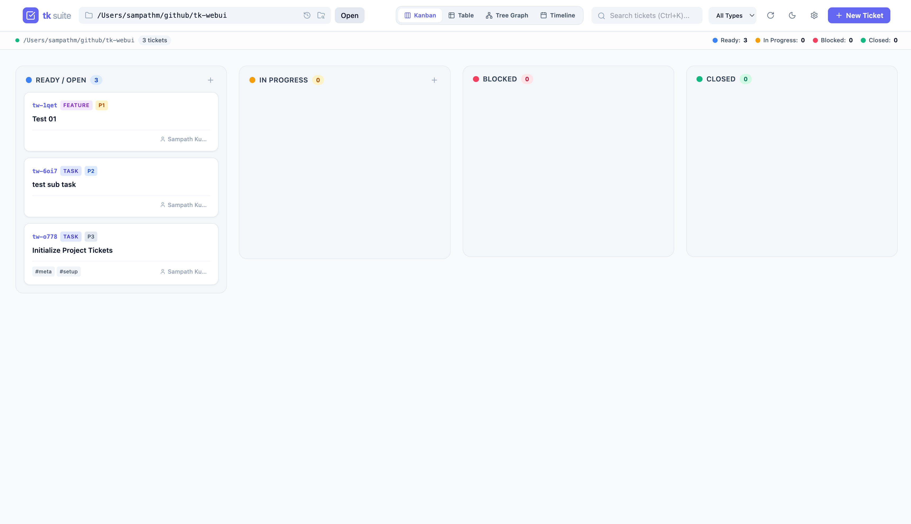
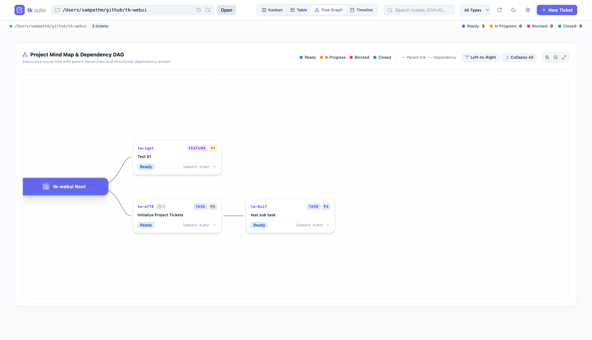
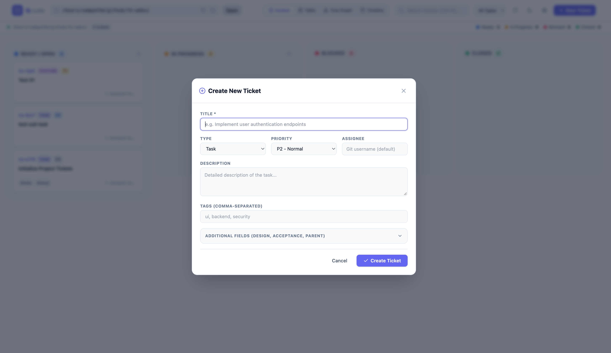
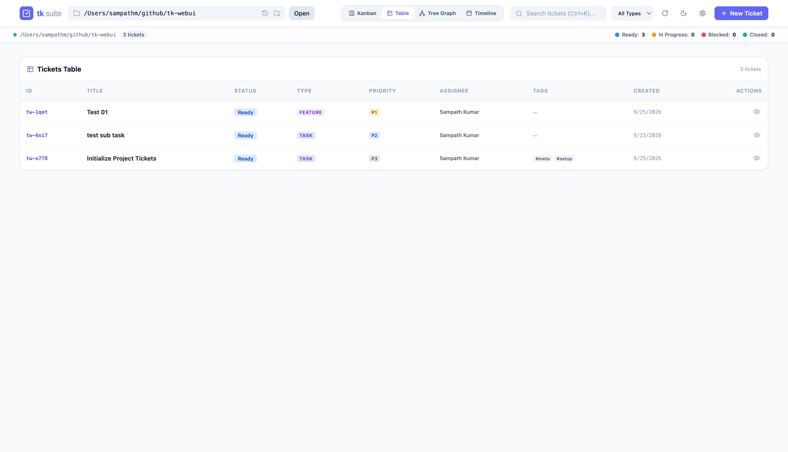

The **Web UI** (`tk-webui`) is an official plugin providing a visual dashboard running on default port **`8475`** (ASCII for **T** = 84, **K** = 75).

---

## Visual Showcase

| 4-Lane Kanban Board | Interactive Dependency Graph |
| :---: | :---: |
|  |  |

| Create & Edit Ticket | Table & Filter View |
| :---: | :---: |
|  |  |

---

## Key Features

- **4-Lane Kanban Board**: Drag-and-drop tasks between Ready, In Progress, Blocked, and Closed lanes.
- **Interactive Mind Map & DAG Graph**: Visualize task dependencies, filter by status, toggle top-down or left-to-right layouts, and expand/collapse subtrees.
- **Multi-View Switcher**: Switch between **Kanban**, **Table View**, **Dependency Tree Graph**, and **Timeline/Gantt View**.
- **In-Place Task Editing**: Edit titles, descriptions, tags, priorities, assignees, design notes, and acceptance criteria directly in the browser.
- **PR-Style Review Comments**: Chronological audit trail for review notes and comments (`Cmd+Enter` to submit).
- **Multi-Project Switcher**: Switch between repositories containing `.tickets/` on your system.

---

## Installation

Install the Web UI plugin via the modular installer:

```bash
# Install Web UI plugin only
./install.sh --webui

# Or install as part of the full default suite (CLI + Web UI + Skill)
./install.sh --full
```

This installs `tk-webui` to `~/.local/bin/`. Ensure `~/.local/bin` is in your `$PATH`.

---

## Server & Daemon Commands

You can run the Web UI as an active foreground process or as a persistent background daemon:

```bash
# Foreground Server
tk webui [optional-project-path]

# Background Daemon Management
tk webui server start [optional-project-path]  # Starts daemon on http://127.0.0.1:8475
tk webui server status                         # Inspect PID, URL, and log path
tk webui server stop                           # Stop daemon
tk webui server restart                        # Restart daemon

# Run locally without installing
./run.sh [optional-project-path]
```

---

## Configuration & State

The Web UI manages its runtime state locally without requiring an external database:

- **Default Port**: **`8475`** (ASCII `T`=84, `K`=75).
- **Default Host**: `127.0.0.1` (localhost).
- **Daemon State File**: `~/.local/state/tk/webui.json` (records daemon PID, bound port, URL, and active project path).
- **Daemon Logs**: `~/.local/state/tk/webui.log` (automatically rotated).
- **Theme Engine**: Defaults to Indigo (`#6366f1`) with light/dark mode support; preferences persist in browser `localStorage`. In light mode, container and card borders use high-contrast slate-300 borders with dynamic brand-color hover transitions.
