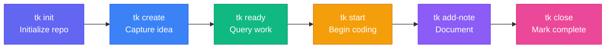

The **Solo CLI Workflow** is designed for software engineers, solo founders, and terminal power users who want rapid, offline task tracking without leaving their shell.

---

## Lifecycle Overview



---

## Step-by-Step Walkthrough

### 1. Initialize Once
Inside your Git project root:
```bash
tk init
```
This creates `.tickets/`. All task metadata is versioned directly with your code.

### 2. Rapid Task Creation
Create tickets on the fly without breaking your flow:
```bash
tk create "Add SQLite caching layer" -p 1 -t feature --tags database,performance
```

### 3. Check Ready Tasks
Instead of scanning endless lists, let `tk` compute what is actionable right now:
```bash
tk ready
```

### 4. Work & Add Notes
Mark your ticket in progress and record design thoughts:
```bash
tk start tic-10a
tk add-note tic-10a "Evaluated in-memory cache vs WAL mode; choosing WAL mode."
```

### 5. Close and Unblock
When complete, close the task:
```bash
tk close tic-10a
```
Any dependent tasks are automatically unblocked and immediately appear in `tk ready`.
