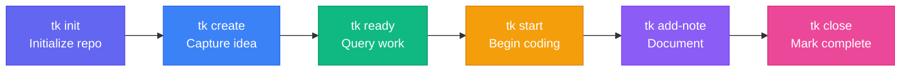

The **Solo CLI Workflow** provides rapid, offline task tracking for individual developers and terminal power users directly in the shell.

---

## Lifecycle Overview



---

## Step-by-Step Walkthrough

### 1. Initialize Once

Inside your Git project root:

```bash
tk init
```

This creates `.tickets/`. All task metadata is versioned directly with your code.

### 2. Rapid Task Creation

Create tasks with priority, type, and tags directly from the shell:

```bash
tk create "Add SQLite caching layer" -p 1 -t feature --tags database,performance
```

### 3. Check Ready Tasks

Query actionable tasks whose dependencies are satisfied:

```bash
tk ready
```

### 4. Work & Add Notes

Mark the task in progress and record design decisions or progress notes:

```bash
tk start tic-10a
tk add-note tic-10a "Evaluated in-memory cache vs WAL mode; choosing WAL mode."
```

### 5. Close and Unblock

When work is complete, close the task:

```bash
tk close tic-10a
```

Any dependent tasks are automatically unblocked and immediately appear in `tk ready`.
