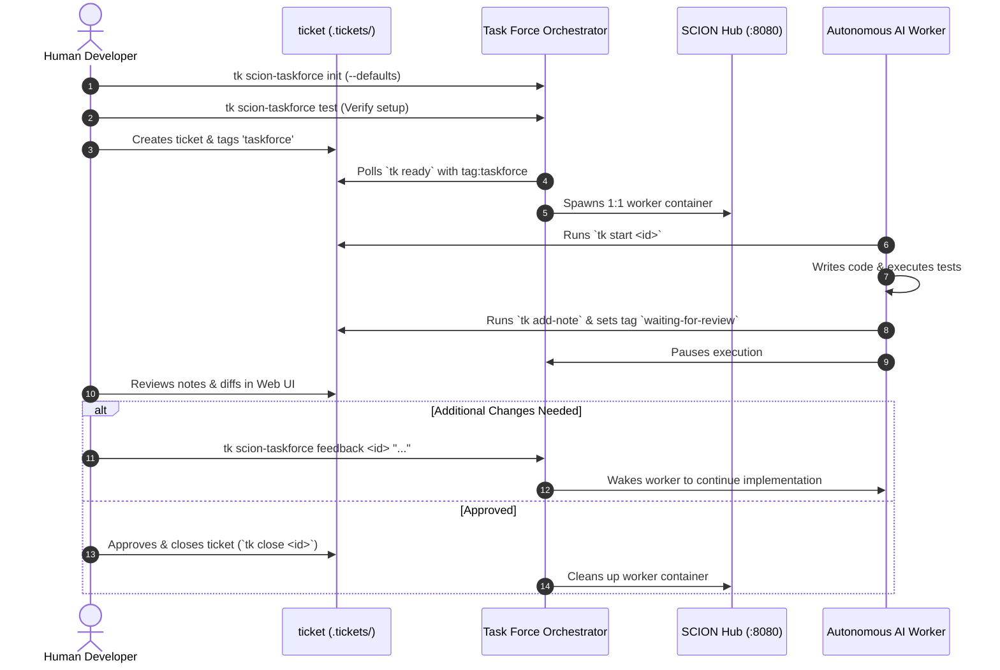

The **SCION Task Force Workflow** allows teams to delegate actionable engineering tasks directly to autonomous coding agents while maintaining oversight through human review checkpoints.

---

## Lifecycle Overview



---

## Step-by-Step Walkthrough

### 1. Initialize Task Force for Your Project

Run the setup wizard to configure orchestrator defaults and seed the project worker template:

```bash
# Guided interactive setup
tk scion-taskforce init

# Or 1-step non-interactive initialization
tk scion-taskforce init --defaults
```

This creates:
- `.scion-taskforce/scion-taskforce.yaml`: Project orchestrator configuration.
- `.scion/templates/taskforce-worker/`: Worker template with custom instructions.

### 2. Verify Hub & Model Credentials

Run the end-to-end verification test before delegating real tasks:

```bash
tk scion-taskforce test
```

This verifies that:
- Your local container runtime and SCION Hub (`http://127.0.0.1:8080`) are active.
- Google Cloud Application Default Credentials (ADC) or API keys are valid.
- The worker can read/write files in the mounted repository workspace.

### 3. Tag Actionable Work for Autonomous Execution

Delegate actionable tickets to autonomous workers by adding the `taskforce` tag:

```bash
tk create "Add input sanitization to auth endpoints" \
  -p 1 \
  --tags backend,taskforce \
  --acceptance "Run make test and ensure all pass"
```

### 4. Background Worker Spawning

Start the task force daemon (or run it in the foreground for live logs):

```bash
# Start background daemon
tk scion-taskforce start

# Check active workers and project status
tk scion-taskforce status
```

When a ticket's dependencies are satisfied (`tk ready`), the task force spawns an isolated container via the SCION Hub, moves the ticket to `in_progress`, and mounts the project directory.

### 5. Review Checkpoint & Feedback

When the worker finishes writing code and passing local tests:

1. It records verification notes via `tk add-note <id> "..."`.
2. It tags the ticket with `waiting-for-review`.
3. The worker container automatically pauses.

Inspect the work in the Web UI (`http://localhost:8475`) or CLI:

```bash
tk show <ticket-id>
```

If modifications are needed, send feedback directly to the paused worker:

```bash
tk scion-taskforce feedback <ticket-id> "Fix the edge case in auth validation"
```

The worker wakes up, reads the feedback, and resumes execution.

### 6. Human Approval & Ticket Closure

Once satisfied with the changes and test results, close the ticket:

```bash
tk close <ticket-id>
```

Closing the ticket automatically unblocks downstream tasks in your dependency DAG and schedules the worker container for cleanup.
