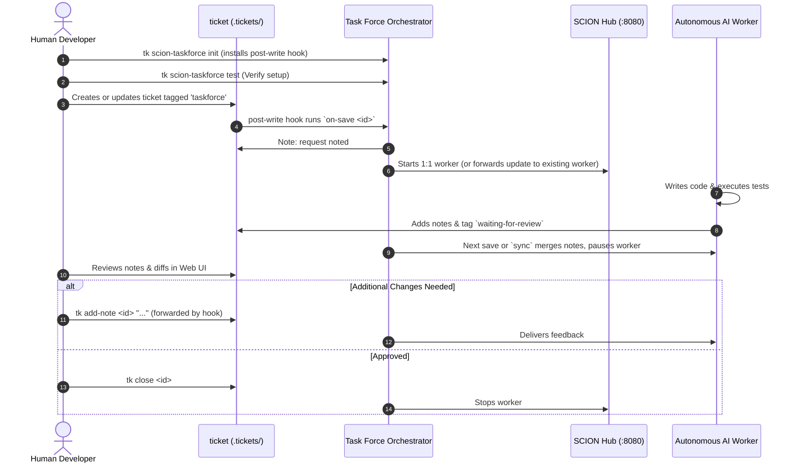

The **SCION Task Force Workflow** allows teams to delegate actionable engineering tasks directly to autonomous coding agents while maintaining oversight through human review checkpoints.

---

## Lifecycle Overview



---

## Step-by-Step Walkthrough

### 1. Initialize Task Force for Your Project

Run the setup wizard to configure orchestrator defaults and seed the project worker template:

```bash
# Guided interactive setup
tk scion-taskforce init

# Or 1-step non-interactive initialization
tk scion-taskforce init --defaults
```

This creates:
- `.scion-taskforce/scion-taskforce.yaml`: Project orchestrator configuration.
- `.scion/templates/taskforce-worker/`: Worker template with custom instructions.
- `.tickets/.hooks/post-write.d/scion-taskforce`: Hook that dispatches on each ticket save.
- A one-time Scion Hub link for the project folder.

### 2. Verify Hub & Model Credentials

Run the end-to-end verification test before delegating real tasks:

```bash
tk scion-taskforce test
```

This verifies that:
- Your local container runtime and SCION Hub (`http://127.0.0.1:8080`) are active.
- Google Cloud Application Default Credentials (ADC) or API keys are valid.
- The worker can read/write files in the mounted repository workspace.

### 3. Tag Actionable Work for Autonomous Execution

Delegate actionable tickets to autonomous workers by adding the `taskforce` tag:

```bash
tk create "Add input sanitization to auth endpoints" \
  -p 1 \
  --tags backend,taskforce \
  --acceptance "Run make test and ensure all pass"
```

### 4. Save-Triggered Dispatch

`init` installs `.tickets/.hooks/post-write.d/scion-taskforce`, which `tk` runs in the background after every successful write (CLI or Web UI). For a ticket tagged `taskforce`, the hook appends a `**Task Force:**` note and then:

| Ticket state | Action |
|--------------|--------|
| Open, dependencies closed, slot free | Starts a Scion worker named after the ticket ID |
| Dependencies still open | Notes "waiting on dependencies" |
| No free slot | Notes "queued"; starts when a slot frees |
| Worker already active, human note added | Forwards the note to the worker |
| Closed | Stops the worker, starts the next queued ticket |

```bash
# Catch up on changes the hook cannot see (hand edits, git pull, worker edits)
tk scion-taskforce sync

# Check workers
tk scion-taskforce list
```

### 5. Review Checkpoint & Feedback

When the worker finishes writing code and passing local tests, it adds verification notes and the `waiting-for-review` tag. The next save or `sync` merges those notes into the project ticket, pauses the worker, and frees its slot.

Inspect the work in the Web UI (`http://localhost:8475`) or CLI:

```bash
tk show <ticket-id>
```

If modifications are needed, add a note. The hook forwards it to the worker:

```bash
tk add-note <ticket-id> "Fix the edge case in auth validation"
```

`tk scion-taskforce feedback <ticket-id> "..."` does the same and also resumes a paused worker.

### 6. Human Approval & Ticket Closure

Once satisfied with the changes and test results, close the ticket:

```bash
tk close <ticket-id>
```

Closing the ticket unblocks downstream tasks in your dependency DAG and stops its worker immediately.
