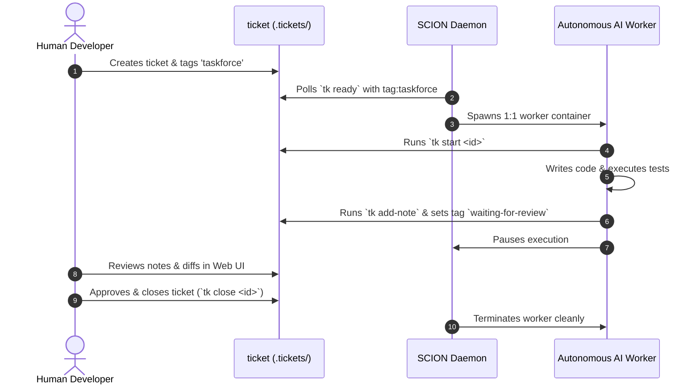

The **SCION Task Force Workflow** empowers teams to delegate actionable engineering tasks directly to autonomous coding agents while maintaining total oversight through human-in-the-loop review checkpoints.

---

## 🧭 Visual Lifecycle



---

## 🛠️ Step-by-Step Walkthrough

### 1. Tag Work for Autonomous Execution
Human engineers explicitly choose which tickets to delegate by adding the `taskforce` tag:
```bash
tk create "Add input sanitization to auth endpoints" \
  -p 1 \
  --tags backend,taskforce \
  --acceptance "Run make test and ensure all pass"
```

### 2. Daemon Worker Spawning
The global SCION daemon notices the ready ticket and provisions an isolated coding worker:
```bash
tk scion-taskforce status
```

### 3. Review Checkpoint
When the worker finishes writing code and passing local tests:
1. It records verification notes via `tk add-note <id> "..."`.
2. It tags the ticket with `waiting-for-review`.
3. The worker pauses execution.

### 4. Human Verification & Closure
The developer opens the Web UI (`http://localhost:8475`), reviews the audit trail and code diff, and closes the ticket:
```bash
tk close tic-auth1
```
Closing the ticket automatically unblocks any downstream tasks in the DAG!
