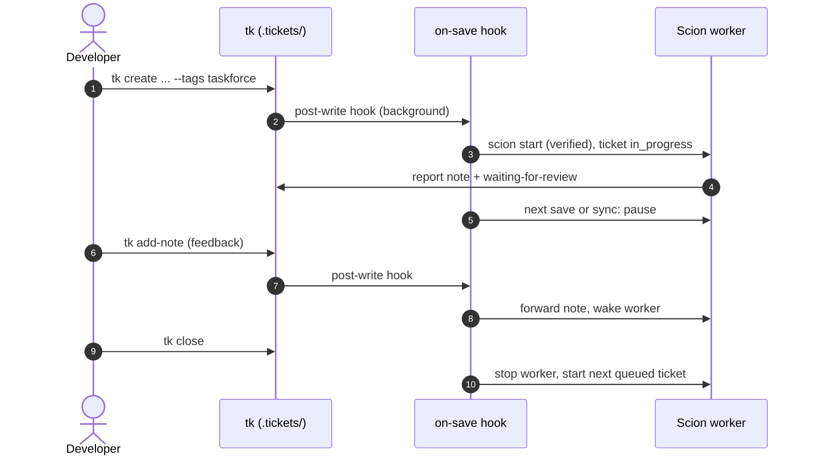

This workflow hands well-scoped tickets to AI coding agents while you keep the review and the merge. Set up the plugin first with the [SCION Task Force guide](../plugins/scion-taskforce.md); it also holds the command reference and troubleshooting.



## 1. Tag the ticket

Write clear acceptance criteria, then add the opt-in tag. The save starts a worker in the project folder. Add `role:<name>` (for example `role:code-reviewer`) to make the worker follow an installed [role skill](../plugins/scion-taskforce.md#role-skills).

```bash
tk create "Add input sanitization to auth endpoints" -p 1 \
  --tags backend,taskforce \
  --acceptance "make test passes; invalid input returns 400"
```

If the ticket has open dependencies, it waits for them. If all worker slots are busy, it queues. Either way, a `**Task Force:**` note on the ticket says why.

## 2. Review the report

The worker leaves its changes in the working tree, adds a report note listing the changed files and tags the ticket `waiting-for-review`. With `worker.git: branch` it commits on a branch named after the ticket instead. The next save in the project, or `tk scion-taskforce sync`, merges the report and pauses the worker. To have reports picked up without saving, keep `tk scion-taskforce watch` running in a spare terminal.

```bash
tk scion-taskforce sync
tk show <id>
git diff            # worker.git: off (in a git repo)
git diff main...<id> # worker.git: branch
```

## 3. Send feedback

Add a note. The hook forwards it to the worker, wakes it and removes `waiting-for-review`.

```bash
tk add-note <id> "Also reject empty usernames"
```

`tk scion-taskforce feedback <id> "..."` does the same in one command. For a live conversation, run `tk scion-taskforce attach <id>`.

## 4. Close the ticket

Commit or merge the changes the usual way, then close the ticket. Closing stops the worker, unblocks dependent tickets and starts the next queued one.

```bash
tk close <id>
```

`tk scion-taskforce gc` deletes the stopped worker 5 days later. A worker branch, if any, is kept.
