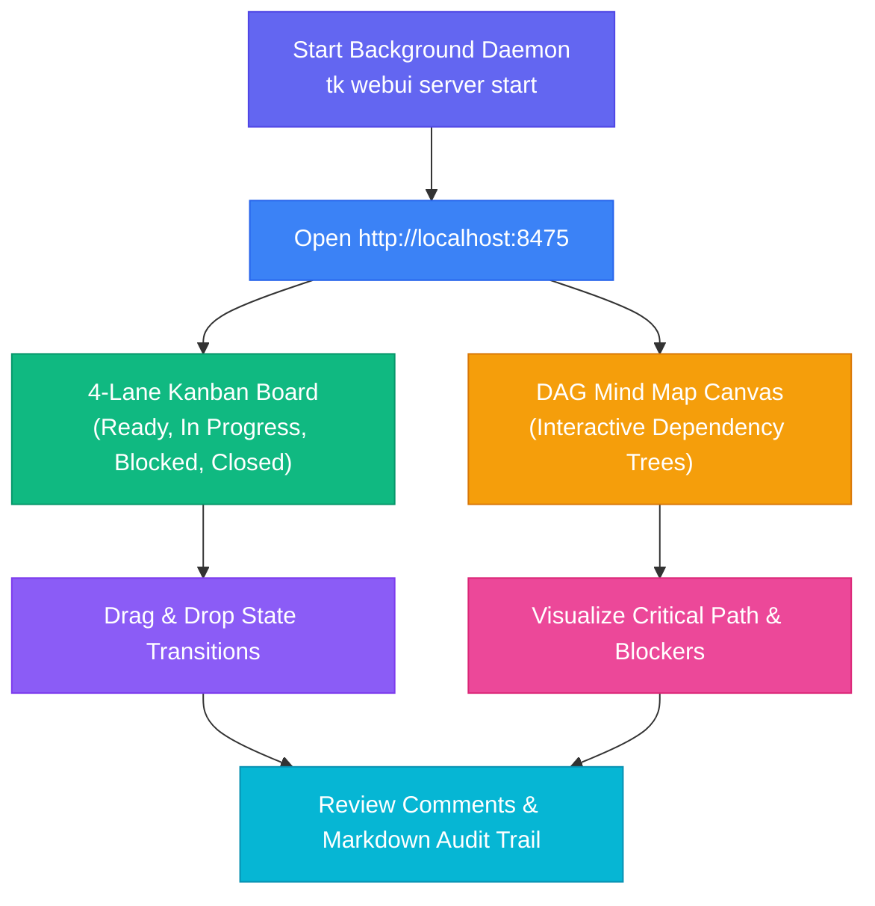

The **Web UI & Kanban Workflow** combines the command-line speed of `tk` with an interactive browser-based dashboard running on port **`8475`**.

---

## Lifecycle Overview



---

## Visual Highlights

| 4-Lane Kanban Board | DAG Mind Map Canvas |
| :---: | :---: |
|  |  |

---

## Step-by-Step Walkthrough

### 1. Launch the Background Daemon
Run the web dashboard persistently in the background:
```bash
tk webui server start
```
Check status or logs at any time:
```bash
tk webui server status
```

### 2. Visualize Sprint & Mind Map
Open [http://localhost:8475](http://localhost:8475) in your browser:
- Switch to **Mind Map View** to see dependencies, parent-child task links, and critical paths.
- Switch to **Kanban Board** to drag tasks between Ready, In Progress, Blocked, and Closed lanes.

### 3. Review & Audit Notes
- Open any task drawer to review design notes and acceptance criteria.
- Append chronological audit notes with `Cmd+Enter`.
