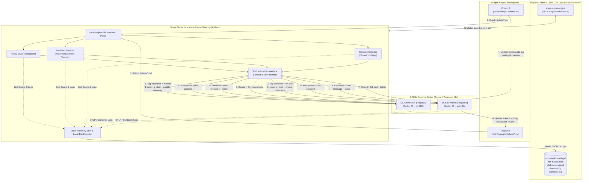
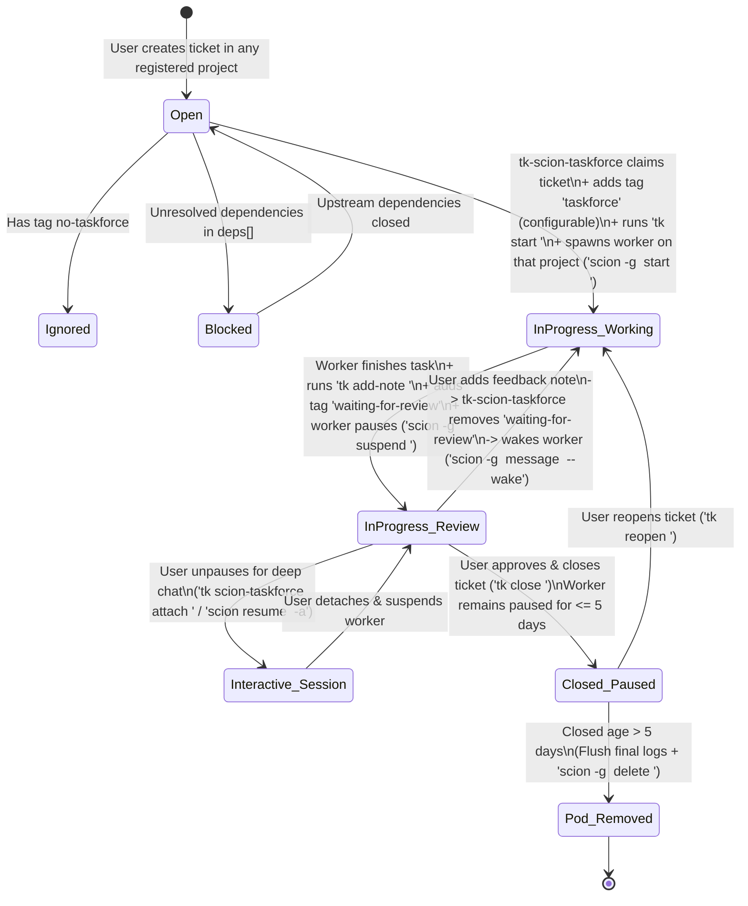

# Scion Task Force Plugin Specification (SCION-TASKFORCE-SPEC.md)

- **Plugin Name**: `tk-scion-taskforce` / `ticket-scion-taskforce`
- **Command**: `tk scion-taskforce`
- **Implementation Language**: Python 3.9+ (with thin POSIX Bash discovery wrapper)
- **Default Worker Provider**: [SCION (`GoogleCloudPlatform/scion`)](https://github.com/GoogleCloudPlatform/scion) *(pluggable driver architecture)*
- **Daemon Model**: Single global multi-project instance (`~/.local/state/tk/scion-taskforce.json`), matching `tk-webui`
- **Version**: `0.1.0`
- **Status**: Design Specification (`tic-822k`)

---

## 1. Overview & Purpose

`tk` provides a fast, Git-backed CLI and Web UI for creating and organizing tasks with DAG dependency tracking, but tickets alone are passive state—without workers, no autonomous execution happens.

**Scion Task Force (`tk-scion-taskforce`)** is an **asynchronous, multi-project ticket identification and autonomous worker orchestration plugin** for `tk`. Today it uses **[SCION](https://github.com/GoogleCloudPlatform/scion)** as its default container agent runtime (running on Docker, Podman, or Kubernetes), while isolating all runtime calls behind a **pluggable `WorkerProvider` interface** so SCION can be swapped for another orchestrator in the future via configuration.

Just like `tk-webui`, **only one `tk-scion-taskforce` daemon instance runs on the host** (`~/.local/state/tk/scion-taskforce.json`) and works across **multiple projects** simultaneously:
1. Continuously watches `.tickets/` directories across all registered projects for newly created or unblocked (`ready`) tickets.
2. Respects opt-out tags (`no-taskforce`) and tags claimed tickets with `taskforce` (user-configurable via `scion-taskforce.yaml`) before transitioning them to `in_progress`.
3. Spawns a dedicated SCION worker container/pod **on the specific project where the task was created**, with the **worker/container ID matching the exact ticket ID** (e.g., `tic-822k`).
4. Instructs the SCION worker agent to complete the task, report progress back via the `tk` CLI, keep the ticket `in_progress` with the label `waiting-for-review` (`waiting for review`), and **pause (`suspend`)** the worker instance.
5. Monitors reviewed tickets across projects for human feedback (new notes/comments) and automatically wakes the paused worker instance with the feedback (`scion message <id> --wake`), while also allowing users to manually unpause and attach (`tk scion-taskforce attach <id>`) for deeper interactive conversations.
6. Automatically garbage-collects worker pods/containers once a ticket is marked `closed` and is **older than 5 days**.
7. Instruments the entire ticket-to-worker lifecycle with **OpenTelemetry (OTel)** (traces, metrics, and structured logs) and persists all telemetry and worker logs to **local files** (`~/.local/state/tk/scion-taskforce/logs/` and per-project `.tickets/.scion-taskforce-logs/`) for offline tracking, replay, and debugging.

---

## 2. Single-Instance Multi-Project Daemon & Pluggable Architecture

### 2.1 Single Global Workforce Instance Across Projects (Like `tk-webui`)

Following the exact daemon pattern in [`tk_webui/server.py`](../../tk_webui/server.py):
- **Singleton Process**: Only **one** `tk-scion-taskforce` background daemon runs per machine, tracked via `~/.local/state/tk/scion-taskforce.json`.
- **Multi-Project Registry**:
  - Running `tk scion-taskforce start [directory]` (or `tk scion-taskforce server start [directory]`) checks `~/.local/state/tk/scion-taskforce.json`.
  - If no daemon is running, it launches the singleton background process and registers `directory` (default: `$PWD`).
  - If the daemon is **already running**, it does **not** spawn a duplicate process—instead, it dynamically registers `directory` into the running instance's watched project list!
- **Per-Project Worker Context**:
  - When a ticket `<id>` becomes `ready` inside `/path/to/project-a/.tickets/`, the singleton daemon invokes SCION scoped to `/path/to/project-a` (`scion --project /path/to/project-a start <id> ...` with `cwd=/path/to/project-a`), ensuring the worker container mounts and operates on the exact project where the ticket was created.

### 2.2 Why Python (+ Thin Bash Entrypoint)?

| Option | Pros | Cons | Verdict |
| :--- | :--- | :--- | :--- |
| **Python 3.9+ (Selected)** | • Shares the exact singleton daemon pattern as `tk_webui/server.py`<br>• Official `opentelemetry-sdk` & `PyYAML` support<br>• Clean Abstract Base Classes (`ABC`) for swapping `scion` later<br>• Native multi-directory file watching (`watchdog` / `asyncio`) | • Requires Python 3 runtime (already standard for `tk` plugins) | **Recommended & Selected** |
| **Pure Bash** | • Zero runtime dependencies | • Fragile multi-project YAML parsing, daemon state management, and OTel JSON span generation | Used only for the 15-line `ticket-scion-taskforce` CLI discovery wrapper |
| **Go** | • Single static binary, strong concurrency | • Introduces a separate Go build/release toolchain into a Bash + Python repo | Optional future migration if standalone binary distribution is needed |

### 2.3 Pluggable `WorkerProvider` Interface (Swapping SCION in the Future)

To ensure `tk-scion-taskforce` can swap SCION for another system in the future without rewriting the multi-project daemon, ticket state machine, or OpenTelemetry tracer, all worker operations go through an abstract Python `WorkerProvider`:

```python
from abc import ABC, abstractmethod
from dataclasses import dataclass
from pathlib import Path
from typing import Iterator

@dataclass
class WorkerInfo:
    worker_id: str          # Matches ticket ID (1:1 mapping, e.g., "tic-822k")
    project_dir: str        # Absolute path to the project where the ticket lives
    phase: str              # "running" | "suspended" | "stopped" | "not_found"
    provider: str           # Default: "scion"

class WorkerProvider(ABC):
    """Abstract interface for worker orchestration backends (SCION today, swappable tomorrow)."""

    @abstractmethod
    def start(
        self,
        project_dir: Path,
        ticket_id: str,
        prompt: str,
        labels: dict[str, str],
        enable_telemetry: bool = True,
    ) -> WorkerInfo:
        """Provision and launch a detached worker instance named <ticket_id> in <project_dir>."""

    @abstractmethod
    def suspend(self, project_dir: Path, ticket_id: str) -> None:
        """Pause/suspend a running worker while preserving its session state."""

    @abstractmethod
    def wake_with_feedback(self, project_dir: Path, ticket_id: str, feedback: str) -> None:
        """Resume a paused worker and deliver human review feedback to its session."""

    @abstractmethod
    def attach(self, project_dir: Path, ticket_id: str) -> int:
        """Unpause (if suspended) and attach the user's terminal for interactive conversation."""

    @abstractmethod
    def delete(self, project_dir: Path, ticket_id: str, preserve_branch: bool = True) -> None:
        """Remove the worker container/pod and clean up its runtime resources."""

    @abstractmethod
    def get_status(self, project_dir: Path, ticket_id: str) -> WorkerInfo:
        """Query current lifecycle phase of worker <ticket_id> in <project_dir>."""

    @abstractmethod
    def stream_logs(self, project_dir: Path, ticket_id: str, follow: bool = False) -> Iterator[str]:
        """Retrieve or stream stdout/stderr logs from worker <ticket_id>."""
```

### 2.4 Plugin Directory Layout

```
plugins/
└── scion-taskforce/
    ├── SCION-TASKFORCE-SPEC.md          # This specification document
    ├── scion-taskforce.yaml             # Starter YAML config template
    ├── ticket-scion-taskforce           # Thin POSIX Bash entrypoint (# tk-plugin: metadata)
    ├── tk-scion-taskforce -> ticket-scion-taskforce
    └── tk_scion_taskforce/              # Python package
        ├── __init__.py
        ├── cli.py                       # CLI argument parser & subcommands
        ├── config.py                    # Loads global & per-project scion-taskforce.yaml
        ├── server.py                    # Singleton daemon manager (~/.local/state/tk/scion-taskforce.json)
        ├── daemon.py                    # Multi-project watcher, feedback detector & 5-day GC loop
        ├── telemetry.py                 # OpenTelemetry SDK setup & local JSONL file exporter
        └── providers/
            ├── __init__.py              # Provider registry & WorkerProvider ABC
            └── scion.py                 # Default SCION implementation
```

---

## 3. End-to-End Architecture & Lifecycle

### 3.1 Multi-Project Singleton Architecture



### 3.2 Ticket & Worker State Machine



---

## 4. Detailed Operational Workflows

### 4.1 Multi-Project Ticket Selection & Opt-Out Filtering (`no-taskforce`)
The singleton `tk-scion-taskforce` daemon iterates through all registered project directories in `~/.local/state/tk/scion-taskforce.json` on file-change events (or every `poll_interval_seconds`, default 5s):

1. **Dependency Check**: For each project directory, runs `TICKETS_DIR="<project>/.tickets" "$TK_SCRIPT" super ready` to identify all `open` tickets whose dependencies (`deps: [...]`) are all `closed`.
2. **Opt-Out Tag Check**: Reads the `tags` frontmatter field of each candidate ticket. If the ticket carries any tag listed in `tags.ignore` (default: `no-taskforce`, matched case-insensitively), `tk-scion-taskforce` **skips** the ticket.
3. **Idempotency Check**: Calls `provider.get_status(project_dir, ticket_id)` (for SCION: `scion --project <project_dir> list --format json`) to verify whether a worker named `<ticket-id>` already exists.

### 4.2 Claiming & Spawning the SCION Worker (`1:1 ID Mapping`)
When an eligible `open` ticket `<id>` (e.g., `tic-822k`) is found in `<project_dir>`:

1. **Initialize OpenTelemetry Root Trace**:
   `tk-scion-taskforce` generates a W3C `trace_id` and `span_id` (`TRACEPARENT="00-<trace_id>-<span_id>-01"`) for the ticket lifecycle and writes a `ticket.claim` span to `otel-traces.jsonl`.
2. **Tag with `taskforce` (or configured `tags.claim`)**:
   `tk-scion-taskforce` appends the configured claim tag (default: `taskforce`) to the ticket's existing `tags` list:
   ```bash
   TICKETS_DIR="<project_dir>/.tickets" tk update <id> --tags "<existing-tags>,taskforce"
   ```
3. **Transition Status to `in_progress`**:
   ```bash
   TICKETS_DIR="<project_dir>/.tickets" tk start <id>
   ```
4. **Provision & Launch Worker on Target Project**:
   Using the default `scion` provider, `tk-scion-taskforce` launches a SCION worker container scoped to `<project_dir>`, using the **exact `<ticket-id>`** as the worker name and enabling telemetry:
   ```bash
   scion --project "<project_dir>" start "<id>" \
     "You are assigned ticket <id>. Inspect requirements with 'tk show <id>', implement the solution in this repository, run tests, record a detailed summary with 'tk add-note <id> \"...\"', and mark it ready for review by adding tag 'waiting-for-review'." \
     --enable-telemetry \
     --label "ticket=<id>" \
     --label "project=<project_name>" \
     --label "managed-by=tk-scion-taskforce" \
     --label "trace-id=<trace_id>" \
     --non-interactive
   ```
5. **Record Dispatch Audit State & Start Local Log Sink**:
   `tk-scion-taskforce` records a state snapshot in `~/.local/state/tk/scion-taskforce/state/<project_slug>/<id>.json` and streams worker container output to `~/.local/state/tk/scion-taskforce/logs/workers/<project_slug>/<id>.log` (and optionally symlinks/mirrors to `<project_dir>/.tickets/.scion-taskforce-logs/`).

### 4.3 Task Completion, Reporting & Auto-Pause (`waiting for review`)
When the worker agent finishes executing the task:

1. **Report Back via `tk`**:
   The agent appends a structured completion report to the ticket:
   ```bash
   tk add-note <id> "Completed implementation and verified tests. Ready for human review."
   ```
2. **Keep Status `in_progress` with Review Label**:
   The ticket remains in `status: in_progress` and is tagged with `waiting-for-review` (displayed in UI/CLI as `waiting for review`):
   ```bash
   tk update <id> --tags "taskforce,waiting-for-review"
   ```
3. **Pause (`suspend`) the Worker Instance**:
   When `tk-scion-taskforce` detects the `waiting-for-review` tag (or the worker enters `waiting_for_input`/`idle`), it calls `provider.suspend(project_dir, id)` and emits a `worker.suspend` OTel span:
   ```bash
   scion --project "<project_dir>" suspend "<id>"
   ```
   Suspending stops active container CPU/memory usage while preserving the container filesystem, git worktree, and LLM harness session state for instant resumption.

### 4.4 Feedback Loop (Passing Review Feedback to Paused Worker)
While a ticket is in `status: in_progress` with tag `waiting-for-review`:

1. **How Feedback is Provided**:
   - **Via `tk` CLI or Web UI**: The user appends a new note (`tk add-note <id> "Please also handle edge case X"`) or edits the ticket in `tk-webui`.
   - **Via Explicit Plugin Command**: The user runs `tk scion-taskforce feedback <id> "Please also handle edge case X"`.
2. **How `tk-scion-taskforce` Detects & Routes Feedback**:
   - The `tk-scion-taskforce` watcher compares the current `## Notes` section of `<project_dir>/.tickets/<id>.md` against the snapshot stored in `~/.local/state/tk/scion-taskforce/state/<project_slug>/<id>.json`.
   - When a new note is detected (or `waiting-for-review` is removed by the user):
     1. `tk-scion-taskforce` extracts the newly added feedback text and starts a `worker.feedback_wake` OTel span linked to the ticket's `trace_id`.
     2. `tk-scion-taskforce` removes the `waiting-for-review` tag from `<project_dir>/.tickets/<id>.md` (keeping `status: in_progress` and `tags: [taskforce]`).
     3. `tk-scion-taskforce` calls `provider.wake_with_feedback(project_dir, id, feedback)`:
        ```bash
        scion --project "<project_dir>" message "<id>" \
          "New review feedback received on ticket <id>:\n\n<feedback-text>\n\nPlease address this feedback, update the ticket with 'tk add-note <id>', and re-apply the 'waiting-for-review' tag when done." \
          --wake
        ```

### 4.5 Interactive Unpausing for Deeper Conversation
At any point while a worker is running or paused (`suspended`), a user may want to unpause the SCION agent worker and have a synchronous, multi-turn conversation with it inside its workspace:

```bash
tk scion-taskforce attach <id>
```

Under the hood, `tk-scion-taskforce` resolves `<project_dir>` (from `$TICKETS_DIR` or the global state registry), calls `provider.attach(project_dir, id)`, and records a `worker.interactive_attach` span:
- For the `scion` provider, if the worker is `suspended` or `stopped`, it runs `scion --project "<project_dir>" resume "<id>" --enable-telemetry --attach`; if already `running`, it runs `scion --project "<project_dir>" attach "<id>"`.
- When the user detaches from the interactive terminal session, if the ticket still has the `waiting-for-review` tag (and `--keep-alive` was not passed), `tk-scion-taskforce` can optionally re-suspend the worker (`scion --project "<project_dir>" suspend "<id>"`).

### 4.6 Worker Garbage Collection (5-Day Retention Policy)
To prevent orphaned containers/pods from accumulating across projects while still allowing easy reopening of recently finished tasks:

1. **On Ticket Closure (`status: closed`)**:
   - When a user closes a ticket (`tk close <id>`), `tk-scion-taskforce` ensures the worker is paused (`provider.suspend(project_dir, id)` if still running) and records `closed_at`.
   - The paused container/pod is **retained for 5 days** (configurable via `gc_retention_days` in `scion-taskforce.yaml`) in case the user reopens the ticket or wants to inspect the agent's workspace/logs.
2. **After 5 Days (`age > 5 days`)**:
   - The periodic GC sweep in the singleton `tk-scion-taskforce` daemon (run every hour across all registered projects, or manually via `tk scion-taskforce gc`) checks all tickets with `status: closed`.
   - If `now - closed_timestamp > 5 days` (432,000 seconds), `tk-scion-taskforce` flushes the final container logs (`provider.stream_logs(project_dir, id)` -> `workers/<project_slug>/<id>.log`), records a `worker.gc_delete` OTel span, and calls `provider.delete(project_dir, id)`:
     ```bash
     scion --project "<project_dir>" delete "<id>" --preserve-branch --non-interactive
     rm -f "~/.local/state/tk/scion-taskforce/state/<project_slug>/<id>.json"
     ```
   - **Note**: Local OpenTelemetry traces and worker logs are **preserved** after the container/pod is deleted (subject to the 30-day log rotation policy in Section 6.6), so historical debugging and audit trails remain intact.

---

## 5. User Configuration File (`scion-taskforce.yaml`)

Users can customize tags, polling intervals, retention windows, the active worker provider (`scion` today, or a future system), and OpenTelemetry paths using a short, human-friendly YAML file.

Configuration resolution order (allowing global defaults with optional per-project overrides):
1. Explicit CLI flag: `--config <path>`
2. Project-level override: `<project_dir>/.tickets/scion-taskforce.yaml`
3. Global user config: `~/.config/tk/scion-taskforce.yaml`
4. Built-in defaults (`plugins/scion-taskforce/scion-taskforce.yaml`)

Running `tk scion-taskforce init [--global]` generates a starter `scion-taskforce.yaml`:

```yaml
# scion-taskforce.yaml — Scion Task Force Configuration
tags:
  claim: taskforce                              # Tag added when tk-scion-taskforce claims a ticket
  review: waiting-for-review                    # Tag added when worker finishes and pauses for review
  ignore:                                       # Opt-out tags that prevent picking up a ticket
    - no-taskforce

watcher:
  poll_interval_seconds: 5                      # How often to check registered projects for ready tasks or feedback
  gc_retention_days: 5                          # Days to keep paused pods after a ticket is closed

provider:
  driver: scion                                 # Active worker backend (default: scion; swappable in future)
  scion:
    harness: ""                                 # Optional harness override (e.g., claude, gemini, codex)
    template: default                           # SCION agent template (-t)
    model: ""                                   # Optional model alias or ID (e.g., large)
    preserve_branch_on_gc: true                 # Pass --preserve-branch on scion delete

telemetry:
  enabled: true                                 # Enable OpenTelemetry tracing, metrics & structured logs
  log_dir: ~/.local/state/tk/scion-taskforce/logs # Local directory for OTel JSONL traces, metrics & worker logs
  mirror_to_project: true                       # Also symlink/write logs under <project>/.tickets/.scion-taskforce-logs
  otlp_endpoint: ""                             # Optional remote OTLP endpoint (e.g., http://localhost:4318)
  rotation:
    retention_days: 30                          # Delete rotated log/OTel files older than N days (default: 30)
    rotate_at: midnight                         # Daily time-based rotation (daemon.log, otel-*.jsonl, workers/*.log)
    max_file_size_mb: 100                       # Also rotate early if a single file exceeds this size
    compress: true                              # gzip rotated files (e.g., otel-traces.jsonl.2026-10-01.gz)
```

---

## 6. OpenTelemetry (OTel) & Local File Logging Specification

To ensure complete visibility, tracking, and offline debugging across asynchronous background workers in all projects, `tk-scion-taskforce` uses the Python **OpenTelemetry SDK (`opentelemetry-sdk`)** across the singleton daemon and enables telemetry on worker containers, writing all telemetry to local files by default.

### 6.1 Global Singleton State & Local Log Directory Layout

Following `tk-webui`'s `~/.local/state/tk/` standard:

```
~/.local/state/tk/
├── webui.json                                  # Existing tk-webui singleton state
├── scion-taskforce.json                        # Singleton PID + registered projects list
└── scion-taskforce/
    ├── state/
    │   └── <project-slug>/
    │       └── tic-822k.json                   # Active worker state + W3C trace_id
    └── logs/
        ├── daemon.log                          # Structured OTel JSONL & human-readable singleton daemon log
        ├── otel-traces.jsonl                   # OpenTelemetry Span exports (OTLP JSON Lines)
        ├── otel-metrics.jsonl                  # OpenTelemetry Metric exports (OTLP JSON Lines)
        └── workers/
            └── <project-slug>/
                └── tic-822k.log                # Captured stdout/stderr & harness events for worker tic-822k
```

#### Singleton PID & Multi-Project Registry (`~/.local/state/tk/scion-taskforce.json`)
```json
{
  "pid": 48210,
  "started_at": "2026-10-01T10:00:00Z",
  "provider": "scion",
  "projects": [
    "/Users/sampathm/github/ticket",
    "/Users/sampathm/github/another-project"
  ],
  "log_dir": "/Users/sampathm/.local/state/tk/scion-taskforce/logs"
}
```

### 6.2 OpenTelemetry Trace Hierarchy & Attributes

Each ticket gets a root W3C `trace_id` when first discovered by `tk-scion-taskforce`. Every action on that ticket emits child spans with standardized OpenTelemetry attributes:

- **Service Name (`service.name`)**: `tk-scion-taskforce` (daemon) and `tk-scion-taskforce-worker` (worker container)
- **Resource & Span Attributes**:
  - `project.path`: `/Users/sampathm/github/ticket`
  - `project.name`: `ticket`
  - `ticket.id`: `<id>` (e.g., `tic-822k`)
  - `ticket.priority`: `<0-4>`
  - `ticket.type`: `task | bug | feature | epic | chore`
  - `ticket.status`: `open | in_progress | closed`
  - `ticket.tags`: `["taskforce", "waiting-for-review"]`
  - `taskforce.provider`: `scion` (or future configured `provider.driver`)
  - `taskforce.worker.id`: `<id>` (1:1 mapping with `ticket.id`)
  - `taskforce.worker.phase`: `running | suspended | stopped | deleted`

#### Span Names
| Span Name | Emitted When | Key Events / Attributes |
| :--- | :--- | :--- |
| `ticket.lifecycle` | Root span covering ticket claim through closure | `ticket.id`, `project.path`, `taskforce.provider` |
| `ticket.claim` | `tk-scion-taskforce` tags ticket `taskforce` & runs `tk start <id>` | `tags.added=taskforce` |
| `worker.start` | `provider.start(project_dir, <id>)` is invoked | `taskforce.provider`, `worker.harness`, `worker.model` |
| `worker.complete_for_review` | Worker adds completion note & `waiting-for-review` tag | `note.length`, `status=in_progress` |
| `worker.suspend` | `provider.suspend(project_dir, <id>)` pauses the container | `reason=waiting_for_review \| ticket_closed` |
| `worker.feedback_wake` | User feedback wakes worker via `provider.wake_with_feedback()` | `feedback.preview`, `feedback.cycle_number` |
| `worker.interactive_attach` | User runs `tk scion-taskforce attach <id>` | `attach.duration_ms`, `user.name` |
| `worker.gc_delete` | Closed ticket > 5 days removed via `provider.delete(project_dir, <id>)` | `closed.age_days`, `logs.archived_path` |

### 6.3 Example Local OpenTelemetry Span Record (`otel-traces.jsonl`)

```json
{
  "trace_id": "4bf92f3577b34da6a3ce929d0e0e4736",
  "span_id": "00f067aa0ba902b7",
  "parent_span_id": "b9c7c989f97918e1",
  "name": "worker.suspend",
  "kind": "SPAN_KIND_INTERNAL",
  "start_time_unix_nano": 1790850912000000000,
  "end_time_unix_nano": 1790850912450000000,
  "status": { "code": "STATUS_CODE_OK" },
  "resource": {
    "service.name": "tk-scion-taskforce",
    "service.version": "0.1.0"
  },
  "attributes": {
    "project.path": "/Users/sampathm/github/ticket",
    "ticket.id": "tic-822k",
    "ticket.status": "in_progress",
    "ticket.tags": "taskforce,waiting-for-review",
    "taskforce.provider": "scion",
    "taskforce.worker.id": "tic-822k",
    "taskforce.worker.phase": "suspended",
    "suspend.reason": "waiting-for-review"
  }
}
```

### 6.4 OpenTelemetry Metrics (`otel-metrics.jsonl`)
- `tk.scion_taskforce.projects.watched` (UpDownCounter): Number of projects registered with the singleton daemon.
- `tk.scion_taskforce.workers.active` (UpDownCounter): Number of currently running worker containers across all projects.
- `tk.scion_taskforce.workers.suspended` (UpDownCounter): Number of paused (`suspended`) workers awaiting review or 5-day GC.
- `tk.scion_taskforce.ticket.execution_duration_seconds` (Histogram): Time from `worker.start` to `waiting-for-review`.
- `tk.scion_taskforce.feedback.iterations_total` (Counter): Number of human feedback wake cycles per ticket.
- `tk.scion_taskforce.gc.deleted_total` (Counter): Number of expired worker pods removed after the 5-day retention window.

### 6.5 Structured Local Log Format (`daemon.log`)
Every daemon decision (skipping a `no-taskforce` ticket, claiming a ready ticket, waking a worker on feedback, or provider CLI errors) is written as an OTel-correlated log line to `~/.local/state/tk/scion-taskforce/logs/daemon.log`:

```json
{"timestamp":"2026-10-01T10:35:12Z","severity":"INFO","trace_id":"4bf92f3577b34da6a3ce929d0e0e4736","span_id":"00f067aa0ba902b7","project":"/Users/sampathm/github/ticket","ticket_id":"tic-822k","provider":"scion","event":"worker.suspend","message":"Ticket tic-822k marked waiting-for-review; suspended worker tic-822k"}
```

### 6.6 Log Rotation & Retention (30-Day Default)
To keep local telemetry bounded while preserving a month of debugging history, the singleton daemon rotates all files under `log_dir` using Python's standard `logging.handlers.TimedRotatingFileHandler` (with a size-based safety valve):

| Setting (`telemetry.rotation`) | Default | Behavior |
| :--- | :--- | :--- |
| `retention_days` | `30` | Rotated files older than 30 days are deleted during the hourly GC sweep (and on daemon start). |
| `rotate_at` | `midnight` | Daily rotation at local midnight; the active file is renamed with a date suffix (e.g., `daemon.log.2026-10-01`). |
| `max_file_size_mb` | `100` | A file exceeding this size is rotated immediately, even before midnight. |
| `compress` | `true` | Rotated files are gzipped (`otel-traces.jsonl.2026-10-01.gz`) to minimize disk usage. |

Rotation applies uniformly to `daemon.log`, `otel-traces.jsonl`, `otel-metrics.jsonl`, and every `workers/<project-slug>/<id>.log`. Per-ticket state files (`state/<project-slug>/<id>.json`) are **not** rotated—they are removed only by the 5-day worker GC (Section 4.6). `tk scion-taskforce logs` and `tk scion-taskforce trace <id>` transparently read both active and rotated (`.gz`) files within the retention window.

Example resulting layout after a few days:

```
~/.local/state/tk/scion-taskforce/logs/
├── daemon.log                          # Active
├── daemon.log.2026-09-30.gz            # Rotated (kept until 2026-10-30)
├── otel-traces.jsonl
├── otel-traces.jsonl.2026-09-30.gz
└── workers/ticket/
    ├── tic-822k.log
    └── tic-822k.log.2026-09-30.gz
```

---

## 7. CLI Interface & Commands

Matches the `tk webui` server & shortcut command conventions while supporting multi-project registration:

```bash
tk scion-taskforce <command> [options]
```

### Daemon & Project Management Commands (Matching `tk webui`)

```bash
# Singleton daemon management (starts if not running; registers [directory] if already running)
tk scion-taskforce server start [directory]
tk scion-taskforce server status
tk scion-taskforce server stop
tk scion-taskforce server restart [directory]

# Direct shortcuts (identical to tk webui start|status|stop|restart)
tk scion-taskforce start [directory]
tk scion-taskforce status
tk scion-taskforce stop
tk scion-taskforce restart [directory]

# Multi-project management on the singleton daemon
tk scion-taskforce project add [directory]      # Register a project with the running daemon
tk scion-taskforce project remove [directory]   # Unregister a project from the daemon
tk scion-taskforce project list                 # List all projects watched by the singleton daemon
```

### Worker & Debugging Commands

| Command | Description |
| :--- | :--- |
| `init [--global]` | Create a starter `scion-taskforce.yaml` in `.tickets/` (or `~/.config/tk/`). |
| `watch [directory]` | Run the multi-project watcher and reconciler loop in the foreground. |
| `dispatch [<id>]` | Run a single reconciliation pass (or force-spawn a worker for `<id>`). |
| `list` \| `ps` | Display a table of tickets and their worker states across the current or `--all` projects. |
| `feedback <id> "<message>"` | Append a review feedback note to `<id>`, clear `waiting-for-review`, and wake the paused worker (`provider.wake_with_feedback`). |
| `attach <id>` | Unpause (if suspended) and attach interactively to the worker's terminal session (`provider.attach`). |
| `pause <id>` | Manually pause/suspend a running worker (`provider.suspend`). |
| `logs [<id>] [--follow] [--otel]` | View or stream local logs from `workers/<project>/<id>.log` or `daemon.log`. |
| `trace <id>` | Inspect the OpenTelemetry span timeline and lifecycle trace for `<id>` from `otel-traces.jsonl`. |
| `gc [--days 5] [--dry-run]` | Remove worker instances for `closed` tickets older than N days (default: `5`) and purge rotated logs older than `telemetry.rotation.retention_days` (default: `30`). |
| `version` \| `--version` \| `-v` | Print plugin version (`tk-scion-taskforce 0.1.0`). |
| `help` \| `--help` \| `-h` | Display plugin usage and help. |

### Options

- `-c, --config <path>`: Path to YAML configuration file (default: `.tickets/scion-taskforce.yaml` or `~/.config/tk/scion-taskforce.yaml`).
- `-a, --all`: Show workers or run GC across all registered projects.
- `--provider <driver>`: Override the worker backend driver (default: `scion`).
- `--claim-tag <tag>`: Override the tag applied when claiming a ticket (default: `taskforce`).
- `--interval <seconds>`: Polling interval for the watcher loop (default: `5`).
- `--retention-days <days>`: Number of days to retain paused pods for `closed` tickets before deletion (default: `5`).
- `--log-retention-days <days>`: Number of days to keep rotated log/OTel files before deletion (default: `30`).
- `--log-dir <path>`: Override local log and OTel output directory (default: `~/.local/state/tk/scion-taskforce/logs`).
- `--otel-endpoint <url>`: Optional OTLP collector endpoint to dual-export telemetry in addition to local files.
- `--harness <name>`: Harness config passed to the worker provider (e.g., `claude`, `gemini`, `codex`, `opencode`).
- `--template <name>`: Agent template passed to the worker provider.
- `--model <model>`: Override model tier or ID passed to the worker provider.
- `--dry-run`: Preview actions (dispatch, feedback wake, or garbage collection) without executing provider mutations.

---

## 8. Data Model, Tags & State Schema

### 8.1 Ticket Frontmatter Tags Contract
`tk-scion-taskforce` coordinates state through standard `tk` YAML frontmatter fields (`status` and `tags`) so both the CLI and `tk-webui` reflect real-time worker activity without custom database tables:

| Tag (Default) | Config Key | Applied By | Meaning |
| :--- | :--- | :--- | :--- |
| `no-taskforce` | `tags.ignore` | User | **Opt-Out**: Prevents `tk-scion-taskforce` from claiming the ticket or spawning a worker. |
| `taskforce` | `tags.claim` | `tk-scion-taskforce` | **Claimed**: Added automatically before `tk-scion-taskforce` starts working on an unblocked ticket. |
| `waiting-for-review` | `tags.review` | Worker / `tk-scion-taskforce` | **Review Gate**: Indicates the worker has completed the task, reported back via `tk add-note`, and paused (`suspended`) awaiting human review while `status` remains `in_progress`. |

### 8.2 Example Ticket in `waiting-for-review` State (`.tickets/tic-822k.md`)

```markdown
---
id: tic-822k
status: in_progress
deps: []
links: []
created: 2026-10-01T09:58:53Z
type: task
priority: 1
assignee: Sampath Kumar
tags: [taskforce, waiting-for-review]
---
# Scion Task Force

...

## Notes

**2026-10-01T10:35:12Z**
[scion-taskforce:tic-822k] Completed task implementation and verified test suite (`make test`).
Worker `tic-822k` is now suspended (`waiting-for-review`). Add a note with feedback to resume work, run `tk scion-taskforce attach tic-822k` for interactive chat, or run `tk close tic-822k` to approve.
```

### 8.3 Local Reconciler State (`~/.local/state/tk/scion-taskforce/state/<project-slug>/<id>.json`)
To reliably detect new feedback notes, correlate OpenTelemetry spans, and track 5-day retention across daemon restarts, `tk-scion-taskforce` stores lightweight per-ticket metadata:

```json
{
  "project_dir": "/Users/sampathm/github/ticket",
  "ticket_id": "tic-822k",
  "worker_id": "tic-822k",
  "provider": "scion",
  "trace_id": "4bf92f3577b34da6a3ce929d0e0e4736",
  "root_span_id": "b9c7c989f97918e1",
  "worker_phase": "suspended",
  "last_note_hash": "e3b0c44298fc1c149afbf4c8996fb92427ae41e4649b934ca495991b7852b855",
  "dispatched_at": "2026-10-01T10:20:00Z",
  "paused_for_review_at": "2026-10-01T10:35:12Z",
  "closed_at": null,
  "log_file": "/Users/sampathm/.local/state/tk/scion-taskforce/logs/workers/ticket/tic-822k.log"
}
```

---

## 9. Dependencies

- **Python 3.9+**: Core plugin runtime (`pyyaml`, `opentelemetry-api`, `opentelemetry-sdk`, `watchdog`).
- **Worker Provider CLI / Runtime**:
  - Default (`provider.driver: scion`): `scion` CLI (`>= 0.1.0`) configured with Docker, Podman, or Kubernetes.
  - Future drivers: Pluggable via `tk_scion_taskforce/providers/`.

---

## 10. Installation & Uninstallation

### Installation
```bash
./install.sh --scion-taskforce
# Or manually symlink plugins/scion-taskforce/ticket-scion-taskforce and plugins/scion-taskforce/tk-scion-taskforce into ~/.local/bin/
```

### Uninstallation
```bash
tk scion-taskforce stop
rm -f ~/.local/bin/tk-scion-taskforce ~/.local/bin/ticket-scion-taskforce
```
