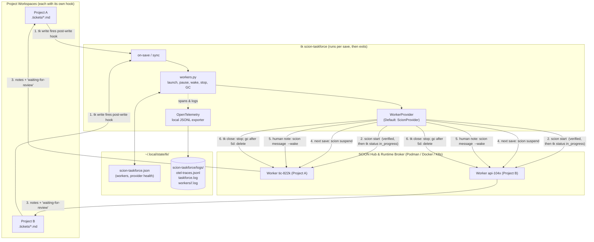
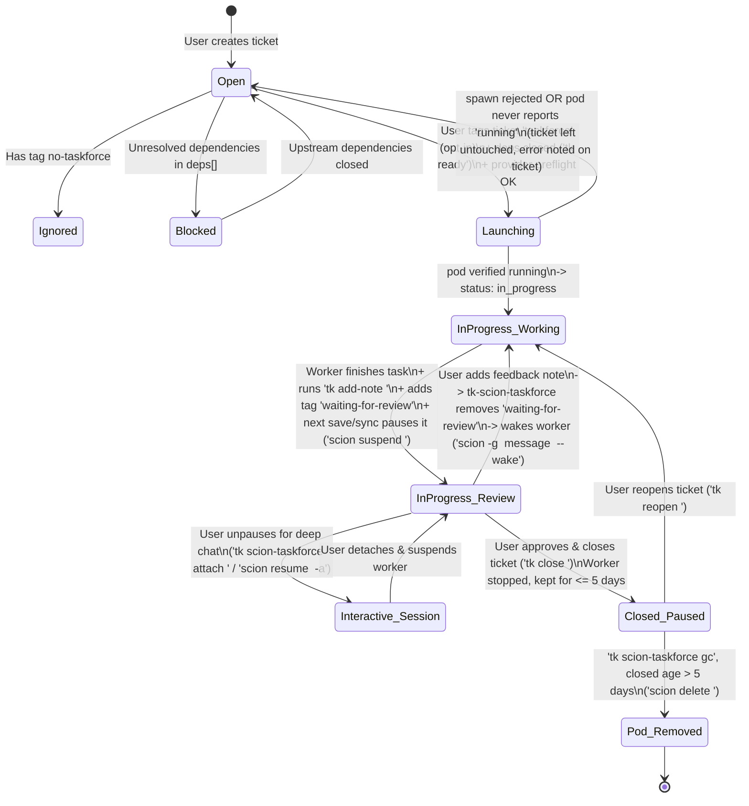

# Scion Task Force Plugin Specification (SCION-TASKFORCE-SPEC.md)

- **Plugin Name**: `tk-scion-taskforce` / `ticket-scion-taskforce`
- **Command**: `tk scion-taskforce`
- **Implementation Language**: Python 3.9+ (with thin POSIX Bash discovery wrapper)
- **Default Worker Provider**: [SCION (`GoogleCloudPlatform/scion`)](https://github.com/GoogleCloudPlatform/scion) *(pluggable driver architecture)*
- **Dispatch Model**: Event-driven. A per-project `tk` post-write hook runs `on-save <id>` after each ticket write. No daemon, no polling.
- **Version**: `0.1.0`
- **Status**: Implemented — Standalone Optional Plugin (`tic-822k`)

---

## 1. Overview & Purpose

`tk` provides a fast, Git-backed CLI and Web UI for creating and organizing tasks with DAG dependency tracking, but tickets alone are passive state—without workers, no autonomous execution happens.

**Scion Task Force (`tk-scion-taskforce`)** is an **asynchronous, multi-project ticket identification and autonomous worker orchestration plugin** for `tk`. Today it uses **[SCION](https://github.com/GoogleCloudPlatform/scion)** as its default container agent runtime (running on Docker, Podman, or Kubernetes), while isolating all runtime calls behind a **pluggable `WorkerProvider` interface** so SCION can be swapped for another orchestrator in the future via configuration.

### 1.1 Event-Driven Dispatch

`tk` runs every executable in `.tickets/.hooks/post-write.d/` after a successful write (see `docs/SPEC.md` §5.1). `tk scion-taskforce init` (or `hook install`) installs `post-write.d/scion-taskforce`, which runs `tk scion-taskforce on-save "$TK_TICKET_ID" --event "$TK_EVENT"` in the background. The Web UI writes through the `tk` CLI, so both paths fire the hook.

Each `on-save` run takes the per-project lock (`flock` under `~/.local/state/tk/locks/`), catches up on worker reports, then acts on the saved ticket:

| Condition | Action | Note appended (`**Task Force:** …`) |
|-----------|--------|-------------------------------------|
| Tagged `taskforce`, `open`, deps closed, slot free, no worker | Launch → verify → claim (§4.2) | "request noted…", then "started Scion worker `<id>`…" |
| Deps still open | None | "request noted; waiting on dependencies: …" |
| No free slot | Queue | "request noted; queued (N of M workers busy)…" |
| Worker active and event is `add-note` from a human | `scion message <id>` (wakes a paused worker) | "worker `<id>` is already in progress; forwarded the latest update." |
| Worker reported back (`waiting-for-review`) | Pause worker, free its slot, start next queued ticket | None |
| Ticket `closed` with a tracked worker | Stop worker, start next queued ticket | "ticket closed; stopped worker `<id>`." |

- Status notes are written directly to the ticket file, so they never re-trigger the hook. `TK_HOOK_DEPTH` also blocks recursion.
- Identical consecutive Task Force notes are deduplicated.
- Catch-up merges notes and the `waiting-for-review` tag from isolated worktrees (§4.3), then pauses that worker.
- `tk scion-taskforce sync [directory]` runs the same catch-up for writes the hook cannot see (hand edits, `git pull`, worker edits), starts queued tickets, and flags dead pods (§4.1).
- `on-save` and `sync` never link a folder to the Hub; only `init` does, once (§4.2).

### 1.2 Capabilities

1. **Opt-in**: only tickets the *user* tagged `taskforce` (`tags.claim`) are picked up; `no-taskforce` (`tags.ignore`) is a hard override. The task force never adds the opt-in tag itself.
2. **One worker per ticket, in the ticket's own project**: the worker ID and branch match the ticket ID (e.g. `tic-822k`). Any number of projects can use the task force at once; each has its own hook and Hub project.
3. **Review checkpoint**: workers report via notes and the `waiting-for-review` tag, then get paused. A human note wakes the worker (`scion message <id> --wake`); `tk scion-taskforce attach <id>` opens an interactive session.
4. **Cleanup**: `tk close` stops the worker; `tk scion-taskforce gc` deletes workers of tickets closed more than 5 days ago.
5. **Observability**: the lifecycle is traced with OpenTelemetry (traces, metrics, structured logs) to local files under `~/.local/state/tk/scion-taskforce/logs/`.

### 1.3 Key Decisions

| Decision | Context | Why | Consequences |
| :--- | :--- | :--- | :--- |
| **Save hook, no daemon** (2026-10) | A singleton daemon polled every registered project every 15 s. | Every write already goes through `tk` (the Web UI shells out to it), so a post-write hook sees each change at once with no process to run, register or restart. | Writes that bypass `tk` (hand edits, `git pull`, worker edits) need `sync`. Worker reports land on the next save. The daemon commands were removed and print a migration hint. |
| **Only `init` links a folder to the Hub** | Dispatch used to run `scion hub link` on any unlinked folder, so test temp dirs became Hub projects. | One Hub project per real project folder; nothing created as a side effect. | An unlinked folder fails preflight with a hint to run `init`. |
| **Pause on review** | Idle workers waiting for review held runtime resources and concurrency slots. | `scion suspend` keeps the worktree and harness session for an instant resume. | A human note (forwarded by the hook) or `feedback` wakes the worker. |
| **One lock per project** | Background hooks and manual commands write the same state file. | `flock` is in the standard library and serialises writers without a server. | Commands touching another project's workers lock only the current project (marked `shortcut:` in `cli.py`). |

---

## 2. Architecture

### 2.1 Event Flow & Shared State

- **Trigger**: `tk` (core Bash) runs `.tickets/.hooks/post-write.d/scion-taskforce` after each write; the hook execs `tk scion-taskforce on-save <id>` in the background. Nothing runs between saves.
- **Per-project context**: every Scion call is scoped to the ticket's project (`scion --project <dir> start <id> ...` with `cwd=<dir>`), so the worker operates on the project where the ticket lives.
- **State**: `~/.local/state/tk/scion-taskforce.json` holds one entry per worker (`<project>::<id>`: state, branch, trace ID, last note hash) and per-project provider health. Worker states: `running`, `paused`, `stopped`, `error`, `deleted`.
- **Concurrency**: `on-save`, `sync` and manual commands take a per-project `flock` (`~/.local/state/tk/locks/`), so two quick saves never start two workers.

### 2.2 Why Python (+ Thin Bash Entrypoint)?

| Option | Pros | Cons | Verdict |
| :--- | :--- | :--- | :--- |
| **Python 3.9+ (Selected)** | • Official `opentelemetry-sdk` & `PyYAML` support<br>• Clean Abstract Base Classes (`ABC`) for swapping `scion` later | • Requires Python 3 runtime (already standard for `tk` plugins) | **Recommended & Selected** |
| **Pure Bash** | • Zero runtime dependencies | • Fragile YAML parsing, state management, and OTel JSON span generation | Used only for the 15-line `ticket-scion-taskforce` CLI discovery wrapper |
| **Go** | • Single static binary, strong concurrency | • Introduces a separate Go build/release toolchain into a Bash + Python repo | Optional future migration if standalone binary distribution is needed |

### 2.3 Pluggable `WorkerProvider` Interface (Swapping SCION in the Future)

To ensure `tk-scion-taskforce` can swap SCION for another system in the future without rewriting the event handling, ticket state machine, or OpenTelemetry tracer, all worker operations go through an abstract Python `WorkerProvider`:

```python
from abc import ABC, abstractmethod
from dataclasses import dataclass
from pathlib import Path
from typing import Iterator

@dataclass
class WorkerInfo:
    worker_id: str          # Matches ticket ID (1:1 mapping, e.g., "tic-822k")
    project_dir: str        # Absolute path to the project where the ticket lives
    phase: str              # "running" | "suspended" | "stopped" | "not_found"
    provider: str           # Default: "scion"

class WorkerProvider(ABC):
    """Abstract interface for worker orchestration backends (SCION today, swappable tomorrow)."""

    @abstractmethod
    def start(
        self,
        project_dir: Path,
        ticket_id: str,
        prompt: str,
        labels: dict[str, str],
        enable_telemetry: bool = True,
    ) -> WorkerInfo:
        """Provision and launch a detached worker instance named <ticket_id> in <project_dir>."""

    @abstractmethod
    def suspend(self, project_dir: Path, ticket_id: str) -> None:
        """Pause/suspend a running worker while preserving its session state."""

    @abstractmethod
    def wake_with_feedback(self, project_dir: Path, ticket_id: str, feedback: str) -> None:
        """Resume a paused worker and deliver human review feedback to its session."""

    @abstractmethod
    def attach(self, project_dir: Path, ticket_id: str) -> int:
        """Unpause (if suspended) and attach the user's terminal for interactive conversation."""

    @abstractmethod
    def delete(self, project_dir: Path, ticket_id: str, preserve_branch: bool = True) -> None:
        """Remove the worker container/pod and clean up its runtime resources."""

    @abstractmethod
    def get_status(self, project_dir: Path, ticket_id: str) -> WorkerInfo:
        """Query current lifecycle phase of worker <ticket_id> in <project_dir>."""

    @abstractmethod
    def stream_logs(self, project_dir: Path, ticket_id: str, follow: bool = False) -> Iterator[str]:
        """Retrieve or stream stdout/stderr logs from worker <ticket_id>."""

    # Optional hooks (no-op defaults) — override when the backend isolates workspaces or
    # needs help getting past interactive harness start-up prompts.
    def workspace_path(self, project_dir: str, worker_id: str) -> Path | None:
        """Host path of the worker's *isolated* checkout, or None when it shares the project dir."""
        return None

    def post_spawn(self, project_dir: str, worker_id: str, timeout_seconds: int = 40) -> str | None:
        """Run right after the pod is verified running (e.g. auto-accept a trust dialog)."""
        return None
```

The SCION implementation of the hooks:

| Hook | SCION behaviour |
| :--- | :--- |
| `workspace_path` | Returns `<project>/.scion/agents/<id>/workspace` when the project was initialised with `scion init` (project-local mode → one git worktree per agent on branch `<id>`); returns `None` for hub/external projects where the live checkout is mounted at `/workspace`. |
| `post_spawn` | Looks up the container via `scion list --format json`, then for up to `watcher.spawn_prompt_unblock_seconds` runs `podman exec -u <container_user> <cid> tmux capture-pane -p -t <tmux_session>`; when the pane shows one of `provider.scion.auto_accept_prompt_patterns` (default *"Yes, I trust this folder"*) it sends `tmux send-keys Enter`, and stops as soon as a `harness_ready_patterns` entry appears. Disabled with `auto_accept_prompts: false`. |

### 2.4 Plugin Directory Layout

```
plugins/
└── scion-taskforce/
    ├── SCION-TASKFORCE-SPEC.md          # This specification document
    ├── scion-taskforce.yaml             # Starter YAML config template
    ├── ticket-scion-taskforce           # Thin POSIX Bash entrypoint (# tk-plugin: metadata)
    ├── tk-scion-taskforce -> ticket-scion-taskforce
    └── tk_scion_taskforce/              # Python package
        ├── __init__.py
        ├── cli.py                       # CLI argument parser & subcommands
        ├── config.py                    # Loads global & per-project scion-taskforce.yaml
        ├── events.py                    # on-save / sync handlers & hook install
        ├── workers.py                   # Verified launch, pause, feedback relay, liveness, GC, locks
        ├── state.py                     # Worker state store (~/.local/state/tk/scion-taskforce.json)
        ├── tickets.py                   # Ticket file parsing & note/tag writes
        ├── telemetry.py                 # OpenTelemetry SDK setup & local JSONL file exporter
        └── providers/
            ├── __init__.py              # Provider registry & WorkerProvider ABC
            └── scion.py                 # Default SCION implementation
```

---

## 3. End-to-End Architecture & Lifecycle

### 3.1 Component Diagram



### 3.2 Ticket & Worker State Machine



---

## 4. Detailed Operational Workflows

### 4.1 Ticket Selection — Opt-In (`taskforce`) & Opt-Out (`no-taskforce`)
`on-save <id>` evaluates the saved ticket; `sync` and a freed slot evaluate every ticket in the project (in `tk ready` order):

1. **Dependency Check**: the ticket is `open` and every `deps` entry is `closed` (equivalent to `tk ready`). Otherwise it gets a "waiting on dependencies" note and starts when the blocker's `tk close` fires the hook.
2. **Opt-In Tag Check**: a ticket is a candidate **only if the user added** the `tags.claim` tag (default: `taskforce`), e.g. `tk update <id> --tags <existing>,taskforce` or from the Web UI.
3. **Opt-Out Tag Check**: tickets tagged `tags.ignore` (default: `no-taskforce`) or already `waiting-for-review` are skipped.
4. **Provider Pre-flight**: `provider.preflight(project_dir)` (for SCION: `scion --project <project_dir> list --format json`). If the runtime (podman/docker/k8s) is unreachable, the ticket gets a "could not start" note, the health transition is logged once, and `tk scion-taskforce status` shows it. Preflight also reads `scion hub status`: if the Hub is reachable but the folder is not linked, preflight fails with a hint to run `tk scion-taskforce init`. Preflight never links a folder; only `init` calls `provider.ensure_project_registered()`, so each folder maps to exactly one Hub project.
5. **Concurrency Gate**: when `watcher.max_concurrent_per_project` (default **1**) workers are `running` in the project, or `watcher.max_concurrent` (default 10) across projects, the ticket gets a "queued" note. A worker that reports back (paused) or whose ticket closes frees its slot, and the next opted-in ready ticket starts in the same run.
   > [!WARNING]
   > **Why 1 per project by default.** SCION has two project modes and the safe limit depends on which one your repo is in:
   >
   > | Mode | How you get it | What each pod sees | Safe `max_concurrent_per_project` |
   > | :--- | :--- | :--- | :--- |
   > | **Hub / external** | repo has no `.scion/` directory | the *live* checkout mounted at `/workspace` — every worker shares one working tree and will switch branches, stash and rebase under each other (observed in the field: 10 concurrent workers left a repo on a worker branch with 5 stray stashes and swallowed the untracked `.tickets/` directory) | **1** |
   > | **Project-local** | you ran `scion init` once in the repo (creates `.scion/` and ignores `.scion/agents/`) | its own git worktree at `<repo>/.scion/agents/<id>/workspace` on branch `<id>`; the task force mirrors the ticket file in and merges notes/review tag back (§4.3) | can be raised (e.g. 3–5); left at 1 it becomes 5 |
   >
   > Different projects are always independent and run in parallel up to `max_concurrent`. **Recommended:** run `scion init` in every repo you hand to the task force (see §10).
6. **Liveness (`sync`)**: for each tracked `running` worker, `provider.health()` is consulted. If the pod is gone, stopped or crashed (e.g. container exit 137/255), the worker is marked `error`, a `worker.lost` span + `ERROR` log is emitted, and a triage note is appended to the ticket (which stays `in_progress`). The slot is freed. `tk reopen <id>` (keeping the `taskforce` tag) fires the hook, which deletes the dead pod (`--preserve-branch`) and relaunches.
7. **Idempotency Check**: `provider.health(project_dir, ticket_id)` checks whether a worker named `<ticket-id>` already exists (a running one is adopted; a stopped one is reported and left for `attach`).

### 4.2 Verified Spawn & Claim (`1:1 ID Mapping`, never fire-and-forget)
When an eligible opted-in `open` ticket `<id>` (e.g., `tic-822k`) is selected in `<project_dir>`, the task force follows a **launch → verify → claim** sequence. The ticket is **not** modified until the worker pod is confirmed running:

1. **Initialize OpenTelemetry Root Trace**:
   `tk-scion-taskforce` generates a W3C `trace_id` and `span_id` (`TRACEPARENT="00-<trace_id>-<span_id>-01"`) for the ticket lifecycle.
2. **Launch** (`provider.spawn`): see step 4 below. If the provider rejects the request (non-zero exit, e.g. `podman ps failed`), the stderr is logged as an `ERROR` span/log line, the ticket stays `open` with a "could not start" note, and no further tickets are started in that run.
3. **Verify** (`provider.wait_until_running`): polls `provider.health(project_dir, <id>)` every `watcher.spawn_verify_poll_seconds` (2s) until the pod reports `running`, for at most `watcher.spawn_verify_timeout_seconds` (30s). If it never does, the ticket stays `open`, the worker is recorded with state `error` in `scion-taskforce.json` (visible in `tk scion-taskforce list`) so it is not blindly re-spawned, and the failure is traced.
4. **Provision & Launch Worker on Target Project** (the actual `spawn` call):
   Using the default `scion` provider, `tk-scion-taskforce` launches a SCION worker container scoped to `<project_dir>`, using the **exact `<ticket-id>`** as the worker name and enabling telemetry:
   ```bash
   scion --project "<project_dir>" start "<id>" \
     "You are assigned ticket <id>. Inspect requirements with 'tk show <id>', implement the solution in this repository, run tests, record a detailed summary with 'tk add-note <id> \"...\"', and mark it ready for review by adding tag 'waiting-for-review'." \
     --enable-telemetry \
     --label "ticket=<id>" \
     --label "project=<project_name>" \
     --label "managed-by=tk-scion-taskforce" \
     --label "trace-id=<trace_id>" \
     --non-interactive
   ```
5. **Claim (only after verification)**: transition the ticket to `in_progress`. The user's opt-in tag is left exactly as they set it:
   ```bash
   TICKETS_DIR="<project_dir>/.tickets" tk start <id>
   ```
5a. **Post-spawn unblock** (`provider.post_spawn`): a verified-running pod can still be stuck on an interactive harness dialog. In project-local SCION mode Claude Code's trust is seeded for the *host* path and `/workspace`, but the worktree is mounted at `/repo-root/.scion/agents/<id>/workspace`, so every worker sat on *"Yes, I trust this folder"* forever (idle pods, exit 255 on suspend). The task force watches the pod's tmux pane for up to `watcher.spawn_prompt_unblock_seconds` (40s) and presses Enter on known prompts, logging `auto-accepted harness prompt`.
5b. **Workspace mirror**: when `provider.workspace_path()` reports an isolated worktree, the task force copies `.tickets/<id>.md` into `<workspace>/.tickets/` if it is missing (`.tickets/` is often untracked and therefore absent from a fresh worktree), so the brief's *"edit `.tickets/<id>.md`"* instruction works. The log line `isolated workspace <path>; ticket edits will be merged back` confirms the mode.
6. **Record Dispatch Audit State & Start Local Log Sink**:
   `tk-scion-taskforce` records the worker entry in `~/.local/state/tk/scion-taskforce.json` and streams worker container output to `~/.local/state/tk/scion-taskforce/logs/workers/<project_slug>/<id>.log` (and optionally symlinks/mirrors to `<project_dir>/.tickets/.scion-taskforce-logs/`).

### 4.3 Task Completion, Reporting & Auto-Pause (`waiting for review`)

#### Worker brief (what the pod is told)
`build_worker_prompt()` hands every pod a brief with the full `tk show <id>` output plus a job section chosen by `classify_work_type()`:

| Work type | Trigger | Job section |
| :--- | :--- | :--- |
| `review` | any tag in `worker.review_tags` (default `pr`, `review`) **or** `external-ref` starting with a `worker.review_ref_prefixes` entry (default `gh-pr-`) — i.e. tickets created by `tk github sync --prs` | Fetch the PR (`gh pr checkout <n>` / `git fetch origin pull/<n>/head`), review the diff (correctness, tests, security, spec compatibility, docs), run the suite, write **Summary / Blocking issues / Suggestions / Verdict** with `path:line` findings; may post the same text as a PR comment if `gh` is authenticated; never approve/merge. |
| `implement` | everything else | Implement on branch `<id>`, run tests/lints, commit, write **Summary / Files touched / Verification / Open questions**. |

Both briefs end with the same **Reporting Back** protocol, written for a pod where `tk` is **not** installed: edit `.tickets/<id>.md` directly (append a `**<UTC ts>**` note block under `## Notes`, set `tags: [taskforce, waiting-for-review]`, keep `status: in_progress`), never close the ticket, never push/merge/rebase/stash (shared checkout). A fully custom brief can be supplied via `worker.prompt_file` (placeholders `{ticket_id} {ticket_title} {project_dir} {branch} {work_type} {claim_tag} {review_tag} {external_ref} {ticket_details}`).

#### Isolated-workspace merge-back (project-local SCION)
When the worker edits its *own copy* of the ticket inside a worktree, the project's `.tickets/<id>.md` would never see it. Every `on-save` and `sync` run therefore first calls `merge_worker_ticket_copy()` for each `running`/`paused` worker with a workspace. The merge is **additive only**: notes the main ticket does not already have (matched by timestamp + text) are appended and the `waiting-for-review` tag is copied over. Status, title, body and any other tag changes made by the worker are ignored — a worker can never close or rewrite a ticket. Log line: `<id>: merged N note(s) and the 'waiting-for-review' tag from the worker workspace`. The pause below then fires in the same run.

When the worker agent finishes executing the task:

1. **Report Back**:
   The agent appends a structured completion report to the ticket, via `tk add-note <id> "..."` when `tk` is available in the pod, otherwise by editing `.tickets/<id>.md` directly as instructed in the brief.
2. **Keep Status `in_progress` with Review Label**:
   The ticket remains in `status: in_progress` and is tagged with `waiting-for-review` (displayed in UI/CLI as `waiting for review`):
   ```bash
   tk update <id> --tags "taskforce,waiting-for-review"     # or edit the frontmatter directly
   ```
3. **Pause (`suspend`) the Worker Instance**:
   On the next save of any ticket in the project (or `sync`), `tk-scion-taskforce` sees the `waiting-for-review` tag, calls `provider.pause(project_dir, id)`, and emits a `taskforce.worker.pause` OTel span:
   ```bash
   scion --project "<project_dir>" suspend "<id>"
   ```
   Suspending stops active container CPU/memory usage while preserving the container filesystem, git worktree, and LLM harness session state for instant resumption.

### 4.4 Feedback Loop (Passing Review Feedback to Paused Worker)
While a ticket is in `status: in_progress` with tag `waiting-for-review`:

1. **How Feedback is Provided**:
   - **Via `tk` CLI or Web UI**: The user appends a new note (`tk add-note <id> "Please also handle edge case X"`) or edits the ticket in `tk-webui`.
   - **Via Explicit Plugin Command**: The user runs `tk scion-taskforce feedback <id> "Please also handle edge case X"`.
2. **How the Hook Routes Feedback**:
   - `tk add-note` fires the hook with `TK_EVENT=add-note`. If the ticket has an active (`running` or `paused`) worker and the latest note is not a `**Task Force:**` status note, the note is forwarded. Hand edits are not forwarded; use `feedback` or `tk add-note`.
   - Forwarding (and `tk scion-taskforce feedback`) emits a `taskforce.worker.feedback_wake` span linked to the ticket's `trace_id`, removes `waiting-for-review` (keeping `status: in_progress` and `taskforce`), and calls `provider.wake_with_message(project_dir, id, message)`:
     ```bash
     scion --project "<project_dir>" message "<id>" \
       "New review feedback received on ticket <id>: ... re-add the 'waiting-for-review' tag when ready for review." \
       --wake
     ```

### 4.5 Interactive Unpausing for Deeper Conversation
At any point while a worker is running or paused (`suspended`), a user may want to unpause the SCION agent worker and have a synchronous, multi-turn conversation with it inside its workspace:

```bash
tk scion-taskforce attach <id>
```

Under the hood, `tk-scion-taskforce` resolves `<project_dir>` (from `$TICKETS_DIR` or the projects recorded in the worker state), calls `provider.attach(project_dir, id)`, and records a `worker.interactive_attach` span:
- For the `scion` provider, if the worker is `suspended` or `stopped`, it runs `scion --project "<project_dir>" resume "<id>" --enable-telemetry --attach`; if already `running`, it runs `scion --project "<project_dir>" attach "<id>"`.
- When the user detaches from the interactive terminal session, if the ticket still has the `waiting-for-review` tag (and `--keep-alive` was not passed), `tk-scion-taskforce` can optionally re-suspend the worker (`scion --project "<project_dir>" suspend "<id>"`).

### 4.6 Worker Garbage Collection (5-Day Retention Policy)
To prevent orphaned containers/pods from accumulating across projects while still allowing easy reopening of recently finished tasks:

1. **On Ticket Closure (`status: closed`)**:
   - `tk close <id>` fires the hook, which stops the worker immediately (`provider.pause`), marks it `stopped`, notes the ticket, and starts the next queued ticket.
   - The stopped container/pod is **retained for 5 days** (configurable via `gc_retention_days` in `scion-taskforce.yaml`) in case the user reopens the ticket or wants to inspect the agent's workspace/logs.
2. **After 5 Days (`age > 5 days`)**:
   - `tk scion-taskforce gc` checks closed tickets in the current project and every project recorded in the worker state.
   - If `now - closed_timestamp > 5 days` (432,000 seconds), `tk-scion-taskforce` flushes the final container logs (`provider.stream_logs(project_dir, id)` -> `workers/<project_slug>/<id>.log`), records a `worker.gc_delete` OTel span, and calls `provider.delete(project_dir, id)`:
     ```bash
     scion --project "<project_dir>" delete "<id>" --preserve-branch --non-interactive
     rm -f "~/.local/state/tk/scion-taskforce/state/<project_slug>/<id>.json"
     ```
   - **Note**: Local OpenTelemetry traces and worker logs are **preserved** after the container/pod is deleted (subject to the 30-day log rotation policy in Section 6.6), so historical debugging and audit trails remain intact.

---

## 5. User Configuration File (`scion-taskforce.yaml`)

Users can customize tags, polling intervals, retention windows, the active worker provider (`scion` today, or a future system), and OpenTelemetry paths using a short, human-friendly YAML file.

Configuration resolution order (allowing global defaults with optional per-project overrides):
1. Explicit CLI flag: `--config <path>`
2. Project-level override: `<project_dir>/.tickets/scion-taskforce.yaml`
3. Global user config: `$XDG_CONFIG_HOME/tk/scion-taskforce.yaml` (default `~/.config/tk/scion-taskforce.yaml`; `tk scion-taskforce init --global --force` regenerates it after upgrades)
4. Built-in defaults (`plugins/scion-taskforce/scion-taskforce.yaml`)

Running `tk scion-taskforce init [--global]` generates a starter `scion-taskforce.yaml`:

```yaml
# scion-taskforce.yaml — Scion Task Force Configuration
tags:
  claim: taskforce                              # OPT-IN tag the USER adds to hand a ticket to the task force (never auto-added)
  review: waiting-for-review                    # Tag added when worker finishes and pauses for review
  ignore: no-taskforce                          # Opt-out tag that always prevents picking up a ticket

watcher:
  max_concurrent: 10                            # Max running workers across all projects
  max_concurrent_per_project: 1                 # Max working tasks per project (see §4.1 warning: pods share the checkout)
  spawn_verify_timeout_seconds: 30              # Wait up to N s for a spawned pod to report 'running' before claiming
  spawn_verify_poll_seconds: 2                  # Poll interval while verifying a freshly spawned pod
  spawn_prompt_unblock_seconds: 40              # After launch, watch the pod up to N s for interactive harness prompts
  gc_retention_days: 5                          # Days to keep paused pods after a ticket is closed

worker:
  prompt_file: ""                               # Optional custom brief template (see §4.3 for placeholders)
  review_tags: [pr, review]                     # Tickets with these tags get the pull-request REVIEW brief
  review_ref_prefixes: [gh-pr-]                 # ...or whose external-ref starts with one of these

provider:
  driver: scion                                 # Active worker backend (default: scion; swappable in future)
  scion:
    harness: ""                                 # Optional harness override (e.g., claude, gemini, codex)
    template: default                           # SCION agent template (-t)
    model: ""                                   # Optional model alias or ID (e.g., large)
    preserve_branch_on_gc: true                 # Pass --preserve-branch on scion delete
    auto_accept_prompts: true                   # Press Enter on known harness start-up prompts inside the pod
    auto_accept_prompt_patterns: ["Yes, I trust this folder"]
    harness_ready_patterns: ["bypass permissions on", "esc to interrupt"]  # Stop watching once seen
    container_user: scion                       # User owning the tmux session inside the pod
    tmux_session: scion                         # tmux session name used by the scion image

telemetry:
  enabled: true                                 # Enable OpenTelemetry tracing, metrics & structured logs
  log_dir: ~/.local/state/tk/scion-taskforce/logs # Local directory for OTel JSONL traces, metrics & worker logs
  mirror_to_project: true                       # Also symlink/write logs under <project>/.tickets/.scion-taskforce-logs
  otlp_endpoint: ""                             # Optional remote OTLP endpoint (e.g., http://localhost:4318)
  rotation:
    retention_days: 30                          # Delete rotated log/OTel files older than N days (default: 30)
    rotate_at: midnight                         # Daily time-based rotation (taskforce.log, otel-*.jsonl, workers/*.log)
    max_file_size_mb: 100                       # Also rotate early if a single file exceeds this size
    compress: true                              # gzip rotated files (e.g., otel-traces.jsonl.2026-10-01.gz)
```

---

## 6. OpenTelemetry (OTel) & Local File Logging Specification

To ensure complete visibility, tracking, and offline debugging across asynchronous background workers in all projects, `tk-scion-taskforce` uses the Python **OpenTelemetry SDK (`opentelemetry-sdk`)** in every `on-save`/`sync` run and enables telemetry on worker containers, writing all telemetry to local files by default.

### 6.1 Local State & Log Directory Layout

```
~/.local/state/tk/
├── scion-taskforce.json                        # Worker entries + per-project provider health
├── locks/<project-slug>-<hash>.lock            # Per-project flock (on-save, sync, manual commands)
└── scion-taskforce/
    └── logs/
        ├── taskforce.log                       # Structured task force log (JSON lines)
        ├── otel-traces.jsonl                   # OpenTelemetry Span exports (OTLP JSON Lines)
        ├── otel-metrics.jsonl                  # OpenTelemetry Metric exports (OTLP JSON Lines)
        └── workers/
            └── <project-slug>/
                └── tic-822k.log                # Captured stdout/stderr & harness events for worker tic-822k
```

#### Worker State (`~/.local/state/tk/scion-taskforce.json`)
```json
{
  "workers": {
    "/Users/sampathm/github/ticket::tic-822k": {
      "ticket_id": "tic-822k",
      "project_dir": "/Users/sampathm/github/ticket",
      "provider": "scion",
      "state": "paused",
      "branch": "tic-822k",
      "trace_id": "4bf92f3577b34da6a3ce929d0e0e4736",
      "last_note_hash": "a1f905cd451b6b2f"
    }
  },
  "project_health": {
    "/Users/sampathm/github/ticket": {"ok": true, "message": "ok", "checked_at": "2026-10-04T01:00:00Z"}
  }
}
```

### 6.2 OpenTelemetry Trace Hierarchy & Attributes

Each ticket gets a root W3C `trace_id` when first discovered by `tk-scion-taskforce`. Every action on that ticket emits child spans with standardized OpenTelemetry attributes:

- **Service Name (`service.name`)**: `tk-scion-taskforce` (on-save/sync) and `tk-scion-taskforce-worker` (worker container)
- **Resource & Span Attributes**:
  - `project.path`: `/Users/sampathm/github/ticket`
  - `project.name`: `ticket`
  - `ticket.id`: `<id>` (e.g., `tic-822k`)
  - `ticket.priority`: `<0-4>`
  - `ticket.type`: `task | bug | feature | epic | chore`
  - `ticket.status`: `open | in_progress | closed`
  - `ticket.tags`: `["taskforce", "waiting-for-review"]`
  - `taskforce.provider`: `scion` (or future configured `provider.driver`)
  - `taskforce.worker.id`: `<id>` (1:1 mapping with `ticket.id`)
  - `taskforce.worker.phase`: `running | suspended | stopped | deleted`

#### Span Names
| Span Name | Emitted When | Key Events / Attributes |
| :--- | :--- | :--- |
| `ticket.lifecycle` | Root span covering ticket claim through closure | `ticket.id`, `project.path`, `taskforce.provider` |
| `ticket.claimed` (event on `ticket.lifecycle`) | Pod verified running → `tk start <id>` | `opt_in_tag=taskforce`, `status=in_progress` |
| `worker.spawn` (`status=ERROR`) | Spawn rejected or pod never reached `running` within `spawn_verify_timeout_seconds` | `error.message`, `worker.state` |
| `worker.start` | `provider.start(project_dir, <id>)` is invoked | `taskforce.provider`, `worker.harness`, `worker.model` |
| `worker.complete_for_review` | Worker adds completion note & `waiting-for-review` tag | `note.length`, `status=in_progress` |
| `worker.suspend` | `provider.suspend(project_dir, <id>)` pauses the container | `reason=waiting_for_review \| ticket_closed` |
| `worker.lost` (`status=ERROR`) | Liveness sweep found a tracked running pod gone/stopped/crashed without a report | `worker.observed_state`, triage note appended to ticket |
| `worker.feedback_wake` | User feedback wakes worker via `provider.wake_with_feedback()` | `feedback.preview`, `feedback.cycle_number` |
| `worker.interactive_attach` | User runs `tk scion-taskforce attach <id>` | `attach.duration_ms`, `user.name` |
| `worker.gc_delete` | Closed ticket > 5 days removed via `provider.delete(project_dir, <id>)` | `closed.age_days`, `logs.archived_path` |

### 6.3 Example Local OpenTelemetry Span Record (`otel-traces.jsonl`)

```json
{
  "trace_id": "4bf92f3577b34da6a3ce929d0e0e4736",
  "span_id": "00f067aa0ba902b7",
  "parent_span_id": "b9c7c989f97918e1",
  "name": "worker.suspend",
  "kind": "SPAN_KIND_INTERNAL",
  "start_time_unix_nano": 1790850912000000000,
  "end_time_unix_nano": 1790850912450000000,
  "status": { "code": "STATUS_CODE_OK" },
  "resource": {
    "service.name": "tk-scion-taskforce",
    "service.version": "0.1.0"
  },
  "attributes": {
    "project.path": "/Users/sampathm/github/ticket",
    "ticket.id": "tic-822k",
    "ticket.status": "in_progress",
    "ticket.tags": "taskforce,waiting-for-review",
    "taskforce.provider": "scion",
    "taskforce.worker.id": "tic-822k",
    "taskforce.worker.phase": "suspended",
    "suspend.reason": "waiting-for-review"
  }
}
```

### 6.4 OpenTelemetry Metrics (`otel-metrics.jsonl`)
- `tk.scion_taskforce.workers.active` (UpDownCounter): Number of currently running worker containers across all projects.
- `tk.scion_taskforce.workers.suspended` (UpDownCounter): Number of paused (`suspended`) workers awaiting review or 5-day GC.
- `tk.scion_taskforce.ticket.execution_duration_seconds` (Histogram): Time from `worker.start` to `waiting-for-review`.
- `tk.scion_taskforce.feedback.iterations_total` (Counter): Number of human feedback wake cycles per ticket.
- `tk.scion_taskforce.gc.deleted_total` (Counter): Number of expired worker pods removed after the 5-day retention window.

### 6.5 Structured Local Log Format (`taskforce.log`)
Every task force decision (starting, pausing or waking a worker, merging worker notes, or provider CLI errors) is written as an OTel-correlated log line to `~/.local/state/tk/scion-taskforce/logs/taskforce.log`. Hook output (one summary line per save) goes to `<project>/.tickets/.hooks/hooks.log`:

```json
{"timestamp":"2026-10-01T10:35:12Z","severity":"INFO","trace_id":"4bf92f3577b34da6a3ce929d0e0e4736","span_id":"00f067aa0ba902b7","project":"/Users/sampathm/github/ticket","ticket_id":"tic-822k","provider":"scion","event":"worker.suspend","message":"Ticket tic-822k marked waiting-for-review; suspended worker tic-822k"}
```

### 6.6 Log Rotation & Retention (30-Day Default)
To keep local telemetry bounded while preserving a month of debugging history, the task force rotates all files under `log_dir` using Python's standard `logging.handlers.TimedRotatingFileHandler` (with a size-based safety valve):

| Setting (`telemetry.rotation`) | Default | Behavior |
| :--- | :--- | :--- |
| `retention_days` | `30` | Rotated files older than 30 days are deleted by `tk scion-taskforce gc`. |
| `rotate_at` | `midnight` | Daily rotation at local midnight; the active file is renamed with a date suffix (e.g., `taskforce.log.2026-10-01`). |
| `max_file_size_mb` | `100` | A file exceeding this size is rotated immediately, even before midnight. |
| `compress` | `true` | Rotated files are gzipped (`otel-traces.jsonl.2026-10-01.gz`) to minimize disk usage. |

Rotation applies uniformly to `taskforce.log`, `otel-traces.jsonl`, `otel-metrics.jsonl`, and every `workers/<project-slug>/<id>.log`. The worker state file is not rotated. `tk scion-taskforce logs` and `tk scion-taskforce trace <id>` transparently read both active and rotated (`.gz`) files within the retention window.

Example resulting layout after a few days:

```
~/.local/state/tk/scion-taskforce/logs/
├── taskforce.log                       # Active
├── taskforce.log.2026-09-30.gz         # Rotated (kept until 2026-10-30)
├── otel-traces.jsonl
├── otel-traces.jsonl.2026-09-30.gz
└── workers/ticket/
    ├── tic-822k.log
    └── tic-822k.log.2026-09-30.gz
```

---

## 7. CLI Interface & Commands

```bash
tk scion-taskforce [--config <path>] [--dry-run] <command> [args]
```

### Setup

| Command | Description |
| :--- | :--- |
| `init [--global] [--force] [--defaults]` | Create `scion-taskforce.yaml` and the worker template; for project scope, link the folder to the Hub once and install the save hook. |
| `uninit [--global]` | Remove `.scion-taskforce/` and the save hook. |
| `hook install\|uninstall\|status` | Manage `.tickets/.hooks/post-write.d/scion-taskforce`. |
| `test [--prompt "<text>"]` | Launch a throwaway worker to verify the Hub, runtime and model credentials. |

### Dispatch

| Command | Description |
| :--- | :--- |
| `on-save <id> [--event <name>]` | Act on one saved ticket (§1.1). Called by the hook; safe to run by hand. |
| `sync [directory]` | Catch up once: merge worker notes, pause reviewed workers, stop workers of closed tickets, flag dead pods, start queued tickets. Prints `started=`, `paused=`, `lost=`, `errors=`. |
| `dispatch <id>` | Start a verified worker for one opted-in ticket now, ignoring the slot limit. |

### Workers & Debugging

| Command | Description |
| :--- | :--- |
| `status` | Save hook, provider health and workers for the current project. |
| `list` \| `ps` | All tracked workers across projects. |
| `feedback <id> "<message>"` | Append a review note, clear `waiting-for-review`, and wake the worker. |
| `attach <id>` | Resume (if paused) and attach interactively to the worker's session. |
| `pause <id>` | Pause a running worker. |
| `logs [<id>]` | Show `taskforce.log` or `workers/<project>/<id>.log` (including rotated `.gz`). |
| `brief <id>` | Show the persisted worker brief. |
| `trace [<id>]` | Show OpenTelemetry spans, optionally for one ticket. |
| `gc [--force]` | Delete workers of tickets closed longer than `watcher.gc_retention_days` (default 5); purge logs older than `telemetry.rotation.retention_days` (default 30). |
| `version`, `help` | Version and usage. |

Global flags: `--config <path>` selects a config file; `--dry-run` previews provider actions without running them.

Removed daemon commands (`start`, `stop`, `restart`, `server`, `watch`, `project`) exit with code 2 and print what to use instead. `dispatch`, `feedback`, `pause` and `gc` hold the project lock while they run.

---

## 8. Data Model, Tags & State Schema

### 8.1 Ticket Frontmatter Tags Contract
`tk-scion-taskforce` coordinates state through standard `tk` YAML frontmatter fields (`status` and `tags`) so both the CLI and `tk-webui` reflect real-time worker activity without custom database tables:

| Tag (Default) | Config Key | Applied By | Meaning |
| :--- | :--- | :--- | :--- |
| `taskforce` | `tags.claim` | **User** | **Opt-In**: Hands a ready ticket to the task force. Never added automatically; a worker is only launched for tickets carrying this tag. |
| `no-taskforce` | `tags.ignore` | User | **Opt-Out / safety override**: Prevents `tk-scion-taskforce` from spawning a worker even if `taskforce` is present. |
| `waiting-for-review` | `tags.review` | Worker / `tk-scion-taskforce` | **Review Gate**: Indicates the worker has completed the task, reported back via `tk add-note`, and paused (`suspended`) awaiting human review while `status` remains `in_progress`. |

### 8.2 Example Ticket in `waiting-for-review` State (`.tickets/tic-822k.md`)

```markdown
---
id: tic-822k
status: in_progress
deps: []
links: []
created: 2026-10-01T09:58:53Z
type: task
priority: 1
assignee: Sampath Kumar
tags: [taskforce, waiting-for-review]
---
# Scion Task Force

...

## Notes

**2026-10-01T10:35:12Z**
[scion-taskforce:tic-822k] Completed task implementation and verified test suite (`make test`).
Worker `tic-822k` is now suspended (`waiting-for-review`). Add a note with feedback to resume work, run `tk scion-taskforce attach tic-822k` for interactive chat, or run `tk close tic-822k` to approve.
```

### 8.3 Local Worker State
One entry per worker in `~/.local/state/tk/scion-taskforce.json` (§6.1). `last_note_hash` lets `feedback` detect new review notes; `trace_id` and `lifecycle_span_id` correlate OpenTelemetry spans across runs.

---

## 9. Dependencies

- **Python 3.9+**: Core plugin runtime (`pyyaml`, `opentelemetry-api`, `opentelemetry-sdk`, `watchdog`).
- **Worker Provider CLI / Runtime**:
  - Default (`provider.driver: scion`): `scion` CLI (`>= 0.1.0`) configured with Docker, Podman, or Kubernetes.
  - Future drivers: Pluggable via `tk_scion_taskforce/providers/`.

---

## 10. Installation & Uninstallation

### Installation
```bash
./install.sh --scion-taskforce
# Or manually symlink plugins/scion-taskforce/ticket-scion-taskforce and plugins/scion-taskforce/tk-scion-taskforce into ~/.local/bin/
```

### Onboarding a project (do this once per repo)
```bash
cd ~/github/my-repo
scion init                     # project-local mode: one git worktree per worker (see §4.1 table)
git add .gitignore .scion && git commit -m "chore: scion project config"
git add .tickets && git commit -m "chore: track tickets"   # recommended: worktrees only see committed files
tk github sync --prs           # optional: creates PR tickets tagged github-sync,pr (→ review brief)
tk scion-taskforce init        # config, worker template, one-time Hub link, save hook
tk update <id> --tags <existing>,taskforce                  # opt a ticket in; the save starts its worker
tk scion-taskforce status; tk scion-taskforce list; tk scion-taskforce logs
```
Without `scion init` the project runs in hub/external mode: workers share the live checkout, so keep `max_concurrent_per_project: 1`. If `scion start` fails with *"'agents/' must be in .gitignore"* the task force prints the `scion init` hint.

### Known SCION quirks the plugin works around (report upstream)
| Symptom | Cause | Plugin mitigation |
| :--- | :--- | :--- |
| Pod idle forever / `Exited (255)` on suspend | Claude trust seeded for host path and `/workspace`, not `/repo-root/...` worktree mount | `post_spawn` auto-accepts *"Yes, I trust this folder"* via `tmux send-keys` |
| `scion message <id> "1"` does not confirm menus | text is typed but no Enter reaches the dialog | same as above |
| `scion logs <id>` fails for project-local agents | looks for `.scion/agents/<id>/home/agent.log`; real log is `/home/scion/agent.log` inside the container | `tk scion-taskforce logs` reads the task force's own sink; use `podman exec` for the harness log |
| `scion --project <repo> list` returns `[]` while pods exist | hub projects live under `~/.scion/project-configs/<slug>__<uuid>/.scion` | use `scion list --all` to find and delete strays |
| Agent names are lower-cased | `scion` normalises names | `health()` matches case-insensitively |

### Uninstallation
```bash
tk scion-taskforce stop
rm -f ~/.local/bin/tk-scion-taskforce ~/.local/bin/ticket-scion-taskforce
```
