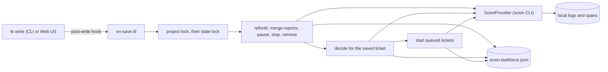
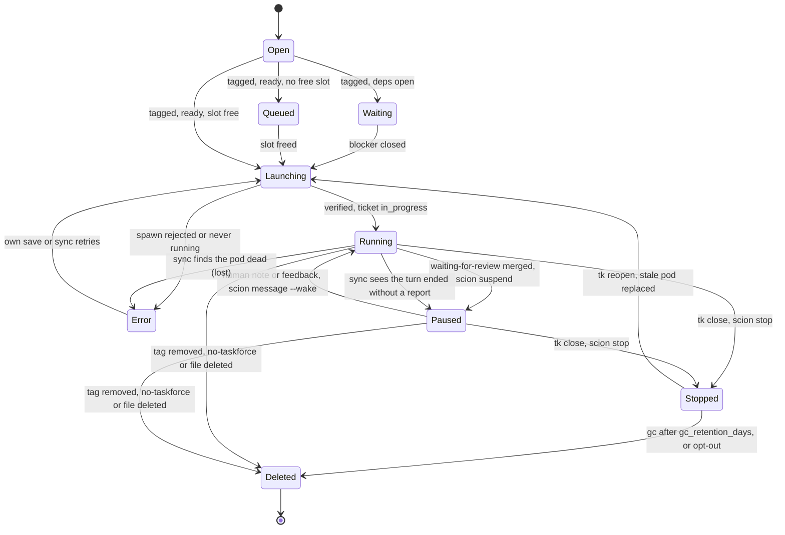

# Scion Task Force: Design (SCION-TASKFORCE-SPEC.md)

| | |
| :--- | :--- |
| Plugin | `tk-scion-taskforce` / `ticket-scion-taskforce`, command `tk scion-taskforce` |
| Language | Python 3.9+ standard library; PyYAML optional. Thin POSIX Bash discovery wrapper |
| Runtime | [SCION](https://github.com/GoogleCloudPlatform/scion) CLI on Podman, Docker or Kubernetes |
| Dispatch | Event-driven: a per-project `tk` post-write hook runs `on-save <id>`. No daemon, no polling |
| Version | `0.1.0` |

This document covers design and internals. Usage, commands, configuration and troubleshooting live in the [user guide](../../docs/plugins/scion-taskforce.md). The full config key reference is the starter YAML that `init` writes (`STARTER_YAML_TEMPLATE` in `tk_scion_taskforce/config.py`).

## 1. Purpose

Tickets are passive state. This plugin hands opted-in tickets to SCION coding agents, one worker per ticket, and keeps each worker in step with its ticket. Humans keep the review, the merge and the close.

**Goals**

- Opt-in only: a worker starts only for tickets a human tagged `taskforce`.
- The ticket file is the source of truth; worker state follows it.
- A ticket is claimed (`in_progress`) only after its worker is verified running.
- Workers stop for review and resume on feedback.
- Nothing runs between saves.
- All telemetry stays in local files.

**Non-goals**

- Pushing, merging or closing tickets on the worker's behalf.
- Scheduling across machines or replacing Scion's own orchestration.
- A pluggable runtime interface. Scion is the only backend today.
- Real-time pickup of worker reports (see §11).

## 2. Key decisions

| Decision | Context | Why | Consequences |
| :--- | :--- | :--- | :--- |
| Save hook, no daemon (2026-10) | A singleton daemon polled every project every 15 s. | Every write goes through `tk` (the Web UI shells out to it), so a post-write hook sees each change with no process to run. | Writes that bypass `tk` need `sync`. Daemon commands exit 2 with a migration hint. |
| Claim only after verification | Fire-and-forget launches left tickets `in_progress` with no worker. | `spawn` success means only that Scion accepted the request. | A ticket stays `open` until `scion list` reports the pod `running`. |
| Direct file writes for claims and notes | `tk start` and `tk add-note` would fire the hook again. | Writing the frontmatter and notes directly never triggers another `on-save`, even when `sync` or `dispatch` runs outside a hook. | Notes carry a `**Task Force:**` prefix, so they are never forwarded to workers. |
| Only configured projects are linked to the Hub | Dispatch once linked any folder, so test temp dirs became Hub projects. | One Hub project per real project folder. | `init` links; dispatch re-links only a folder with `.scion-taskforce/scion-taskforce.yaml`. Others fail preflight with a hint to run `init`. |
| Pause on review | Idle workers held runtime resources and slots. | `scion suspend` keeps the worktree and harness session for a fast resume. | A forwarded note or `feedback` wakes the worker. |
| Resolve model aliases at start | Scion resolves an alias on `start` but passes it verbatim on `resume` (`--model medium`), which the harness rejects. | Starting with the concrete ID keeps resumed workers on a valid model. | `provider.model` may still hold an alias. |
| Two locks: per project, then global state | Background hooks and manual commands write one shared state file. | `flock` is in the standard library and needs no server. | A slow spawn in one project delays hook runs in others (§11). |
| Thin adapter, no interface | One vendor. | An abstract contract with one implementation adds code without value. | A second runtime gets an extracted contract when it arrives. |
| Hand-written OTLP-shaped JSONL | OpenTelemetry SDK would add a dependency. | Spans and metrics as JSON lines cover local debugging. | Records follow OTLP field names but are not exported by an SDK. |
| One worker per project by default | Workers mount the shared checkout (`-w <project>`). Ten concurrent workers once left a repo on a worker branch with stray stashes. | Safe default. | Users raise `watcher.max_concurrent_per_project` explicitly. |
| Python with PyYAML optional | Pure Bash made YAML, state and span generation fragile. | The fallback parser reads the YAML subset `init` writes. | Unsupported YAML raises `ConfigError` instead of being misread. |

## 3. Architecture



1. `tk` runs every executable in `.tickets/.hooks/post-write.d/` after a successful write, in the background. It sets `TK_HOOK_DEPTH=1`, so nested `tk` calls skip hooks. `TK_NO_HOOKS=1` skips hooks for one call. Output goes to `.tickets/.hooks/hooks.log`.
2. The installed hook runs `tk scion-taskforce on-save "$TK_TICKET_ID" --event "$TK_EVENT"`.
3. `on-save` takes the per-project lock, then the state lock, and loads the state.
4. **Refresh** walks every live worker of the project (§7, §8): merge reports from isolated workspaces, pause reviewed workers, stop workers of closed tickets, remove workers whose ticket opted out or was deleted.
5. **Decide** acts on the saved ticket: start, queue, note "waiting on dependencies", or forward a human note. The saved ID must match `.tickets/<id>.md` exactly.
6. **Start queued** fills free slots with opted-in ready tickets, in `tk ready` order.

`sync` runs once, for writes the hook cannot see: refresh, a pod check (§8 Liveness), then start-queued. `watch` repeats `sync` in the foreground every `--interval` seconds (default 60) and skips retries of failed starts, so a broken runtime is not re-noted on every pass. `dispatch <id>` runs the decide checks for one ticket and ignores the worker limit.

### Package layout

```
plugins/scion-taskforce/
├── SCION-TASKFORCE-SPEC.md      # this document
├── install.sh                   # symlinks into ~/.local/bin; --uninstall removes them
├── ticket-scion-taskforce       # Bash entrypoint (# tk-plugin: metadata)
├── tk-scion-taskforce -> ticket-scion-taskforce
└── tk_scion_taskforce/
    ├── cli.py                   # HELP_TEXT (canonical command syntax), subcommands
    ├── config.py                # defaults, starter YAML, loader, fallback parser, worker template
    ├── events.py                # on-save, sync, dispatch_now, hook install
    ├── workers.py               # verified launch, pause, feedback, liveness, gc, project lock
    ├── state.py                 # state file and state lock
    ├── tickets.py               # ticket parsing, note and tag writes, workspace merge
    ├── roles.py                 # agent-team role skills: fetch, install tk-scion-* skills, role selection
    ├── wizard.py                # init menus, tk/scion pre-flight, git exclude fix, model alias resolution
    ├── telemetry.py             # JSONL spans, metrics, logs, rotation
    └── providers/scion.py       # ScionProvider adapter
```

## 4. State and locking

`~/.local/state/tk/scion-taskforce.json` (override: `TK_SCION_TASKFORCE_STATE_FILE` or `TK_SCION_TASKFORCE_STATE_DIR`) holds:

- `workers`: one entry per `<project>::<ticket-id>` with `state`, `branch`, `trace_id`, `lifecycle_span_id`, `feedback_cycles`, `error` and `agent`.
- `project_health`: the last preflight result per project.

`state` is one of `running`, `paused`, `stopped`, `error` or `deleted`. `agent` records whether Scion may hold an agent for the entry. It is `false` after a start that failed before Scion accepted it, and after a delete, so cleanup skips Scion calls.

Writes are atomic (temp file plus `os.replace`). An unparsable file is copied to `scion-taskforce.json.corrupt-<time>` and raises `StateError`; it is never silently reset.

| Lock | File | Taken by |
| :--- | :--- | :--- |
| Per project | `~/.local/state/tk/locks/<slug>-<sha1[:12]>.lock` | `on-save`, `sync`, `dispatch`, `uninit`, `feedback`, `pause`, `gc` |
| Global state | `scion-taskforce.json.lock` | Always inside the project lock |

The project lock stops two quick saves from starting two workers. The state lock serialises writers from different projects.

## 5. Scion adapter (`providers/scion.py`)

`ScionProvider` runs one `scion` command per method. Every call uses `scion --project <dir>` with `cwd=<dir>` and `--non-interactive`. It also sets `GOOGLE_CLOUD_PROJECT` and `GOOGLE_CLOUD_REGION`/`LOCATION` from `provider.gcp_project` and `provider.gcp_region`. Failures land in `last_error`, with ANSI codes and usage dumps stripped and a hint added for known errors. `--dry-run` or `TK_SCION_TASKFORCE_DRY_RUN=1` simulates every call and tracks fake pod states in memory.

| Method | `scion` command |
| :--- | :--- |
| `preflight` | `list --format json`, then `hub status`; fails when the Hub is reachable and reports `Linked: no` |
| `ensure_project_registered` | `hub status`, then `hub link --yes` and `hub enable`. `init`, or dispatch for a configured project |
| `start_runtime` | `podman machine start` (not a scion command) |
| `spawn` | `start <id> <brief> [--branch <b>] -w <dir> --enable-telemetry [-t <template>] [--config <launch.json>] [--profile <p>] [--harness-config <h>] [--model <resolved>] [extra_start_args]` |
| `health`, `wait_until_running` | `list --format json`, matched case-insensitively; reads `phase` and `activity`; polled until `running` or `error` |
| `pause` | `suspend <id>`, falling back to `stop <id>` |
| `stop` | `stop <id>` |
| `wake_with_message` | `message <id> <text> --wake`, falling back to `resume <id> <text> --enable-telemetry [extra_resume_args]` |
| `attach_command` | `attach <id>` when running, else `resume <id> --enable-telemetry --attach [extra_resume_args]` |
| `delete` | `delete <id> --preserve-branch` |
| `workspace_path` | No call. Returns `<project>/.scion/agents/<id>/workspace` if it exists, else `None` |

Preflight failures carry a `reason`. Dispatch fixes two of them once, then re-runs preflight: `runtime_down` -> `podman machine start` (`provider.auto_start_runtime`; tk never stops the machine) and `hub_unlinked` -> `scion hub link` for projects with a task force config (`provider.auto_link_hub`). Each attempt is logged with `autofix: true`. `--branch` is passed only with `worker.git: branch`. `-t <template>` is the ticket's role template (`role:<name>` -> `tk-<name>`) or `provider.template`, passed only when `.scion/templates/<template>/` exists. Before `start`, dispatch adds `/.scion/agents/` to `.git/info/exclude` when the project is in a git repo that does not ignore it (Scion's `CheckAgentsGitignore`); the change is logged with `autofix: true` and listed by `status`. Scion state names map to `running` (running, thinking, idle, waiting_for_input), `paused` (suspended, paused, stopped) or `error`.

## 6. State machine



`Waiting` and `Queued` are ticket notes, not worker states. A lost worker is `error` with `agent: true`; `tk reopen` with the tag kept relaunches it.

## 7. Dispatch internals

**Eligibility.** The ticket is `open`, carries `tags.claim`, and carries neither `tags.ignore` nor `tags.review`. Its deps are closed (`tk ready`). A free slot exists unless the caller is `dispatch`.

**Verified spawn** (`workers.dispatch_ticket`):

1. **Preflight.** On failure, record the health change (logged and metered only on transitions) and raise `DispatchError`.
2. **Idempotency.** A running pod with the ticket's ID is adopted. A dead pod is deleted (`--preserve-branch`) and relaunched when the previous entry is `error`, `deleted` or `stopped`, or missing. Otherwise the start is refused: "a worker named `<id>` already exists".
3. **Brief and launch config.** Build the brief (§10) and save it as `workers/<project>/<id>.brief.md`. With `provider.mount_tk` (default on), resolve `tk` on this machine (`$TK_SCRIPT`, then `tk`/`ticket` on `PATH`, symlinks followed) and save a Scion inline config as `<id>.scion-config.json`: a read-only volume from that file to `/usr/local/bin/tk` and `TK_NO_HOOKS=1`. Spawn passes it with `--config`, which Scion layers over the template. The path is resolved per launch, so templates stay machine-independent. If `tk` is not found, no `--config` is passed and an INFO line is logged.
4. **Spawn.** Pass the worker `OTEL_EXPORTER_OTLP_TRACES_FILE`, `OTEL_EXPORTER_OTLP_METRICS_FILE`, `OTEL_RESOURCE_ATTRIBUTES` (`service.name=scion-worker`, ticket and project) and `TRACEPARENT`. A model alias is resolved first: `wizard.resolve_model_alias` reads `model_aliases` from `~/.scion/harness-configs/<harness>/config.yaml`.
5. **Verify.** Poll `health` every `spawn_verify_poll_seconds` (2) for up to `spawn_verify_timeout_seconds` (30). If the pod never runs, record the entry as `error` with `agent: true` and raise `DispatchError`.
6. **Claim.** Write `status: in_progress` into the frontmatter. The user's tags are left as they are.
7. **Workspace mirror.** If `workspace_path` returns a worktree, copy `.tickets/<id>.md` into it when missing. `.tickets/` is often untracked, so a fresh worktree lacks it.
8. Emit `taskforce.ticket.lifecycle` and `taskforce.worker.spawn`, and record the entry as `running`.

**Failure handling.** A `DispatchError` records the entry as `error` and notes a 120-character hint on the ticket; full detail goes to the local logs only, because ticket files are committed. Start-queued stops at the first failure. It skips `error` tickets on saves of other tickets, so a broken runtime does not re-note them on every save. A save of the ticket itself or `sync` retries.

## 8. Reports, review and teardown

**Merge-back.** Refresh merges each active worker's workspace copy of the ticket into the project ticket (`tickets.merge_worker_ticket_copy`). The merge is additive: notes the project ticket lacks (matched by timestamp and text) and the review tag. Worker edits to status, title, body or other tags are ignored, so a worker can never close or rewrite a ticket.

**Pause.** A `running` worker whose ticket has `tags.review` is paused. A failed suspend keeps the entry `running`, so its slot stays taken, and notes the ticket.

**Feedback.** A save with `TK_EVENT=add-note` forwards the latest note if the worker is `running` or `paused` and the note does not start with a plugin prefix (`**Task Force:**`, `**Review Feedback:**`, `## Task Force:`). `feedback <id> "<msg>"` does the same and writes the note itself, with the `**Review Feedback:**` prefix. Both wake the worker first. Only after a successful wake do they remove the review tag (in the project ticket and the workspace copy), set `in_progress` and count a feedback cycle.

**Stop on close.** A closed ticket's active worker is stopped (`scion stop`) and marked `stopped`. A failed stop keeps the entry active, so its slot stays taken and the next save or `sync` retries.

**Remove.** When the opt-in tag is removed, `no-taskforce` is added or the ticket file is deleted, the worker is stopped (if active) and deleted with `--preserve-branch`. The entry is marked `deleted` even when the delete fails, so a missing agent is not retried on every save. An entry without an agent is marked `deleted` with no Scion call and no note.

**Liveness.** Only `sync` (and `watch`) checks pods, after refresh, for workers still `running`.

- A pod that is missing or not running becomes `error` and frees its slot. The ticket stays `in_progress` with a "worker lost" note that explains how to retry or abandon.
- A pod stays phase `running` after its harness finishes a turn; only Scion's `activity` changes. `completed`, `waiting_for_input` or `limits_exceeded` means the turn ended. The workspace report is merged again (it may have landed after refresh), then the worker is paused. Without a review tag the reason is `turn <activity>` and the ticket gets a note asking for direction. The brief asks workers to run `sciontool status task_completed` after reporting, so activity reflects the report.
- `turn_started` is set on spawn and on each successful wake. A finished-turn activity within `watcher.turn_grace_seconds` (60) of it is ignored, because Scion may still show the previous turn's `completed`.

**Garbage collection.** `gc` visits the current project and every project in the state file. It deletes the agents of tickets closed for at least `gc_retention_days`, using the `closed` timestamp or the file's mtime (`--force` ignores the age). A failed delete keeps the entry for the next `gc`. It then purges rotated logs older than `telemetry.rotation.retention_days`.

## 9. Concurrency

The per-project limit (`watcher.max_concurrent_per_project`, default 1) and the global limit (`watcher.max_concurrent`, default 10) count only `running` workers. A paused, stopped or lost worker frees its slot, and the next queued ticket starts in the same run.

Spawns pass `-w <project>`, so workers in one project share the checkout. The configured limit is honoured exactly, also when `.scion/` exists. When Scion gives an agent its own worktree (`.scion/agents/<id>/workspace`), the plugin mirrors the ticket in (§7) and merges reports back (§8). Different projects always run in parallel up to the global limit.

## 10. Worker briefs

`build_worker_prompt` gives every worker the full `tk show <id>` output plus a job section chosen by `classify_work_type`:

| Type | Trigger | Job |
| :--- | :--- | :--- |
| `review` | A tag in `worker.review_tags` (`pr`, `review`) or an `external-ref` starting with a `worker.review_ref_prefixes` entry (`gh-pr-`), as created by `tk github sync --prs` | `off`: read `gh pr view`/`gh pr diff` without checkout. `branch`: check out the PR and run the suite. Report Summary, Blocking issues, Suggestions and Verdict with `path:line` findings. `standard` privacy may post a PR comment; never approves or merges |
| `implement` | Everything else | Implement, run tests and lints, report Summary, Files touched, Verification and Open questions. `worker.git: off`: no commits, list changed files. `branch`: commit on the ticket branch |

Both end with a reporting protocol built on the mounted `tk`: read the ticket and new feedback with `tk show <id>`, post progress, questions and the report with `tk add-note`, then add the review tag with `tk update <id> --tags <current tags>,<review>` (the brief lists the current tags because `--tags` replaces the list). Workers never close, reopen, create or re-status tickets. If `tk` is missing, the fallback is a direct edit: a timestamped note under `## Notes` plus the review tag, keeping `status: in_progress`. The protocol also states the `worker.git` rule (never push) and asks for `sciontool status task_completed`. `worker.privacy: confidential` (default) appends a confidentiality section: no uploads, public links, pushes or external comments. The seeded template `agents.md` and the role-skill contract repeat the tk rules. After the ticket details the brief carries a skill section: for `role:<name>` tags, "read and follow `.agents/skills/tk-scion-<name>/SKILL.md`" (mandatory, by path, so it works for any harness); without a role tag, the installed role skills and hand-made `tk-scion-*` skills with descriptions, to use only if one clearly fits. `worker.prompt_file` replaces the brief; it accepts `{ticket_id} {ticket_title} {project_dir} {branch} {work_type} {claim_tag} {review_tag} {external_ref} {ticket_details} {skills}`.

The seeded template `.scion/templates/tk-worker-gemini-cli-with-api-key-auth/` adds `agents.md` and `system-prompt.md`. Its `scion-agent.yaml` sets no harness, because Scion's template rules reserve that for the launch config.

**Role skills** (`roles.py`). Template = how the pod runs; skill = how to do the job. Every ticket runs on the one worker template. `skills install` fetches `scion-frontiers/agent-team` at a pinned commit (GitHub tarball, or `--from <dir>` holding `<owner>/<repo>/`), stages everything, then writes into `<project>/.agents/skills/`:

- `tk-scion-<role>/SKILL.md`: frontmatter `name: tk-scion-<role>` and the upstream description; tk contract; upstream `system-prompt.md` folded in as the persona; upstream `agents.md`; paths of related skills. Per-role model and resource settings are dropped.
- `tk-scion-<skill>/`: every `gh://` skill a role references, installed once, `name:` rewritten to the prefixed folder name, with its repo's LICENSE.
- `UPSTREAM.md` in each folder: sources, licences, dropped skills; a `| Role |` row marks role skills. It marks generated folders: only those are regenerated (`--force`) or removed (`uninit`). A `tk-scion-<role>` folder without it aborts the install; unprefixed folders are never touched.

With `confidential` privacy, publishing skills (`gcs-artifact-publishing`) are dropped, and `--force` removes old generated copies. tk neither commits nor ignores the skills; the install prints how to do either. tk does not copy skills into an isolated worktree (the plugin stays a simple bridge); a worktree sees them only when they are committed.

Selection: each `role:<name>` tag (several allowed) maps to `tk-scion-<name>`. A role with no skill falls back to an old generated `.scion/templates/tk-<role>/` template (deprecated, at most one per worker); with neither, the start is refused before any Scion call: the ticket gets a note with `tk scion-taskforce skills install <name>`, its state becomes `error`, and the queue continues with the next ticket. `templates install|list` are deprecated aliases of `skills` (remove after 2027-04-01).

## 11. Telemetry

Files live under `telemetry.log_dir` (default `~/.local/state/tk/scion-taskforce/logs`, override `TK_SCION_TASKFORCE_LOG_DIR`):

| File | Content |
| :--- | :--- |
| `taskforce.log` | JSON lines: `timestamp`, `severity`, `message`, `service.name`, optional `trace_id`, `span_id` and `attributes` |
| `otel-traces.jsonl` | Spans: `timestamp`, `trace_id`, `span_id`, `parent_span_id`, `name`, `kind`, `status.code`, `resource`, `attributes`, `events` |
| `otel-metrics.jsonl` | Metrics: `timestamp`, `name`, `value`, `unit`, `resource`, `attributes` |
| `workers/<project>/<id>.log` | Plain-text lifecycle lines for one worker |
| `workers/<project>/<id>.brief.md` | The brief the worker was started with |

`telemetry.enabled: false` turns off spans and metrics; the logs are always written. Each append first rotates the file if its mtime is before today (UTC) or it exceeds `max_bytes`. Rotated files are named `<file>.<YYYY-MM-DD>[.N][.gz]`. `logs` and `trace` read active and rotated files. A write failure prints one warning and never fails the command.

Every span carries `ticket.id`, `project.path`, `project.name` and `worker.id`. The resource is `service.name=tk-scion-taskforce` with `service.version`.

| Span | Emitted when | Extra attributes or events |
| :--- | :--- | :--- |
| `taskforce.ticket.lifecycle` | Worker verified and ticket claimed; parent of the worker spans | `worker.branch`, `ticket.title`, `ticket.status`, `ticket.priority`, `ticket.tags`; event `ticket.claimed` |
| `taskforce.worker.spawn` | Spawn succeeded, was rejected or was never verified | `worker.branch`, `worker.state`, `worker.verified` or `error.message` |
| `taskforce.worker.pause` | Suspend attempted | `worker.state`, `pause.reason`; event `worker.paused_for_review` |
| `taskforce.worker.lost` | `sync` found the pod dead | `worker.state`, `worker.observed_state`; event `worker.lost` |
| `taskforce.worker.feedback_wake` | Note forwarded or `feedback` sent | `feedback.note_timestamp`, `feedback.cycle`; event `worker.resumed_with_feedback` |
| `taskforce.worker.attach` | `attach` run | none |
| `taskforce.worker.gc_delete` | `gc` delete attempted | `gc.retention_days`, `gc.ticket_closed_age_days`; event `worker.gc_deleted` |

| Metric | Value |
| :--- | :--- |
| `taskforce.workers.spawned`, `.spawn_failed`, `.spawn_unverified` | 1 per launch outcome |
| `taskforce.workers.paused_for_review`, `.lost`, `.feedback_cycles`, `.gc_deleted` | 1 per event |
| `taskforce.provider.healthy` | 1 or 0, on health transitions only |
| `taskforce.logs.rotated_purged` | Files purged by `gc` |

## 12. Scion quirks

| Symptom | Cause | Mitigation |
| :--- | :--- | :--- |
| Pod idle forever, or `Exited (255)` on suspend | Claude trust is seeded for the host path and `/workspace`, not the worktree mount | None; confirm once with `tk scion-taskforce attach <id>` |
| `scion message <id> "1"` does not confirm menus | Text is typed but no Enter reaches the dialog | None; confirm with `attach` |
| `scion logs <id>` fails for project-local agents | It reads `.scion/agents/<id>/home/agent.log`; the real log is `/home/scion/agent.log` in the container | `tk scion-taskforce logs` reads the plugin's own log; use `podman exec` for the harness log |
| `scion --project <repo> list` returns `[]` while pods exist | Hub projects live under `~/.scion/project-configs/<slug>__<uuid>/.scion` | Find strays with `scion list --all` |
| Agent names are lower-cased | Scion normalises names | `health` matches case-insensitively |
| An alias is passed verbatim on `resume` | Scion stores the alias, not the resolved ID | Aliases are resolved before `start` (§7) |

## 13. Known shortcuts and open questions

The first five items are marked `shortcut:` in the code.

- Pods are checked only by `sync` and `watch`, not on every save, because each check is one `scion list` call. Subscribing to Scion Hub notifications (`COMPLETED`, `WAITING_FOR_INPUT`) would pick reports up instantly without a foreground loop.
- The `tk` mount is a host bind mount, so it works only with a local runtime broker. Ship `tk` in the worker image or a Scion volume when workers run on remote brokers.
- One state lock serves all projects. Split the state file per project if parallel multi-project dispatch matters.
- The `watcher:` config section is named after the removed daemon. Rename it, reading the old name as a fallback, at the next schema change.
- `opencode` Vertex model IDs in the wizard are hand-maintained.
- Open question: `feedback`, `pause` and `gc` take the lock of the current project, even when the ticket is found in another project. The state lock still serialises state writes.
